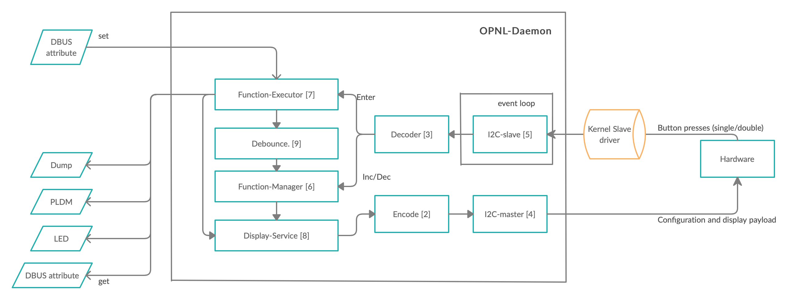
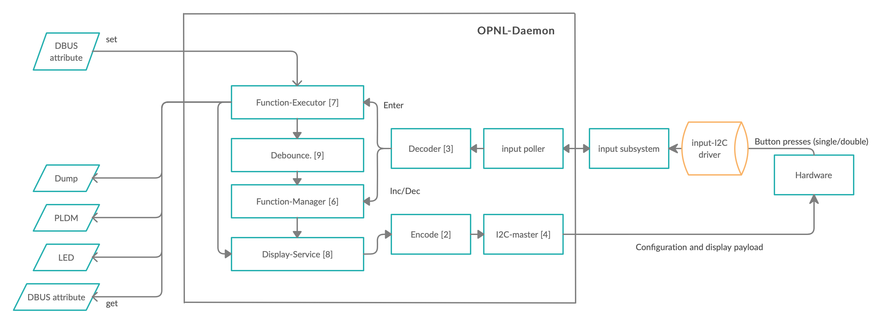

# IBM Operator Panel management app on OpenBMC (OPNL)

Author: Jinu Joy Thomas <jinujoy@linux.vnet.ibm.com>

Primary assignee: Jinu Joy Thomas

Created: 2020-12-01

  

## Problem Description

On IBM Power Servers, we have a hardware unit called the Operator Panel.  
This hardware consists of three buttons and an LCD display, this function is  
already available on IBM systems that are not managed by the BMC/OpenBMC  
firmware stack.

The physical control panel is your initial interface with the server. You can  
use the physical control panel to perform functions such as IPL, power on,  
and power off.

The control panel has the following two parts:  

 - base panel
 - LCD panel

More details can be found [here][physical panel].

The LCD of the panel, displays information about the system as well as  
helps to guide the user to select available and supported base and extended  
functions. There are three user operable buttons on the panel. Increment  
and decrement are used to navigate through control functions and enter  
button used to invoke the selected function. This hardware also has a  
micro-controller in it, which basically controls the display chip for  
displaying characters on the LCD. Further, it also helps to identify  
button presses and relay that to the BMC. The connection from the  
micro-controller on the Operator panel to the BMC is via I2C, the BMC  
and micro-controller communicate over raw I2C.

We would need a management application running on the BMC to understand  
and manage the communication between the micro-controller and to decode  
as well as format the proprietary I2C message for the Panel micro-controller  
to understand. The app would do all sorts of "inside the box communication"  
like between stakeholders (apps on BMC) and the OPNL bidirectionally,  
OPNL and the hardware

This design document aims to define a high level design for the  
Operator Panel management app based on the OpenBMC stack.

#####It does not cover low level API details. 

## Background and References

Panel code is supported on all power servers.  
These servers do not run the BMC/OpenBMC stack.

Details on operator panel usage in IBM systems are given in 
[Knowledge Centre][Knowledge Centre]

Details on the Base Functions are mentioned 
[here] [Base functions].

Details on the Extended Functions are mentioned 
[here] [Extended functions].

## Requirements

  
Following are the external requirements:

* Keep the hardware functionality same as is in the legacy stack.
* Implementation may differ , end outcome should be same.
* No change to be done on the Panel micro controller code.
* Requirement on BMC applications that need to react to panel 
triggers need to be via D-Bus APIs

The following are the requirements for the OPNL app:

- Act as a slave to receive I2C message from the Panel hardware.
- Act as a master to send I2C message to the Panel hardware.
- Encode/Decode the I2C message as required.
- Invoke different apps to perform required functions  
(BMC dump, Partition dump[ etc.]).
- Have required apps invoke OPNL app to display characters on the  
LCD panel on the hardware
- There needs to be a tool to simulate the Hardware to an extent,  
mainly for developer use.
- Have internal debounce mechanism for certain function which require extra  
confirmation before activation.
- Ability for detection of hot plugging
- Ability for creation of error logs on failures.

  

## Proposed Design

This document covers the architectural, interface, and design details. It  
provides recommendations for implementations, but implementation details are  
outside the scope of this document. The design aims at having a single OPNL  
daemon serve both the communication to the hardware and also other apps, and  
having bidirectional communication with the Hardware via I2C messages.

  

The proposed design is to have the below from which it could be build further:

  

* [**opnl-daemon**] : <em>The main daemon.</em>

* [**opnl-encoder**] :  <em>This encodes the I2C message.</em>

* [**opnl-decoder**] :  <em>This decodes the I2C message.</em>

*  [**opnl-i2c-master**] :  <em>This sends the messages to the hardware.</em>

*  [**opnl-i2c-slave**] :  <em>This receives the messages from the hardware.</em>

*  [**opnl-function-manager**] :  <em>Also known as inc/dec button manager,  
helps manage the function number and scrolling.</em>

*  [**opnl-function-executer**] :  <em>This manages the execution of the selected  
function , like display /input/debounce or trigger.</em>

*  [**opnl-display-service**] :  <em>This takes care to create a DBUS api for  
external apps to display on the hardware as well as internal display.</em>

*  [**opnl-debounce-manager**] : <em>This is a mechanism to display a particular  
string on the screen for certain functions which should not be activated by  
mistake.</em>

#### <em> The design flow is shown in the below diagram.</em>

This flow can make use of the i2c slave mqueue driver that intel has  
downstream, either we ask them to up-stream the code or i create a  
similar one and upstream it.
  

## Alternatives Considered

Use input subsystem for communication between the hardware and the app for the  
button communication only.

#### <em> The design flow is shown in the below diagram.</em>

This flow makes use of the input subsystem and an intermediate i2c dirver.  
The catch however is that the input subsystem cannot give only single  
events, which is what the Hardware sends. 

## Impacts

Development would be required to implement the whole app.

Foreseen impacts would be

- how the app survives flood of requests from external apps and the hardware
- how different communication issues can be handled.

  

## Testing

Use of the tool will be used for initial testing, once all things are in place  
will use hardware to confirm the simulated tests.

[physical panel]: https://www.ibm.com/support/knowledgecenter/en/POWER9/p9hb5/areaaphycntrlpnl.htm
[Knowledge Centre]:https://www.ibm.com/support/knowledgecenter/en/POWER9/p9hb5/p9hb5_kickoff.htm
[Base functions]: https://www.ibm.com/support/knowledgecenter/en/POWER9/p9hb5/normfunc.htm
[Extended functions]: https://www.ibm.com/support/knowledgecenter/en/POWER9/p9hb5/custext.htm
