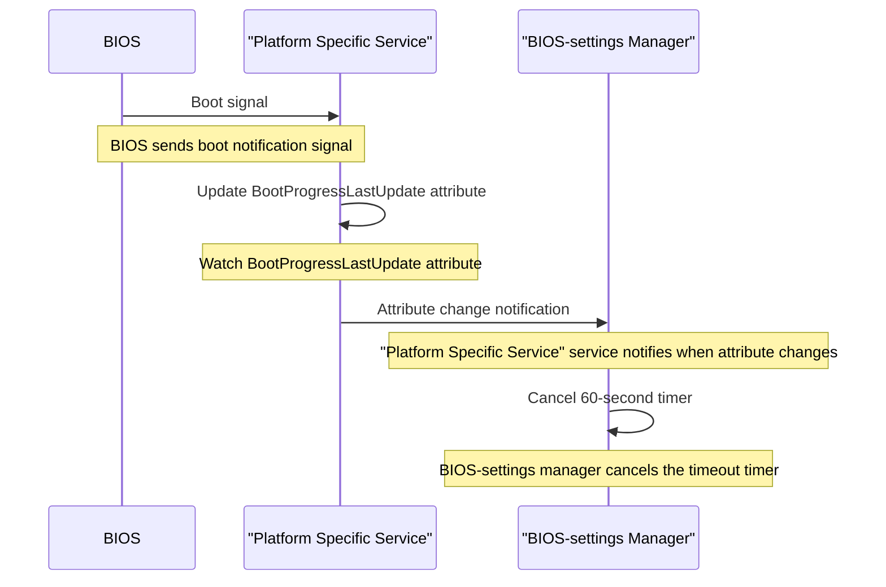
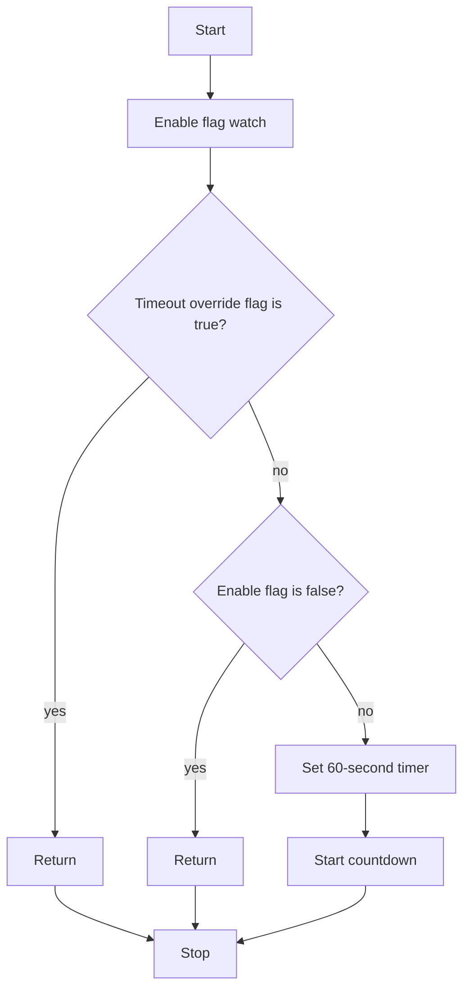
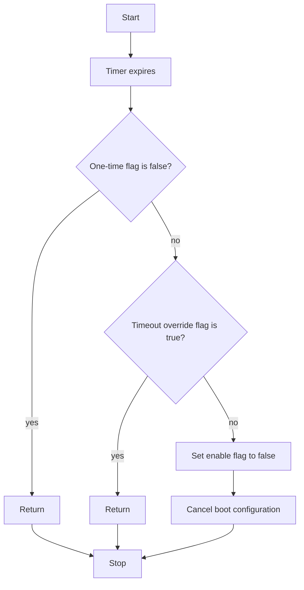

# BIOS Boot Configuration Flags and Timeout Management

**Author:** Adi Fogel
**Created:** Jun 24th, 2025

## Problem Description

This design addresses the IPMI specification requirement for automatic timeout
management of boot configuration flags. When a remote console application sets
boot options and then terminates (either accidentally or intentionally), there's
a risk that a system restart occurring hours or days later could cause an
unexpected boot sequence if the boot options are used without examining the
reset cause. The BMC must automatically clear the 'boot flags valid bit' if a
system restart is not initiated by a Chassis Control command within 60 seconds
±10% of the valid flag being set. The current implementation lacks proper BIOS
boot detection, causing premature timeout of valid boot configurations. The boot
detection can also be used by different application and not only the
Bios-manager.

**Goals:** Implement reliable BIOS boot detection to prevent premature timeout
of boot configuration flags, ensuring boot options remain valid during
legitimate system restarts.

> If the BIOS is not booted within 60 seconds, the boot settings should be
> automatically canceled.

## Background and References

The IPMI (Intelligent Platform Management Interface) specification defines
requirements for boot configuration management in enterprise systems. The [IPMI
v2.0 Specification](https://www.intel.com/content/dam/www/public/us/en/documents/product-briefs/ipmi-second-gen-interface-spec-v2-rev1-1.pdf)
(Section 28.2) mandates automatic timeout mechanisms for boot flags to prevent
unintended boot sequences.

## Requirements

### Functional Requirements

1. **BIOS Boot Detection**: The system must detect when BIOS boot begins within
   60 seconds of boot flag setting
2. **Timeout Cancellation**: The 60-second timeout timer must be cancelled upon
   BIOS boot detection
3. **Fallback Mechanism**: If BIOS boot is not detected within the timeout
   period, boot flags must be cleared
4. **One time settings**: Option to set the BIOS configuration only for one
   boot. The second boot will return the previous configuration.

## Proposed Design

### Current Design

### Backend D-Bus Objects

The configuration flags are stored in the following D-Bus objects:

#### Enable Flag

**Purpose:** Indicates whether the boot configuration is valid

**D-Bus Path:**

```text
xyz.openbmc_project.Settings /xyz/openbmc_project/control/host0/boot xyz.openbmc_project.Object.Enable Enabled
```

**Behavior:**

- Set to `true` when user configures boot settings
- Set to `false` by BMC if 60-second timer expires and we did not get BIOS boot
  indication (prevents UEFI from using configuration)
- Set to `false` by UEFI after applying one-time settings

#### One-Time Enable Flag

**Purpose:** Indicates whether boot configuration is valid only for the next
boot

**D-Bus Path:**

```text
xyz.openbmc_project.Settings /xyz/openbmc_project/control/host0/boot/one_time xyz.openbmc_project.Object.Enable Enabled
```

**Behavior:**

- Set to `true` when user configures one-time boot option

**Configuration Examples:**

**IPMI (persistent flag):**

```bash
chassis bootdev force_pxe options=persistent
```

_Note: When using persistent flag, this is set to `false` (default is `true`)_

**Redfish:**

```bash
curl -u <user>:<password> -H 'content-type: application/json' -X PATCH \
  https://<ip>/redfish/v1/Systems/Bluefield \
  -d '{ "Boot": { "BootSourceOverrideEnabled": "Once" } }'
```

#### Timeout Override Flag

**Purpose:** Controls whether the 60-second timeout should be ignored

**D-Bus Path:**

```text
xyz.openbmc_project.Settings /xyz/openbmc_project/control/host0/boot xyz.openbmc_project.Control.Boot.BootSettingsExpiryOverride BootValidTimeoutOverride
```

**Behavior:**

- When set to `true`, timeout is ignored
- IPMI-only feature

**IPMI Configuration:**

```bash
ipmitool chassis bootparam set bootflag force_pxe options=timeout
```

_Note: If timeout override option is not specified, timeout is ignored and previous value will still be set. For this reason, it is not recommended to use
bootparam command without specifying the timeout option_

### IPMI Commands example

| IPMI Command                                                           | Description                                        | One-Time Enable Flag | Timeout Override Flag |
| :--------------------------------------------------------------------- | :------------------------------------------------- | :------------------- | :-------------------- |
| `chassis bootdev force_pxe<br>options=persistent`                      | Set PXE boot persistently                          | `false`              | `ignored`             |
| `ipmitool chassis bootparam set<br>bootflag force_pxe options=timeout` | Set PXE boot with timeout override                 | `true`               | `false`               |
| `chassis bootparam set bootflag<br>force_pxe options=no-timeout`       | Set PXE boot persistently with no timeout override | `true`               | `true`                |

Remark - enable flag is always set to true.

### The addition to the current Design

The signal flow for boot notification and timer cancellation:



**Sequence Description:**

1. **BIOS** sends a boot signal to a Platform Specific Service.
2. **Platform Specific Service** receives the signal and updates the
   `BootProgressLastUpdate` attribute
3. **BIOS-settings Manager** watches the `BootProgressLastUpdate` attribute for
   changes
4. **BIOS-settings Manager** when `BootProgressLastUpdate` changes, cancels the
   60-second timeout timer

This design ensures proper timeout timer cancellation when BIOS boot begins,
preventing premature timeout of boot configuration settings.
If the timer expires, the **BIOS-settings Manager** sets the enable flag to false,
causing the BIOS to ignore the settings when it boots.
If the BIOS boots within 60 seconds and the timer is canceled, for one-time
settings, the BIOS will set the enable flag back to false and
apply the one-time boot configuration.

### Timer Setting Logic

The following activity diagram shows the logic for setting the timer when the
enable flag changes:



**Logic Description:**

1. When the enable flag changes, check the timeout override flag
2. If timeout override flag is `true`, return (no timer needed)
3. If enable flag is `false`, return (no timer needed)
4. Otherwise, set the 60-second timer and start countdown

This ensures the timer is only set when both conditions are met: timeout
override is disabled and enable flag is true.

### Timer Expiration Handler

The following activity diagram shows the logic for handling timer expiration:



**Logic Description:**

1. When the timer expires, check the one-time flag
2. If one-time flag is `false`, return (no action needed)
3. If timeout override flag is `true`, return (no action needed)
4. Otherwise, set the enable flag to `false` to cancel the boot configuration

This ensures the boot configuration is only cancelled when the timer expires
and both conditions are met: one-time flag is true and timeout override is
disabled.

## Alternatives Considered

None

## Impacts

The timeout management feature will be implemented using a configuration flag,
ensuring minimal impact on existing systems while providing the required
functionality.
When enabled, this feature will change how one-time configuration with timeout
currently operates.

### Organizational

The changes for supporting it will be in the bios-settings-mgr repository.
[bios-settings-mgr](https://github.com/openbmc/bios-settings-mgr)

## Testing

### Integration Test

Testing will be performed by executing IPMI and RedFish commands and verifying
the behavior both with and without BIOS reboot scenarios.

1. **Setting timer without booting the BIOS** - Expected: The setting will be
   canceled after 60 seconds
2. **Setting timer with booting BIOS** - Expected: The setting will be applied
   and timer canceled
3. **Setting persistent settings without booting** - Expected: The settings
   should remain unchanged
