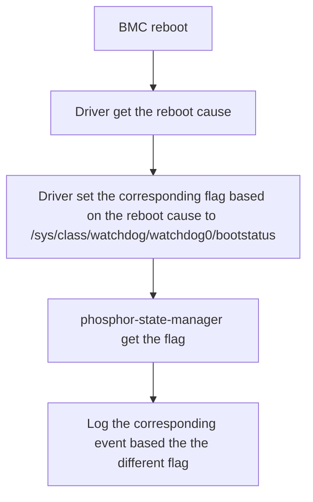

# BMC Boot Cause Event Log

Author: Patrick Lin (patrick_lin_wiwynn)

Other contributors: Delphine Chiu(delphinechiu), Bonnie Lo(bonnielo), Ricky
Wu(ricky_cx_wu)

Created: Aug 19, 2024

## Problem Description

Currently, OpenBMC lacks a unified method that meets the needs of various
vendors to record different types of BMC reboot cause event logs. The purpose of
this proposal is to update the existing method, consolidating more BMC reboot
causes to better align with current usage needs.

## Background and References

In the current approach, the only defined reboot causes are **WDIOF_EXTERN1**
and **WDIOF_CARDRESET**, but this is insufficient to meet today's needs.
However, due to varying needs among different vendors, it’s not feasible to
cover all possible reboot causes. In this update, we will add support for
several more common types.

## Requirements

1. Each BMC vendor needs to provide or update their driver to retrieve the
   corresponding BMC reboot cause.
2. Each BMC vendor needs to record the results of the retrieved reboot cause to
   the specified path.
3. Each vendor needs to ensure the accuracy of interpreting the reboot cause
   results.
4. New reboot cause types need to be defined to cover the requirements
5. Revise the definitions of certain existing reboot cause types to better
   represent their respective conditions.
6. Ensure that methods based on the original design can adapt well to this
   change.

## Proposed Design

After a BMC reboot, each BMC vendor’s driver first retrieves the reboot cause.
Then, based on the reboot cause, it sets different flags to the specified path.
The PSM (Phosphor-state-manager) reads the flags from the specified path to
determine the type of reboot cause. Finally, it generates the corresponding
event log based on the determination.

This process ensures accurate logging and handling of different BMC reboot
causes, improving system reliability and monitoring. Belows are the details of
the new additions and changes:

1. Driver Provision by BMC Vendors:

- Each BMC vendor must provide a driver to retrieve the BMC reboot cause and
  record the result at the specified location.

2. Redefining Reboot Cause Type **WDIOF_EXTERN1**:

- This type will henceforth represent a software reset.

3. Revise the Definition of **WDIOF_CARDRESET**:

- The **WDIOF_CARDRESET** type will now specifically indicate resets caused by
  the watchdog.

4. Clarification of The **Power-on-reset case**:

- When a BMC reset occured, but the flag in the bootstatus remains unchanged by
  the watchdog driver (i.e., it stays at 0), this indicates that a
  **Power-on-reset** has occurred.

5. Update Reboot Cause Interpretation:

| phosphor-state-manager | bootstatus value | watchdog driver                  |
| ---------------------- | ---------------- | -------------------------------- |
| WDIOF_EXTERN1          | 0x04             | return 0x04 if reset by Software |
| WDIOF_CARDRESET        | 0x20             | return 0x20 if reset by Watchdog |
| POR                    | 0x00             | Do nothing                       |

6. Generate Corresponding Event Log:

- After interpreting the reboot cause, the system should issue the corresponding
  event log based on the determined type.

## Alternatives Considered

In the original approach, **WDIOF_CARDRESET** was used to represent a **POR**
(power-on-reset). However, with the new method, we need to distinguish between
watchdog resets and power-on resets. Therefore, we now use **WDIOF_CARDRESET**
to represent watchdog resets, aligning with the existing kernel documentation 
and driver implementation.

## Impacts

1. Common reboot causes across vendors can be consolidated to issue a unified
   event log.
2. If any functions rely on the original reboot cause, the code must be adjusted
   to align with the new definitions.

### Organizational

Which repositories are expected to be modified to execute this design?
phosphor-state-manager

## Testing

Reboot the BMC under various conditions and check whether the corresponding
event logs are generated correctly.
