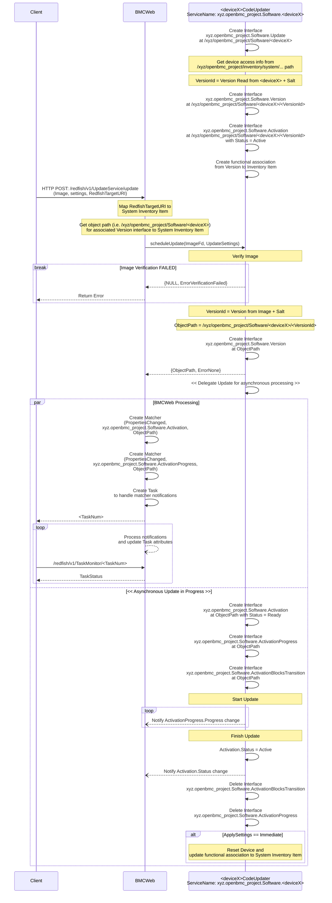

# Code Update Design

Author: Jagpal Singh Gill <paligill@gmail.com>

Created: 4th August 2023

## Requirements

1. Provides simple interface for code update with following requirements -
   - Able to schedule an update, given a firmware image and update settings.
     - Update settings shall be able to specify when to apply the image, for
       example immediately or on reset.
   - Able to retrieve the update status.
   - Able to retrieve the update progress.
2. Able to produce an interface complaint with
   [Redfish UpdateService](https://redfish.dmtf.org/schemas/v1/UpdateService.v1_11_3.json)
3. Filesystem shall not be used for storing the firmware images.
4. Update request shall respond timely (rather than long hogging wait), so
   client can query the status while update is in progress.
5. All errors shall propagate back to the client.
6. Vendors shall be able to choose any image format with no imposition to use
   generic or single one.
7. Able to support update for different type of hardware components such as
   cplds, nics, BIOS, BIC, pci switches, etc.
8. Able to support code update for multi host platforms where same type of
   hardware component resides on multiple hosts.
9. Able to update multiple components in parallel.
10. Able to restrict critical system actions, such as reboot, while the code
    update is in flight.

## Background and References

- [phosphor-bmc-code-mgmt](https://github.com/openbmc/phosphor-bmc-code-mgmt)
- [Software DBus Interface](https://github.com/openbmc/phosphor-dbus-interfaces/tree/master/yaml/xyz/openbmc_project/Software)
- [Code Update Design](https://github.com/openbmc/docs/tree/master/architecture/code-update)

## Problem Description

This section covers the limitations discoverd with
[phosphor-bmc-code-mgmt](https://github.com/openbmc/phosphor-bmc-code-mgmt)

1. Current code update flow is complex as it involves 3 different daemons -
   Image Manager, Image Updater and Update Service.
2. Update invocation flow has no explicit interface but rather depends upon the
   discovery of a new file in /tmp/images by Image Manager.
3. Images POSTed via Redfish are downloaded by BMCWeb to /tmp/images which
   requires write access to filesystem. This poses a security risk.
4. Current design doesn't support parallel upgrades for different firmware
   ([Issue](https://github.com/openbmc/bmcweb/issues/257)).

Please refer to
[current flow](https://www.mermaidchart.com/raw/685d49d5-dd9f-4371-81a3-6a43a676a7e2?version=v0.1&theme=light&format=svg)
for more details on current design.

## Proposed Design

### Proposed End to End Flow

- Each upgradable hardware type will have a separate daemon (\<deviceX\> as per
  above flow) handling its update process and would need to implement the
  proposed interfaces in next section. This satisfies the
  [Requirement# 7](#requirements).
- Since, there would be single daemon handling the update (as compared to
  three), less hand shaking would be involved and hence addresses the
  [Issue# 1](#problem-description) and [Requirement# 4](#requirements).

### Proposed D-Bus Interface

The DBus Interface for code update will consist of following -

| Interface Name                                                                                                                                                                                         | Existing/New |                               Purpose                               |
| :----------------------------------------------------------------------------------------------------------------------------------------------------------------------------------------------------- | :----------: | :-----------------------------------------------------------------: |
| [xyz.openbmc_project.Software.Update](https://gerrit.openbmc.org/c/openbmc/phosphor-dbus-interfaces/+/65738)                                                                                           |     New      |                       Provides update method                        |
| [xyz.openbmc_project.Software.Version](https://github.com/openbmc/phosphor-dbus-interfaces/blob/master/yaml/xyz/openbmc_project/Software/Version.interface.yaml)                                       |   Existing   |                        Provides version info                        |
| [xyz.openbmc_project.Software.Activation](https://github.com/openbmc/phosphor-dbus-interfaces/blob/master/yaml/xyz/openbmc_project/Software/Activation.interface.yaml)                                 |   Existing   |                     Provides activation status                      |
| [xyz.openbmc_project.Software.ActivationProgress](https://github.com/openbmc/phosphor-dbus-interfaces/blob/master/yaml/xyz/openbmc_project/Software/ActivationProgress.interface.yaml)                 |   Existing   |               Provides activation progress percentage               |
| [xyz.openbmc_project.Software.ActivationBlocksTransition](https://github.com/openbmc/phosphor-dbus-interfaces/blob/master/yaml/xyz/openbmc_project/Software/ActivationBlocksTransition.interface.yaml) |   Existing   | Signifies barrier for state transitions while update is in progress |

Introduction of xyz.openbmc_project.Software.Update interface streamlines the
update invocation flow and hence addresses the [Issue# 2](#problem-description)
and [Requirement# 1 & 2](#requirements).

### Keep images in memory

Rather than downloading the images to tmpfs, images will be kept in memory and
passed to \<deviceX>CodeUpdater using a file descriptor rather than file path.
This takes away the constraint to have write access to file system and hence
addresses the [Issue# 3](#problem-description) and
[Requirement# 3](#requirements).

### Propagate errors to client

xyz.openbmc_project.Software.Update.scheduleUpdate return value will propagate
any errors related to initial setup and image verification back to user. Any
asynchronous errors which happen during the update process will be notified via
failed activation status which maps to failed task associated with the update.
Also, a SEL log entry will be logged which will be sent back to client via
[Redfish Log Service](https://redfish.dmtf.org/schemas/v1/LogService.v1_4_0.json).

Another alternative could be to use
[Redfish Event Services](https://redfish.dmtf.org/schemas/v1/EventService.v1_10_0.json).

### Firmware Image Format

Image parsing will be performed in \<deviceX>CodeUpdater and since
\<deviceX>CodeUpdater is a vendor specific daemon, vendor can choose any image
format for the firmware image. This fulfills the
[Requirement# 6](#requirements).

### Update for Multi Host Platforms

- For multi host scenarios, extend the Dbus path to specify "\<deviceX> on
  \<hostY>", for example,
  /xyz/openbmc_project/Software/\<deviceX>/\<VersionId>/\<hostY>. All the
  corresponding interfaces can reside on this path and same path will be
  returned from xyz.openbmc_project.Software.Update.scheduleUpdate.
- Extend openbmc_project.Software.Update.scheduleUpdate method parameters to
  include SystemInventoryItem path, so \<deviceX>CodeUpdater can map the update
  operation to the appropriate host.

This fulfills the [Requirement# 8](#requirements).

### Parallel Upgrade

- Across Hardware Components:

  Handled via different <deviceX>CodeUpdater daemon for each <deviceX> type
  which can be invoked in parallel from BMCWeb and then tracked via different
  tasks.

- Same Hardware Components:

  Refer to solution described in Update for Multi Host Platforms.

This fulfills the [Requirement# 9](#requirements).

### Uninterrupted Updates

ActivationBlocksTransitions interface will be created on the specific DBus path
for a version update which will help to block any interruptions from critical
system actions such as reboots. This interface can in turn start and stop
services such as Boot Guard Service to prevent such interruptions. This is
already part of the existing design.

## Alternatives Considered

### Centralized Design with Global Software Manager

Single SoftwareManager which communicates with the BCMWeb, hosts all the
interfaces such as Version, Activation, Progress for all hardware components
within the system on different DBus paths. Software Manager keeps list of
various hardware update services within the system and start them based on
update request. These on-demand services update the hardware and interfaces
hosted by Software Manager and exits.

#### Pros

- Most of the DBus interfaces gets implemented by Software Manager and vendors
  would need to write minimal code to change properties for these interfaces
  based on status and progress.
- Under normal operating conditions (no update in flight), only Software Manager
  will be running.

#### Cons

- Imposes the need of a common image format as Software Manager needs to parse
  and verify the image for creating interfaces.
- Limitation in the design, as there is a need to get the current running
  version from the hardware at system bring up. So, Software Manager would need
  to start each update daemon at system startup to get the running version.

### Pull model for Status and Progress

The proposed solution uses a push model where status and progress updates are
asynchronously pushed to BMCWeb. Another alternative would be to use a pull
model where Update interface can have get methods for status and progress (for
example, getActivationStatus and getActivationProgress).

#### Pros

- Server doesn't have to maintain a Dbus matcher
  ([Issue](https://github.com/openbmc/bmcweb/issues/202)).
- Easier implementation in Server as no asynchronous handlers would be required.

#### Cons

- Server would still need maintain some info so it can map client's task status
  request to Dbus path for /xyz/openbmc_project/Software/<deviceX> for calling
  getActivationStatus and getActivationProgress.
- Aforementioned [issue](https://github.com/openbmc/bmcweb/issues/202) is more
  of an implementation problem which can be resolved through implementation
  changes.
- Currently, activation and progress interfaces are being used in
  [lot of Servers](#organizational). In future, harmonizing the flow to single
  one will involve changing the push to pull model in all those places. With the
  current proposal, the only change will be in update invocation flow.

## Impacts

The introduction of new DBus API will create two different invocation flows from
Server. Servers (BMCWeb, IPMI, etc) can initially support both the code stacks.
As new API gets soaked into the system and gets wider acceptance, Servers can be
changed to completely use the new API stack.

## Organizational

### Does this design require a new repository?

Yes. The <deviceX>CodeUpdater for each hardware device will reside in its own
repository.

### Which repositories are expected to be modified to execute this design?

Requires changes in following repositories to incorporate the new interface for
update invocation -

- [BMCWeb](https://github.com/openbmc/bmcweb)
- [phosphor-host-ipmid](https://github.com/openbmc/phosphor-host-ipmid)
- [phosphor-webui](https://github.com/openbmc/phosphor-webui)
- [openbmc-tools](https://github.com/openbmc/openbmc-tools)
- [phosphor-rest-server](https://github.com/openbmc/phosphor-rest-server)

## Testing

### Unit Testing

All the functional testing of the reference implementation will be performed
using GTest.

### Integration Testing

The end to end integration testing involving Servers (for example BMCWeb) will
be covered using openbmc-test-automation.
