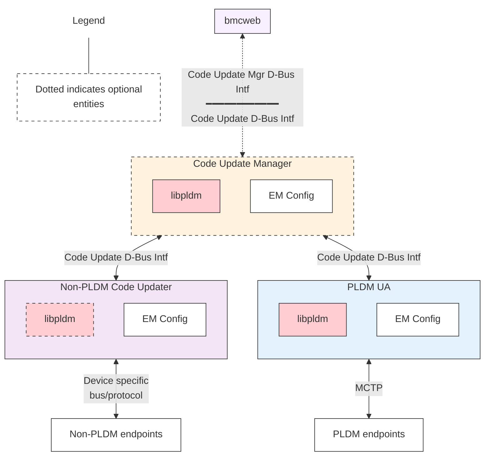

# Code Update Design

Author: Jagpal Singh Gill <paligill@gmail.com>

Other contributors: \
Deepak Kodihalli <deepak.kodihalli.83@gmail.com> @dkodihal \
Tom Joseph <rushtotom@gmail.com> @tomjose

Created: 4th August 2023

## Problem Description

This section covers the limitations discovered with
[phosphor-bmc-code-mgmt](https://github.com/openbmc/phosphor-bmc-code-mgmt) and
the current code update design.

1. Current code update flow is complex as it involves 3 different daemons -
   Image Manager, Image Updater and Update Service.
2. Update invocation flow has no explicit interface but rather depends upon the
   discovery of a new file in /tmp/images by Image Manager.
3. Images POSTed via Redfish are downloaded by BMCWeb to /tmp/images which
   requires write access to filesystem. This poses a security risk.
4. Current design doesn't support parallel upgrades for different firmware
   ([Issue](https://github.com/openbmc/bmcweb/issues/257)).
5. Current code update flow does not provide a unified way to code update the
   PLDM and Non-PLDM devices on a platform with a single composite PLDM package
   containing the firmware for both PLDM and Non-PLDM devices. Invoking the
   Redfish API with the single composite PLDM package should update all the
   firmware on the platform which is not currently supported.

   5.1 Support not available to aggregate the update details and progress of the
   code update across pldmd and multiple code updaters.

   5.2 Targets are not forwarded from the bmcweb to pldmd or code updaters, so
   select update of components with a single package is not possible.

   5.3 Not all code updaters can be expected to interpret PLDM package format,
   so forwarding the PLDM package to every code updater is not feasible.

   5.4 No mechanism available to perform integrity check & authorization check
   once for a single package, other than repeating the same checks on pldmd and
   other code updaters.

   5.5 No support available to guarantee components are updated in a specific
   order when multiple components are contained in a single package.

   5.6 No mechanism available to do pre and post operations at a platform level
   for the code update, the current support for this operation is at a per
   component level.
   https://gerrit.openbmc.org/c/openbmc/docs/+/75500/5/designs/code-update.md

## Background and References

- [phosphor-bmc-code-mgmt](https://github.com/openbmc/phosphor-bmc-code-mgmt)
- [Software DBus Interface](https://github.com/openbmc/phosphor-dbus-interfaces/tree/master/yaml/xyz/openbmc_project/Software)
- [Code Update Design](https://github.com/openbmc/docs/tree/master/architecture/code-update)
- [PLDM for Firmware Update Specification](https://www.dmtf.org/sites/default/files/standards/documents/DSP0267_1.3.0.pdf)
- [Redfish Firmware Update White Paper](https://www.dmtf.org/sites/default/files/standards/documents/DSP2062_1.0.0.pdf)

## Requirements

1. Able to start an update, given a firmware image and update settings.

- Update settings shall be able to specify when to apply the image, for example
  immediately or on device reset or on-demand.
- Able to use Targets to update specific component images using a multi-part
  image format like PLDM package format.
- Able to use ForceUpdate to override checks and optimisations to do a force
  update

2. Able to retrieve the update progress and status.
3. Able to produce an interface complaint with
   [Redfish UpdateService](https://redfish.dmtf.org/schemas/v1/UpdateService.v1_11_3.json)
4. Unprivileged daemons with access to DBus should be able to accept and perform
   a firmware update.
5. Update request shall respond back immediately, so client can query the status
   while update is in progress.
6. All errors shall propagate back to the client.
7. Able to support update for different type of hardware components such as
   CPLD, NIC, BIOS, BIC, PCIe switches, etc.
8. Design shall impose no restriction to choose any specific image format.
9. Able to update multiple hardware components of same type running different
   firmware images, for example, two instances of CPLDx residing on the board,
   one performing functionX and other performing functionY and hence running
   different firmware images.
10. Able to update multiple components in parallel.
11. Able to restrict critical system actions, such as reboot for entity under
    update while the code update is in flight.
12. Able to aggregate the progress & status of the code update across multiple
    code updaters for multi part images.
13. Able to order code update sequence when multiple components are updated
    using multi part images.

## Proposed Design

### Proposed End to End Flow


- Each upgradable hardware type may have a separate daemon (\<deviceX\> as per
  above flow) handling its update process and would need to implement the
  proposed interfaces in next section. This satisfies the
  [Requirement# 6](#requirements).
- Since, there would be single daemon handling the update (as compared to
  three), less hand shaking would be involved and hence addresses the
  [Issue# 1](#problem-description) and [Requirement# 4](#requirements).

### Proposed D-Bus Interface

The DBus Interface for code update will consist of following -

| Interface Name                                                                                                                                                                                         | New/Existing/Modify |                                                                                Purpose                                                                                 |
| :----------------------------------------------------------------------------------------------------------------------------------------------------------------------------------------------------- | :------------------ | :--------------------------------------------------------------------------------------------------------------------------------------------------------------------: |
| [xyz.openbmc_project.Software.Update](https://github.com/openbmc/phosphor-dbus-interfaces/blob/master/yaml/xyz/openbmc_project/Software/Update.interface.yaml)                                         | Modify              | Provides update method, modified to include <br> Targets, ForceUpdate to match [Redfish UpdateService](https://redfish.dmtf.org/schemas/v1/UpdateService.v1_14_1.json) |
| xyz.openbmc_project.Software.Manager                                                                                                                                                                   | New                 |                                                            Provides identification for code update manager                                                             |
| [xyz.openbmc_project.Software.Version](https://github.com/openbmc/phosphor-dbus-interfaces/blob/master/yaml/xyz/openbmc_project/Software/Version.interface.yaml)                                       | Existing            |                                                                         Provides version info                                                                          |
| [xyz.openbmc_project.Software.Activation](https://github.com/openbmc/phosphor-dbus-interfaces/blob/master/yaml/xyz/openbmc_project/Software/Activation.interface.yaml)                                 | Existing            |                                                                       Provides activation status                                                                       |
| [xyz.openbmc_project.Software.ActivationProgress](https://github.com/openbmc/phosphor-dbus-interfaces/blob/master/yaml/xyz/openbmc_project/Software/ActivationProgress.interface.yaml)                 | Existing            |                                                                Provides activation progress percentage                                                                 |
| [xyz.openbmc_project.Software.ActivationBlocksTransition](https://github.com/openbmc/phosphor-dbus-interfaces/blob/master/yaml/xyz/openbmc_project/Software/ActivationBlocksTransition.interface.yaml) | Existing            |                                                  Signifies barrier for state transitions while update is in progress                                                   |
| [xyz.openbmc_project.Software.RedundancyPriority](https://github.com/openbmc/phosphor-dbus-interfaces/blob/master/yaml/xyz/openbmc_project/Software/RedundancyPriority.interface.yaml)                 | Existing            |                                                       Provides the redundancy priority for the version interface                                                       |

Introduction of xyz.openbmc_project.Software.Update interface streamlines the
update invocation flow and hence addresses the [Issue# 2](#problem-description)
and [Requirement# 1 & 2](#requirements).

#### Association

`running` : A `running` association from xyz.openbmc_project.Inventory.Item to
xyz.openbmc_project.Software.Version represents the current functional or
running software version for the associated inventory item. The `ran_on` would
be the corresponding reverse association.

`activating` : An `activating` association from
xyz.openbmc_project.Inventory.Item to xyz.openbmc_project.Software.Version
represents the activated (but not yet run) software version for the associated
inventory item. There could be more than one active versions for an inventory
item, for example, in case of A/B redundancy models there are 2 associated
flash-banks and xyz.openbmc_project.Software.RedundancyPriority interface
defines the priority for each one.

For A/B redundancy model with staging support, the
xyz.openbmc_project.Software.Activation.Activations.Staged will help to define
which software version is currently staged.

The `activated_on` would be the corresponding reverse association.

### Keep images in memory

Images will be kept in memory and passed to \<deviceX>CodeUpdater using a file
descriptor rather than file path. Implementation needs to monitor appropriate
memory limits to prevent parallel updates from running BMC out of memory.

### Propagate errors to client

xyz.openbmc_project.Software.Update.StartUpdate return value will propagate any
errors related to initial setup and image metadata/header parsing back to user.
Any asynchronous errors which happen during the update process will be notified
via failed activation status which maps to failed task associated with the
update. Also, a phosphor-logging event will be created and sent back to client
via
[Redfish Log Service](https://redfish.dmtf.org/schemas/v1/LogService.v1_4_0.json).

Another alternative could be to use
[Redfish Event Services](https://redfish.dmtf.org/schemas/v1/EventService.v1_10_0.json).

### Firmware Image Format

Image parsing will be performed in \<deviceX>CodeUpdater and since
\<deviceX>CodeUpdater may be a device specific daemon, vendor may choose any
image format for the firmware image. This fulfills the
[Requirement# 7](#requirements).

#### PLDM Image Packaging

The PLDM for
[Firmware Update Specification](https://www.dmtf.org/sites/default/files/standards/documents/DSP0267_1.3.0.pdf)
provides a standardized packaging format for images, incorporating both standard
and user-defined descriptors. This format can be utilized to package firmware
update images for non-PLDM devices as well. For such devices, the CodeUpdater
will parse the entity manager configuration to identify applicable PLDM
descriptors, which can include but are not limited to the following -

| PLDM Package Descriptor | Decsriptor Type |                                                                                           Description                                                                                            |
| :---------------------: | :-------------: | :----------------------------------------------------------------------------------------------------------------------------------------------------------------------------------------------: |
|   IANA Enterprise ID    |    Standard     |                                       [IANA Enterprise Id](https://www.iana.org/assignments/enterprise-numbers/enterprise-numbers) of the hardware vendor                                        |
|       ASCII Model       |    Standard     | Compatible hardware name (com.\<vendor\>.Hardware.\<XXX\>) specified by hardware vendor in [phosphor-dbus-interfaces](https://github.com/openbmc/phosphor-dbus-interfaces/tree/master/yaml/com). |

#### Entity Manager Configuration

The entity manager configuration can provide firmware-related information as
part of board configurations, which can be utilized for firmware validation and
modeling device access details. These D-Bus objects can then be consumed by the
CodeUpdater service to manage updates for the relevant firmware entities.

For common firmware info definition
[refer](https://gerrit.openbmc.org/c/openbmc/entity-manager/+/75947)

The following example is one such instance of this definition for an i2c CPLD
device firmware.

```json
"Exposes": [
  ...
  {
    "Name": "MB_LCMX02_2000HC",
    "Type": "CPLDFirmware",
    ...
    "FirmwareInfo" :
    {
      "VendorIANA": 0000A015,
      "CompatibleHardware": "com.meta.Hardware.Yosemite4.MedusaBoard.CPLD.LCMX02_2000HC"
    }
    ...
  },
  ...
]
```

- `Name`: The name of the firmware entity instance.
- `Type`: This field is used by the CodeUpdater service to determine which
  firmware EM configurations it should process.
- `VendorIANA`: This field maps to the `IANA Enterprise ID` descriptor in PLDM
  package header.
- `CompatibleHardware`: This field maps to the `ASCII Model` descriptor in PLDM
  package header.

### Multi part Images

A multi part image has multiple component images as part of one image package.
PLDM image is one such example of multi part image format. Sometimes, for multi
part devices there is no concrete physical firmware device but firmware device
itself consists of multiple phsyical components, each of which may have its own
component image. In such a scenario, \<deviceX>CodeUpdater can create a logical
inventory item for the firmware device. While performing the firmware device
update, the client may target the logical firmware device which further knows
how to update the corresponding child components for supplied component images.
The user can also update the specific component by providing the image package
with component as head node. The \<deviceX>CodeUpdater can implement the
required logic to verify if the supplied image is targeted for itself (and child
components) or not.

An alternate option is to delegate the multi part image to the code update
manager which will orchestrate the code update across multiple code updaters.
The code update manager will implement the xyz.openbmc_project.Software.Manager
xyz.openbmc_project.Software.Update interface and bmcweb will delegate to the
code update manager to orchestrate the code update across multiple code
updaters.



#### Proposed End to End Flow with code update manager

```mermaid
sequenceDiagram
  participant CL as RF Client
  participant BMCW as bmcweb
  participant MGR as Code update manager<br><br> ServiceName: xyz.openbmc_project.Software.Update.Manager
  participant UA as PLDM UA<br><br> ServiceName: xyz.openbmc_project.PLDM
  participant CU as <deviceX>CodeUpdater<br> ServiceName: xyz.openbmc_project.Software.<deviceX>

  par
    Note over MGR: Get device mapping info from EM config
    MGR ->> MGR: Obj Path: /xyz/openbmc_project/software/manager <br><br> Create Interface:<br><br> xyz.openbmc_project.Software.Update.Manager<br>xyz.openbmc_project.Software.Update<br>
  and
    Note over UA: Discover MCTP endpoints supporting PLDM T5
    Note over UA: Get additional information for devices from EM config
    UA ->> UA: Create Interface<br> xyz.openbmc_project.Software.Version<br> at /xyz/openbmc_project/software/<comp_id> <br><br>Create functional association <br> from Version to Inventory Item
    UA ->> UA: Obj Path: /xyz/openbmc_project/software/pldm <br><br> Create Interface:<br><br> xyz.openbmc_project.Software.Update
  and
    Note over CU: Get device access info from EM config
    CU ->> CU: Obj Path: /xyz/openbmc_project/software/swid <br><br> Create Interface:<br><br> xyz.openbmc_project.Software.Update<br>
    opt
      CU ->> CU: Create Interface<br> xyz.openbmc_project.Software.Version at <br> /xyz/openbmc_project/software/<DeviceName>_<Instance><br><br>
      CU ->> CU: Create functional association <br> from Version to Inventory Item
    end
  end

CL ->> BMCW: HTTP POST: /redfish/v1/UpdateService/update-multipart <br> (Targets, ApplyTime, ForceUpdate, Oem)
Note over BMCW: Stage the FW package<br> based on configured location
Note over BMCW: If any Service implements xyz.openbmc_project.Software.Update.Manager<br> StartUpdate(Image, ApplyTime, Targets, ForceUpdate)
BMCW ->> MGR: StartUpdate(Image, ApplyTime, Targets, ForceUpdate)
Note over MGR: ObjectPath = /xyz/openbmc_project/software/<SwId>
MGR ->> MGR: Create Interface<br>xyz.openbmc_project.Software.Activation<br> at ObjectPath with Status = NotReady
MGR -->> BMCW: {ObjectPath, Success}
MGR ->> MGR: << Delegate Update for asynchronous processing >>
par BMCWeb Processing
    BMCW ->> BMCW: Create Matcher<br>(PropertiesChanged,<br> xyz.openbmc_project.Software.Activation,<br> ObjectPath)
    BMCW ->> BMCW: Create Matcher<br>(PropertiesChanged,<br> xyz.openbmc_project.Software.ActivationProgress,<br> ObjectPath)
    BMCW ->> BMCW: new msg
    BMCW ->> BMCW: Create Task<br> to handle matcher notifications
    BMCW -->> CL: <TaskNum>
    loop
    BMCW --) BMCW: Process notifications<br> and update Task attributes
    CL ->> BMCW: /redfish/v1/TaskMonitor/<TaskNum>
    BMCW -->> CL: TaskStatus
    end
and << Asynchronous Update in Progress >>
    Note over MGR: Verification/Integrity check of the FW package
        break FW Package Verification FAILED
        MGR ->> MGR: Activation.Status = Invalid
        MGR --) BMCW: Notify Activation.Status change
        end
    MGR ->> MGR: Activation.Status = Ready
    MGR --) BMCW: Notify Activation.Status change
    Note over MGR: Map PLDM descriptors to Non-PLDM updaters based on EM config
    Note over MGR: PLDM and Non-PLDM updates started in parallel
    MGR ->> MGR: Create Interface<br>xyz.openbmc_project.Software.ActivationProgress<br> at ObjectPath
    MGR ->> MGR: Create Interface<br> xyz.openbmc_project.Software.ActivationBlocksTransition<br> at ObjectPath
    MGR ->> MGR: Activation.Status = Activating
    MGR --) BMCW: Notify Activation.Status change
    Note over MGR: Manager aggregates the overall progress and completion of the PLDM package
    loop
        MGR --) BMCW: Notify ActivationProgress.Progress change
    end
    par <PLDM update in parallel>
        MGR ->> UA: StartUpdate(Image, ApplyTime, Targets, ForceUpdate)
        Note over UA: ObjectPath = /xyz/openbmc_project/software/<SwId>
        UA ->> UA: Create Interface<br>xyz.openbmc_project.Software.Activation<br> at ObjectPath with Status = NotReady
        UA -->> MGR: {ObjectPath, Success}
        Note over UA: Match descriptors from PLDM devices to PLDM package
        UA ->> UA: Activation.Status = Ready
        UA --) MGR: Notify Activation.Status change
        UA ->> UA: Create Interface<br>xyz.openbmc_project.Software.ActivationProgress<br> at ObjectPath
        UA ->> UA: Activation.Status = Activating
        UA --) MGR: Notify Activation.Status change
        Note over UA: Start PLDM T5 standard based FW update
        loop
            UA --) MGR: Notify ActivationProgress.Progress change
        end
        Note over UA: Finish FW update
        UA ->> UA: Activation.Status = Active
        UA --) MGR: Notify Activation.Status change
    and <Non-PLDM updates in parallel>
        MGR ->> CU: StartUpdate(Image, ApplyTime, Targets, ForceUpdate)
        Note over CU: ObjectPath = /xyz/openbmc_project/software/<SwId>
        CU ->> CU: Create Interface<br>xyz.openbmc_project.Software.Activation<br> at ObjectPath with Status = NotReady
        CU -->> MGR: {ObjectPath, Success}
        Note over CU: Read component images using libpldm APIs
        CU ->> CU: Activation.Status = Ready
        CU --) MGR: Notify Activation.Status change
        CU ->> CU: Create Interface<br>xyz.openbmc_project.Software.ActivationProgress<br> at ObjectPath
        CU ->> CU: Activation.Status = Activating
        CU --) MGR: Notify Activation.Status change
        Note over CU: Start Update
        loop
            CU --) MGR: Notify ActivationProgress.Progress change
        end
        Note over CU: Finish FW update
        CU ->> CU: Activation.Status = Active
        CU --) MGR: Notify Activation.Status change
    end
    MGR ->> MGR: Activation.Status = Active
    MGR --) BMCW: Notify Activation.Status change
    MGR ->> MGR: Delete interface<br>xyz.openbmc_project.Software.ActivationBlocksTransition
end
```



### Update multiple devices of same type

- For same type devices, extend the Dbus path to specify device instance, for
  example, /xyz/openbmc_project/Software/\<deviceX>\_\<InstanceNum>\_\<SwId>.
  All the corresponding interfaces can reside on this path and same path will be
  returned from xyz.openbmc_project.Software.Update.StartUpdate.

This fulfills the [Requirement# 9](#requirements).

### Parallel Upgrade

- Different type hardware components:

  Upgrade for different type hardware components can be handled either by
  different <deviceX>CodeUpdater daemons or by a single daemon for hardware
  components with common features, for example, PLDMd may handle update for
  devices using PLDM specification. Such updates can be invoked in parallel from
  BMCWeb and tracked via different tasks.

- Similar type hardware component:

  BMCWeb will trigger xyz.openbmc_project.Software.Update.StartUpdate on
  different D-Bus paths pertaining to each hardware instance. For more details
  on D-Bus paths refer to
  [Update multiple devices of same type](#update-multiple-devices-of-same-type).

This fulfills the [Requirement# 9](#requirements).

### Uninterrupted Updates

`ActivationBlocksTransitions` interface will be created on the specific D-Bus
path for a version update which will help to block any interruptions from
critical system actions such as reboots. This interface can in turn start and
stop services such as Boot Guard Service to prevent such interruptions.

Moreover, when a device is being upgraded the sensor scanning for that device
might need to be disabled. To achieve this, the sensor scanning flow can check
for existence of `ActivationBlocksTransitions` interface on associated `Version`
DBus path for the inventory item. If such interface exists, the sensor scanning
for that device can be skipped by returning back relevant error (such as
`EBUSY`) to the client. Another alternative is to check for existence of
`ActivationBlocksTransitions` interface only if sensor scanning times out. This
won't impact average case performance for sensor scanning but only the worst
case scenario when device is busy, for example, due to update in progress.

## Alternatives Considered

### Centralized Design with Global Software Manager

Single SoftwareManager which communicates with the BCMWeb, hosts all the
interfaces such as Version, Activation, Progress for all hardware components
within the system on different DBus paths. Software Manager keeps list of
various hardware update services within the system and start them based on
update request. These on-demand services update the hardware and interfaces
hosted by Software Manager and exits.

#### Pros

- Most of the DBus interfaces gets implemented by Software Manager and vendors
  would need to write minimal code to change properties for these interfaces
  based on status and progress.
- Under normal operating conditions (no update in flight), only Software Manager
  will be running.

#### Cons

- Imposes the need of a common image format as Software Manager needs to parse
  and verify the image for creating interfaces.
- Limitation in the design, as there is a need to get the current running
  version from the hardware at system bring up. So, Software Manager would need
  to start each update daemon at system startup to get the running version.

### Pull model for Status and Progress

The proposed solution uses a push model where status and progress updates are
asynchronously pushed to BMCWeb. Another alternative would be to use a pull
model where Update interface can have get methods for status and progress (for
example, getActivationStatus and getActivationProgress).

#### Pros

- Server doesn't have to maintain a Dbus matcher
  ([Issue](https://github.com/openbmc/bmcweb/issues/202)).
- Easier implementation in Server as no asynchronous handlers would be required.

#### Cons

- Server would still need maintain some info so it can map client's task status
  request to Dbus path for /xyz/openbmc_project/Software/<deviceX> for calling
  getActivationStatus and getActivationProgress.
- Aforementioned [issue](https://github.com/openbmc/bmcweb/issues/202) is more
  of an implementation problem which can be resolved through implementation
  changes.
- Currently, activation and progress interfaces are being used in
  [lot of Servers](#organizational). In future, harmonizing the flow to single
  one will involve changing the push to pull model in all those places. With the
  current proposal, the only change will be in update invocation flow.

## Impacts

The introduction of new DBus API will temporarily create two invocation flows
from Server. Servers (BMCWeb, IPMI, etc) can initially support both the code
stacks. As all the code update daemons gets moved to the new flow, Servers would
be changed to only support new API stack. No user-api impact as design adheres
to Redfish UpdateService.

## Organizational

### Does this design require a new repository?

Yes. There will be a device transport level repositories and multiple
\<deviceX>CodeUpdater using similar transport layer can reside in same
repository. For example, all devices using PMBus could have a common repository.

### Who will be the initial maintainer(s) of this repository?

Meta will propose repositories for following devices and `Jagpal Singh Gill` &
`Patrick Williams` will be the maintainer for them.

- VR Update
- CPLD Update

### Which repositories are expected to be modified to execute this design?

Requires changes in following repositories to incorporate the new interface for
update invocation -

| Repository                                                                      | Modification Owner |
| :------------------------------------------------------------------------------ | :----------------- |
| [phosphor-bmc-code-mgmt](https://github.com/openbmc/phosphor-bmc-code-mgmt)     | Jagpal Singh Gill  |
| [BMCWeb](https://github.com/openbmc/bmcweb)                                     | Jagpal Singh Gill  |
| [phosphor-host-ipmid](https://github.com/openbmc/phosphor-host-ipmid)           | Jagpal Singh Gill  |
| [pldm](https://github.com/openbmc/pldm/tree/master/fw-update)                   | Jagpal Singh Gill  |
| [openpower-pnor-code-mgmt](https://github.com/openbmc/openpower-pnor-code-mgmt) | Adriana Kobylak    |
| [openbmc-test-automation](https://github.com/openbmc/openbmc-test-automation)   | Adriana Kobylak    |

NOTE: For
[phosphor-psu-code-mgmt](https://github.com/openbmc/phosphor-psu-code-mgmt) code
seems unused, so not tracking for change.

## Testing

### Unit Testing

All the functional testing of the reference implementation will be performed
using GTest.

### Integration Testing

The end to end integration testing involving Servers (for example BMCWeb) will
be covered using openbmc-test-automation.
