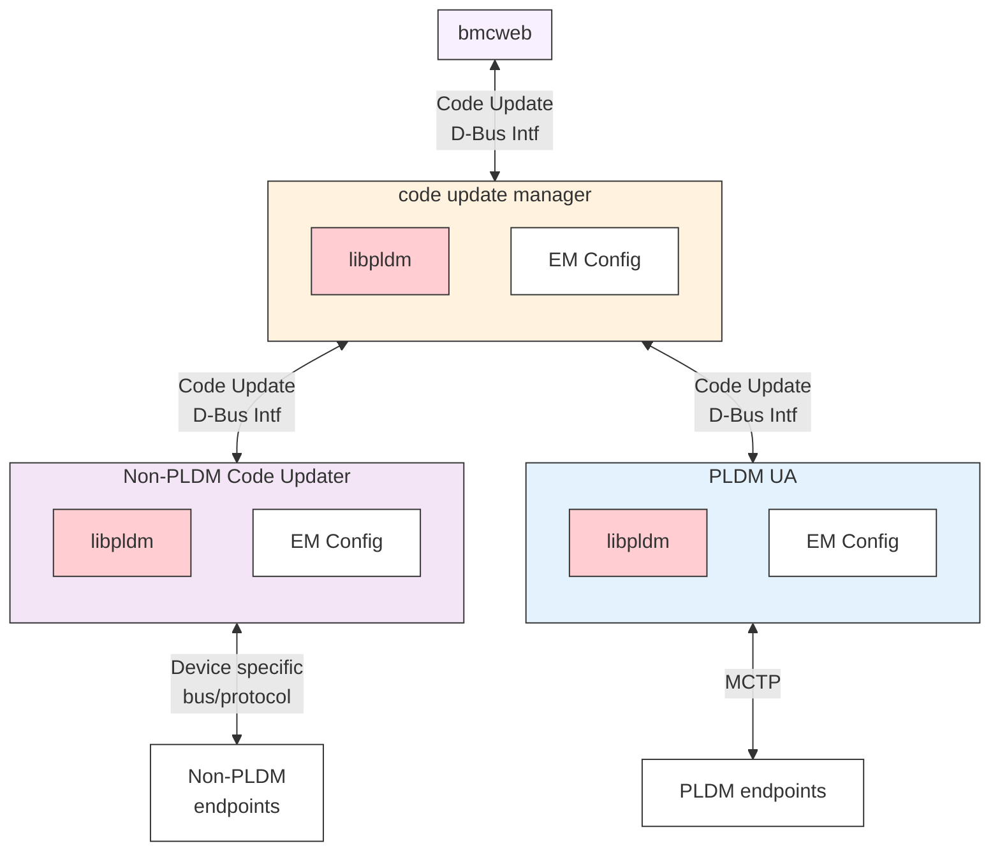

# Code Update Design Enhancements

Author: Tom Joseph

Created: 28th November 2024

## Problem Description

This section covers the limitations discovered with the current code update
design.

1. The existing code update update flow does not process a single PLDM package
   that contains a mixture of PLDM and Non-PLDM components. This shortcoming
   prevents from code updating a system with a unified package with diverse
   component types.

2. The current code update flow lacks orchestration capabilities essential for a
   reliable code update process.

- Verification and integrity check for the firmware package prior to code update
  process.
- Handle scenarios were parallel component update is not possible and platform
  specific configuration is needed to order the update of components.
- The flow does not account for pre-update and post-update operations associated
  with the individual devices. For example, device needs to be powered on before
  the code update.
- Disengaging global write protection before initiating code updates and
  re-engaging it afterwards.

3. The default behavior of the code update would be to update all the components
   in the PLDM package. This proposal adds capabilities to override the default
   behavior by using Targets to update specific components only and ForceUpdate
   flag to override optimisations like version check.

4. The current code update design keeps the images in the memory, this does not
   account for the case where memory is insufficient and will need alternate
   storage to keep the firmware package.

## Background and References

1. [PLDM for Firmware Update Specification](https://www.dmtf.org/sites/default/files/standards/documents/DSP0267_1.3.0.pdf)
2. [Redfish Firmware Update White Paper](https://www.dmtf.org/sites/default/files/standards/documents/DSP2062_1.0.0.pdf)
3. [Code Update Design](https://github.com/openbmc/docs/blob/master/designs/code-update.md)

## Requirements

1. The flow to handle code update of PLDM and Non-PLDM components packaged in a
   single PLDM firmware package:

- Able to add Targets to update specific components using the single PLDM
  firmware package.
- Able to use ForceUpdate to override checks and optimisations to do a force
  update

2. Design shall impose no restriction to choose any specific image format.

3. The design should be flexible to support parallel code update of devices. The
   goal should be to minimize code update time.

4. Redfish task for code update should indicate the following but not restricted
   to:

- List of components updated
- Update task on completion of Transfer, Verification and Apply Stages.
- Step needed for activating the image like power cycle, device reset etc.

5. Redfish task progress percentage should indicate the progress of the code
   update and progress percentage should be updated atleast every few minutes.

6. Able to update multiple hardware components of same type running different
   firmware images, for example, two instances of CPLDx residing on the board,
   one performing functionX and other performing functionY and hence running
   different firmware images.

## Proposed Design

The code update manager is a daemon running on the BMC that performs the
firmware update orchestration tasks and handles PLDM package containing
components for both PLDM and Non-PLDM devices. The design is not restricted to
only PLDM packaging format and can be extended in future to support other
packaging formats.

1. Parsing the package and verifying the integrity of the PLDM package.
2. code update manager to aggregate the progress across code updaters and PLDM
   daemon.
3. code update manager will implement D-Bus iterfaces for code update as
   decribed in D-Bus interfaces section, additionally it will implement the
   interface for code update manager.
4. code update manager is optional for code update if the additional tasks in
   the requirements needs to be performed.
5. The lifetime of the FW package is handled by bmcweb.
6. For design simplicity, code update manager does not support parallel update,
   when one FW package is handled by code update manager.

### Future Enhancements for code update manager

1. Handle sequencing of code updaters when parallel update is not possible.
2. Add capability to define specific actions at the start and end of the
   firmware update. (eg -power on/off the system)
3. Control capability for global write protect.

```mermaid
sequenceDiagram
  participant CL as RF Client
  participant BMCW as bmcweb
  participant MGR as Code update manager<br><br> ServiceName: xyz.openbmc_project.Software.Update.Manager
  participant UA as PLDM UA<br><br> ServiceName: xyz.openbmc_project.PLDM
  participant CU as <deviceX>CodeUpdater<br> ServiceName: xyz.openbmc_project.Software.<deviceX>

  par
    Note over MGR: Get device mapping info from EM config
    MGR ->> MGR: Obj Path: /xyz/openbmc_project/software/manager <br><br> Create Interface:<br><br> xyz.openbmc_project.Software.Update.Manager<br>xyz.openbmc_project.Software.Update<br>
  and
    Note over UA: Discover MCTP endpoints supporting PLDM T5
    Note over UA: Get additional information for devices from EM config
    UA ->> UA: Create Interface<br> xyz.openbmc_project.Software.Version<br> at /xyz/openbmc_project/software/<comp_id> <br><br>Create functional association <br> from Version to Inventory Item
    UA ->> UA: Obj Path: /xyz/openbmc_project/software/pldm <br><br> Create Interface:<br><br> xyz.openbmc_project.Software.Update
  and
    Note over CU: Get device access info from EM config
    CU ->> CU: Obj Path: /xyz/openbmc_project/software/swid <br><br> Create Interface:<br><br> xyz.openbmc_project.Software.Update<br>
    opt
      CU ->> CU: Create Interface<br> xyz.openbmc_project.Software.Version at <br> /xyz/openbmc_project/software/<DeviceName>_<Instance><br><br>
      CU ->> CU: Create functional association <br> from Version to Inventory Item
    end
  end

CL ->> BMCW: HTTP POST: /redfish/v1/UpdateService/update-multipart <br> (Targets, ApplyTime, ForceUpdate, Oem)
Note over BMCW: Stage the FW package<br> based on configured location
Note over BMCW: If any Service implements xyz.openbmc_project.Software.Update.Manager<br> StartUpdate(Image, ApplyTime, Targets, ForceUpdate)
BMCW ->> MGR: StartUpdate(Image, ApplyTime, Targets, ForceUpdate)
Note over MGR: ObjectPath = /xyz/openbmc_project/software/<SwId>
MGR ->> MGR: Create Interface<br>xyz.openbmc_project.Software.Activation<br> at ObjectPath with Status = NotReady
MGR -->> BMCW: {ObjectPath, Success}
MGR ->> MGR: << Delegate Update for asynchronous processing >>
par BMCWeb Processing
    BMCW ->> BMCW: Create Matcher<br>(PropertiesChanged,<br> xyz.openbmc_project.Software.Activation,<br> ObjectPath)
    BMCW ->> BMCW: Create Matcher<br>(PropertiesChanged,<br> xyz.openbmc_project.Software.ActivationProgress,<br> ObjectPath)
    BMCW ->> BMCW: new msg
    BMCW ->> BMCW: Create Task<br> to handle matcher notifications
    BMCW -->> CL: <TaskNum>
    loop
    BMCW --) BMCW: Process notifications<br> and update Task attributes
    CL ->> BMCW: /redfish/v1/TaskMonitor/<TaskNum>
    BMCW -->> CL: TaskStatus
    end
and << Asynchronous Update in Progress >>
    Note over MGR: Verification/Integrity check of the FW package
        break FW Package Verification FAILED
        MGR ->> MGR: Activation.Status = Invalid
        MGR --) BMCW: Notify Activation.Status change
        end
    MGR ->> MGR: Activation.Status = Ready
    MGR --) BMCW: Notify Activation.Status change
    Note over MGR: Map PLDM descriptors to Non-PLDM updaters based on EM config
    Note over MGR: PLDM and Non-PLDM updates started in parallel
    MGR ->> MGR: Create Interface<br>xyz.openbmc_project.Software.ActivationProgress<br> at ObjectPath
    MGR ->> MGR: Create Interface<br> xyz.openbmc_project.Software.ActivationBlocksTransition<br> at ObjectPath
    MGR ->> MGR: Activation.Status = Activating
    MGR --) BMCW: Notify Activation.Status change
    Note over MGR: Manager aggregates the overall progress and completion of the PLDM package
    loop
        MGR --) BMCW: Notify ActivationProgress.Progress change
    end
    par <PLDM update in parallel>
        MGR ->> UA: StartUpdate(Image, ApplyTime, Targets, ForceUpdate)
        Note over UA: ObjectPath = /xyz/openbmc_project/software/<SwId>
        UA ->> UA: Create Interface<br>xyz.openbmc_project.Software.Activation<br> at ObjectPath with Status = NotReady
        UA -->> MGR: {ObjectPath, Success}
        Note over UA: Match descriptors from PLDM devices to PLDM package
        UA ->> UA: Activation.Status = Ready
        UA --) MGR: Notify Activation.Status change
        UA ->> UA: Create Interface<br>xyz.openbmc_project.Software.ActivationProgress<br> at ObjectPath
        UA ->> UA: Activation.Status = Activating
        UA --) MGR: Notify Activation.Status change
        Note over UA: Start PLDM T5 standard based FW update
        loop
            UA --) MGR: Notify ActivationProgress.Progress change
        end
        Note over UA: Finish FW update
        UA ->> UA: Activation.Status = Active
        UA --) MGR: Notify Activation.Status change
    and <Non-PLDM updates in parallel>
        MGR ->> CU: StartUpdate(Image, ApplyTime, Targets, ForceUpdate)
        Note over CU: ObjectPath = /xyz/openbmc_project/software/<SwId>
        CU ->> CU: Create Interface<br>xyz.openbmc_project.Software.Activation<br> at ObjectPath with Status = NotReady
        CU -->> MGR: {ObjectPath, Success}
        Note over CU: Read component images using libpldm APIs
        CU ->> CU: Activation.Status = Ready
        CU --) MGR: Notify Activation.Status change
        CU ->> CU: Create Interface<br>xyz.openbmc_project.Software.ActivationProgress<br> at ObjectPath
        CU ->> CU: Activation.Status = Activating
        CU --) MGR: Notify Activation.Status change
        Note over CU: Start Update
        loop
            CU --) MGR: Notify ActivationProgress.Progress change
        end
        Note over CU: Finish FW update
        CU ->> CU: Activation.Status = Active
        CU --) MGR: Notify Activation.Status change
    end
    MGR ->> MGR: Activation.Status = Active
    MGR --) BMCW: Notify Activation.Status change
    MGR ->> MGR: Delete interface<br>xyz.openbmc_project.Software.ActivationBlocksTransition
end
```

## Proposed D-Bus Interface

| Interface Name                                                                                                                                                                                         | New/Modify |                                                                                Purpose                                                                                 |
| :----------------------------------------------------------------------------------------------------------------------------------------------------------------------------------------------------- | :--------- | :--------------------------------------------------------------------------------------------------------------------------------------------------------------------: |
| [xyz.openbmc_project.Software.Update](https://github.com/openbmc/phosphor-dbus-interfaces/blob/master/yaml/xyz/openbmc_project/Software/Update.interface.yaml)                                         | Modify     | Provides update method, modified to include   Targets, ForceUpdate to match [Redfish UpdateService](https://redfish.dmtf.org/schemas/v1/UpdateService.v1_14_1.json) |
| xyz.openbmc_project.Software.Manager                                                                                                                                                                   | New        |                                                            Provides identification for code update manager                                                             |
| [xyz.openbmc_project.Software.Version](https://github.com/openbmc/phosphor-dbus-interfaces/blob/master/yaml/xyz/openbmc_project/Software/Version.interface.yaml)                                       | Existing   |                                                                         Provides version info                                                                          |
| [xyz.openbmc_project.Software.Activation](https://github.com/openbmc/phosphor-dbus-interfaces/blob/master/yaml/xyz/openbmc_project/Software/Activation.interface.yaml)                                 | Existing   |                                                                       Provides activation status                                                                       |
| [xyz.openbmc_project.Software.ActivationProgress](https://github.com/openbmc/phosphor-dbus-interfaces/blob/master/yaml/xyz/openbmc_project/Software/ActivationProgress.interface.yaml)                 | Existing   |                                                                Provides activation progress percentage                                                                 |
| [xyz.openbmc_project.Software.ActivationBlocksTransition](https://github.com/openbmc/phosphor-dbus-interfaces/blob/master/yaml/xyz/openbmc_project/Software/ActivationBlocksTransition.interface.yaml) | Existing   |                                                  Signifies barrier for state transitions while update is in progress                                                   |

### Which repositories are expected to be modified to execute this design?

Requires changes in following repositories to incorporate the changes for this
enhancement.

| Repository                                                                  | Changes                                                         |
| :-------------------------------------------------------------------------- | :-------------------------------------------------------------- |
| [phosphor-bmc-code-mgmt](https://github.com/openbmc/phosphor-bmc-code-mgmt) | Add FW manager application                                      |
| [bmcweb](https://github.com/openbmc/bmcweb)                                 | Integrate changes to work with FW manager application           |
| [pldm](https://github.com/openbmc/pldm/tree/master/fw-update)               | Integrate changes to work with the code update D-Bus interfaces |

## Testing

### Unit Testing

All the functional testing of the reference implementation will be performed
using GTest.

### Integration Testing

The end to end integration testing involving Servers (for example BMCWeb) will
be covered using openbmc-test-automation.
