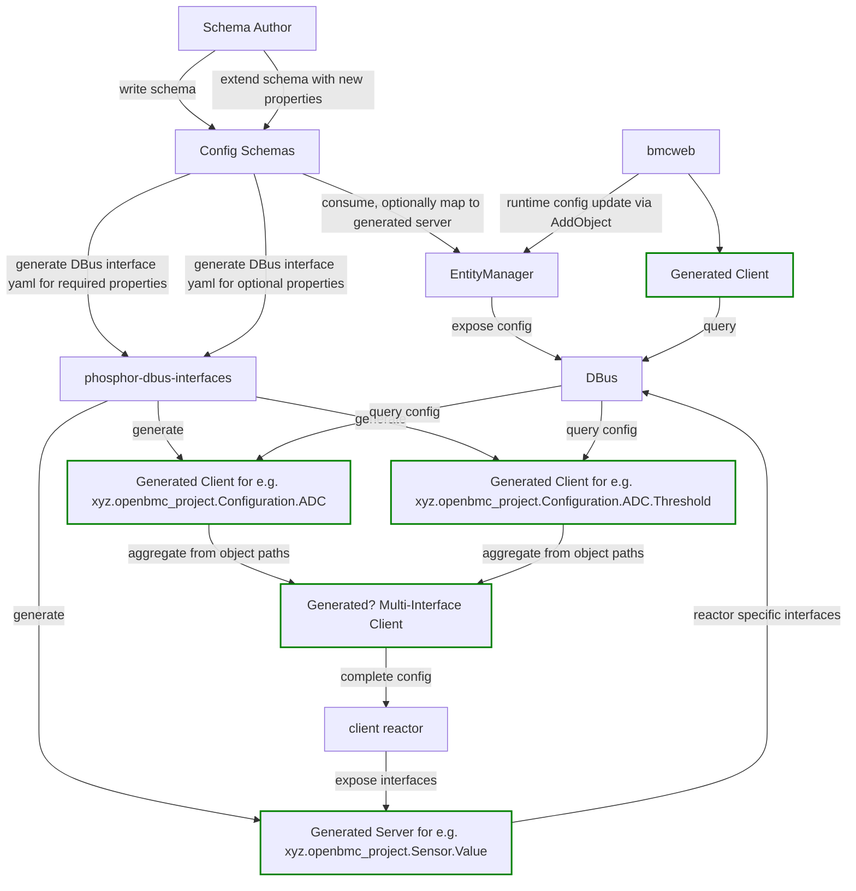

# PDI compatible configuration interfaces

Author: Alexander Hansen `alexander.hansen@9elements.com`

Other contributors: Various contributors, particularly EM maintainers, have
helped to consider tradeoffs, with significant time put into discussions. It
does not imply they endorse or support this design. See the
[discord channel](https://discordapp.com/channels/775381525260664832/1379890287614099638),
i am not sure if they would like to be named here. Let me know.

Created: September 1, 2025

## Problem Description

Entity-Manager (EM) is responsible for exposing system configuration discovered
from JSON files onto D-Bus. Historically, EM represented nested configuration
data in ways that are **not compatible** with phosphor-dbus-interfaces (PDI)
generated bindings and DBus design intent:

- **Interface explosion**: Arrays of objects generated interfaces lik
  `xyz.openbmc_project.Configuration.ADC.Thresholds0` `...Thresholds1`, etc... →
  unbounded interface names, impossible to model in PDI YAML.
  [example config](https://github.com/openbmc/entity-manager/blob/d3ec0661dda2d26f2268cc3aab23c354f261b699/configurations/gospower_g1136-1300wna_psu.json#L31)
- **Dropped properties**: Fields beyond a nesting depth were silently lost.
- **Type names embedded in interfaces**: e.g.
  `xyz.openbmc_project.Configuration.SPIFlash.FirmwareInfo` ,
  `xyz.openbmc_project.Configuration.${Type}.Threshold0` → no reuse across
  contexts
- **Breaks DBus design intent**: Typed information like a `Threshold` should map
  to a single DBus interface.

This prevented clients (in particular, those using sdbusplus with PDI-generated
bindings) from consuming EM configuration in a type-safe and stable way.

## Background and References

[DBus Specification](https://dbus.freedesktop.org/doc/dbus-specification.html)
[Lengthy discussions in discord channel](https://discordapp.com/channels/775381525260664832/1379890287614099638)
[varlink](https://varlink.org/)
[dbus-sensors (one of the more important EM clients)](https://github.com/openbmc/dbus-sensors/)
[phosphor-dbus-interfaces](https://github.com/openbmc/phosphor-dbus-interfaces/)
[gerrit change for implementation of this design](https://gerrit.openbmc.org/c/openbmc/entity-manager/+/79837)

## Requirements

sorted by subjectively perceived importance (feel free to suggest re-ordering)

1. Compliance with DBus design intent.
2. Represent nested objects and arrays of objects in a PDI-compatible way.
3. Use a finite set of DBus interfaces.
4. Reuse DBus interfaces across multiple records.
5. Solution should scale to an arbitrary depth of information to be represented.
6. Preserve backward compatibility with existing EM D-Bus layout.
7. Remain discoverable and human-browsable via D-Bus introspection tools.
8. Can be implemented over time, without heavy lifting.
9. Users should be able to add/remove/update configuration at runtime via e.g.
   redfish. Currently this is supported by `AddObject` API.
10. Support evolving and extending config schemas and DBus interfaces.
11. Provide visible error reporting for unsupported schema depths.

## Proposed Design (nested object paths)

### Summary

- **Nested objects** → nested DBus interfaces, same as before.
- **Arrays of objects** → child directories with numeric indices as nodes.
- **Primitive properties** stay on the parent object, same as before.
- **Arrays of primitive properties** stay on the parent object, same as before.

### Example 1: Firmware configuration

```json
{
  "Name": "MyRecord",
  "SPIControllerIndex": 1,
  "SPIDeviceIndex": 0,
  "FirmwareInfo": {
    "VendorIANA": 3733,
    "CompatibleHardware": "com.abcd.myboard.Host.SPI"
  },
  "MuxOutputs": [
    { "Name": "SPI_SEL_0", "Polarity": "High" },
    { "Name": "SPI_SEL_1", "Polarity": "Low" }
  ],
  "Type": "SPIFlash"
}
```

Old (still supported)

```text
Path: /xyz/openbmc_project/inventory/system/board/myboard/MyRecord
        Iface: xyz.openbmc_project.Configuration.SPIFlash.FirmwareInfo
        Iface: xyz.openbmc_project.Configuration.SPIFlash.MuxOutputs0
        Iface: xyz.openbmc_project.Configuration.SPIFlash.MuxOutputs1
```

New (preferred)

```text
Path: /xyz/openbmc_project/inventory/system/board/myboard/MyRecord
        Iface: xyz.openbmc_project.Configuration.SPIFlash.FirmwareInfo
Path: /xyz/openbmc_project/inventory/system/board/myboard/MyRecord/MuxOutputs/0
        Iface: xyz.openbmc_project.Configuration.SPIFlash.MuxOutput
Path: /xyz/openbmc_project/inventory/system/board/myboard/MyRecord/MuxOutputs/1
        Iface: xyz.openbmc_project.Configuration.SPIFlash.MuxOutput
```

### Example 2: ADC configuration

```json
{
  "CPURequired": 0,
  "EntityId": 19,
  "EntityInstance": 10,
  "Index": 28,
  "MaxValue": 2.4,
  "MinValue": 0,
  "Name": "S0_1V8_SOC",
  "PollRate": 15,
  "PowerState": "On",
  "ScaleFactor": 0.5,
  "Thresholds": [
    {
      "Direction": "greater than",
      "Name": "upper critical",
      "Severity": 1,
      "Value": 2.157
    },
    {
      "Direction": "greater than",
      "Name": "upper non critical",
      "Severity": 0,
      "Value": 2.062
    }
  ],
  "Type": "ADC"
}
```

Old (still supported)

```text
Path: /xyz/openbmc_project/inventory/system/board/myboard/S0_1V8_SOC
        Iface: xyz.openbmc_project.Configuration.ADC
        Iface: xyz.openbmc_project.Configuration.ADC.Thresholds0
        Iface: xyz.openbmc_project.Configuration.ADC.Thresholds1
```

New (preferred)

```text
Path: /xyz/openbmc_project/inventory/system/board/myboard/S0_1V8_SOC
        Iface: xyz.openbmc_project.Configuration.ADC
Path: /xyz/openbmc_project/inventory/system/board/myboard/S0_1V8_SOC/Thresholds/0
        Iface: xyz.openbmc_project.Configuration.ADC.Threshold
Path: /xyz/openbmc_project/inventory/system/board/myboard/S0_1V8_SOC/Thresholds/1
        Iface: xyz.openbmc_project.Configuration.ADC.Threshold
```

### Proposed Design: Pros

- PDI compatibility: finite set of reusable interfaces; generated code works.
- Discoverability: object tree mirrors structure; browsable with `busctl tree`.
- Granular changes: individual nested objects can emit property changes
  independently.
- Optional properties can be represented via extra DBus interfaces which may or
  may not be there. This is not part of the design but presents a possible
  extension.
- Backwards-compatible: clients relying on legacy flattened layout have a
  migration strategy. This design allows reactors to be migrated one at a time.
- Nested objects always get per-type interfaces as before, it is possible to add
  properties e.g. for Thresholds on a single config schema without affecting
  others.
- Updating the config schema can also be easily handled by using versioned DBus
  interfaces.

### Proposed Design: Cons

- More objects in the bus tree (slightly larger ObjectManager payloads).
- Consumers must traverse subtrees to find nested items.
- Extra code needs to be generated to represent use-cases previously handled by
  a single `InterfacesAdded` handler
- Need to migrate EM `AddObject` API for runtime configuration changes

## Proposed Design: Diagram

These steps are shown here to better illustrate how a complete workflow for
updating configuration schemas and consuming configuration interfaces might look
like.



## Alternatives Considered

Legend: y: yes, n: no, p: possible extension

| Name                       | DBus compat. | 1 object path | intf. re-use | easy configure | migration complexity | type-safe |
| -------------------------- | ------------ | ------------- | ------------ | -------------- | -------------------- | --------- |
| this design                | y            | n             | y            | y              | 2                    | y         |
| 1: status quo (flat intf)  | n            | y             | n            | y              | 0                    | n         |
| 2: json blob               | y            | y             | n            | y              | 3                    | n         |
| 3: property `a{sv}`        | y            | y             | n            | y              | 2                    | n         |
| 4. Typed Containers        | y            | y             | n            | y              | 2                    | y         |
| 5. Typed Containers arrray | y            | y             | y            | y              | 1                    | y         |
| 6. Typed Containers consis | y            | y             | n            | y              | 3                    | y         |
| 7. Hybrid                  | y            | n             | y            | n              | 3                    | y         |
| 8. Flat with Association   | y            | y             | y            | n              | 5                    | y         |
| 9. Fully nested obj paths  | y            | n             | n            | y              | 3                    | y         |

### 1. Status Quo (flattened interfaces)

- Arrays encoded as unique interfaces (`MuxOutputs0`, `MuxOutputs1`, …).
- Nested objects embedded in parent interface names.

### 1: Pros

- Flat, easy to `grep` in `busctl`
- Clients have fewer signals
- Configuration is compact
- It exists
- No changes to reactors required
- Supports single property update
- Supports user property update
- Supports user device creation via `AddObject` API

### 1: Cons

- Unbounded interface set breaks DBus design intent.
- Incompatible with PDI.
- Properties silently dropped at depth.
- Not type-safe as interface names, property names, andproperty types are
  hand-coded.
- Interfaces are inherently limited in the depth they can represent due to
  [DBus interface name length limitation](https://dbus.freedesktop.org/doc/dbus-specification.html#message-protocol-names-interface)
- Imprecise matching of interfaces
  [has already become a problem in upstream code](https://github.com/openbmc/dbus-sensors/blob/13b3cad1dca451e2c903035e524d77a5134e4376/src/Thresholds.cpp#L64)

### 1: Verdict

Hard to review reactor code, breaks DBus design intent, does not scale to more
deeply nested config, discarded.

### 2. Single “blob” property (JSON)

Keep one interface; expose the entire nested config as a string.

### 2: Pros

- Easy to implement.

### 2: Cons

- No granular property-changed signals
- Clients must parse JSON
- Clients must take on a JSON dependency
- Requires migrating all configuration interfaces
- Threshold changes now break user expectation that they can be changed without
  reinitting the sensor.

### 2: Verdict

Not type-safe, json parsing overhead, discarded

### 3. Single “blob” property (`a{sv}`)

Keep one interface; expose the entire nested config as a dict, possibly with
nested dicts.

### 3: Pros

- Minimal D-Bus footprint.

### 3: Cons

- No type safety
- No granular property-changed signals
- Clients must check for presence of any property
- Clients must check for type of any property
- Requires migrating all configuration interfaces

### 3: Verdict

Discarded (see
`https://lists.ozlabs.org/pipermail/openbmc/2023-January/032801.html` which goes
into detail as to why this is bad)

### 4. Explicit Typed Containers (structs/arrays)

- Use D-Bus container types (`(...)`, `a(...)`) for nested objects.
- Define reusable structs and enums in PDI YAML.
- Keep all config on the parent object path.
- Use a single D-Bus interface

yaml example:

```yaml
types:
  - name: FirmwareInfo
    type: struct
    members:
      - { name: VendorIANA, type: uint32 }
      - { name: CompatibleHardware, type: string }

  - name: MuxOutput
    type: struct
    members:
      - { name: Name, type: string }
      - { name: Polarity, type: enum[Low, High] }

interfaces:
  - name: xyz.openbmc_project.Configuration.SPIFlash
    properties:
      - { name: SPIControllerIndex, type: uint32 }
      - { name: SPIDeviceIndex, type: uint32 }
      - { name: FirmwareInfo, type: FirmwareInfo }
      - { name: MuxOutputs, type: array[MuxOutput] }
```

### Resulting D-Bus signatures

- `FirmwareInfo`: `(us)`
- `MuxOutputs`: `a(sy)`

Example for SPIFlash config:

```text
xyz.openbmc_project.Configuration.SPIFlash              interface -         -                                  -
.Name                                                   property  s         "HostSPIFlash"                     emits-change
.SPIControllerIndex                                     property  t         1                                  emits-change
.SPIDeviceIndex                                         property  t         0                                  emits-change
.FirmwareInfo                                           property  (us)      -                                  emits-change
.MuxOutputs                                             property  a(sy)     -                                  emits-change
.Type                                                   property  s         "SPIFlash"                         emits-change
```

Example for ADC config:

```text
xyz.openbmc_project.Configuration.ADC             interface -         -                -
.Index                                            property  t         10               emits-change
.Name                                             property  s         "VBAT_33"        emits-change
.PowerState                                       property  s         "Always"         emits-change
.ScaleFactor                                      property  d         0.3333           emits-change
.Type                                             property  s         "ADC"            emits-change
.Thresholds                                       property  a(ssdd)   ...              emits-change
```

### 4: Pros

- single object path
- easy to query in one shot.
- consistent, strongly typed
- compatible with DBus design intent
- PDI compatible
- schema changes can be done without any effect on other config schemas, since
  the DBus-interfaces are not re-used between config schemas.

### 4: Cons

- Any field change emits a change for the entire struct/array.
- Updating one element usually requires rewriting the entire array.
- ABI rigidity: adding struct members breaks signatures → need versioning
  strategies.
- Less discoverable with generic D-Bus tools.
- Less compatible with ObjectMapper, e.g. Thresholds (or other config) at depth
  cannot be queried via their DBus interfaces.
- Need for extra code to be developed to e.g. "Query all Thresholds" since DBus
  does not know what the anonymous struct represents.
- Inconsistency: top-level properties have property names, nested properties do
  not.
- Hard to add optional properties at depth, the property type needs to be
  changed for each instance of schema re-use.

### 4: Verdict

Technically viable, but less intuitive for browsing.

### 5. Explicit Typed Containers (only for objects in arrays)

Just like explicitly typed containers, but only for objects in arrays. Simply
nested objects still get nested DBus interfaces as before.

Example:

```text
xyz.openbmc_project.Configuration.SPIFlash              interface -         -                                  -
.Name                                                   property  s         "HostSPIFlash"                     emits-change
.SPIControllerIndex                                     property  t         1                                  emits-change
.SPIDeviceIndex                                         property  t         0                                  emits-change
.MuxOutputs                                             property  a(sy)     -                                  emits-change
.Type                                                   property  s         "SPIFlash"                         emits-change
xyz.openbmc_project.Configuration.SPIFlash.FirmwareInfo interface -         -                                  -
.CompatibleHardware                                     property  s         "com.tyan.Hardware.S8030.SPI.Host" emits-change
.VendorIANA                                             property  t         6653                               emits-change
```

### 5: Pros

- single object path
- minimal changes to reactors
- PDI-compatible
- type-safe

### 5: Cons

- inconsistency of representation between objects in arrays and simply nested
  objects

### 5: Verdict

Technically viable, minimal fix for the immediate issue.

### 6. Explicit Typed Containers (structs/arrays) made consistent

To fix the inconsistency with alternative 3 (top-level properties having names,
nested ones not having names) would require all config properties lose their
names and only having one property `Configuration` on
`xyz.openbmc_project.Configuration.${Type}` interface.

```text
xyz.openbmc_project.Configuration.ADC             interface -             -              -
.Configuration                                    property  tssda(ssdd)s  10             emits-change
```

### 6: Pros

- single object path
- consistent, strongly typed
- compatible with DBus design intent
- PDI compatible

### 6: Cons

- requires all configuration interfaces to be migrated
- bad developer experience, require new cli tools to recover the property names
  and display things for debug.

### 6: Verdict

Only useful as a thought experiment

### 7. Hybrid of Explicit Typed Containers (structs/arrays) and nested object paths

In this design every config schema must declare if it's to be exposed in a
compact way (inside a property value) or gets its own object path.

### 7: Pros

- Can have separate object paths on an as-needed basis (e.g. `Thresholds`) while
  data which may not need separate signals and properties changed signals can be
  compacted into typed containers (e.g. `FirmwareInfo`)

### 7: Cons

- Implementation overhead
- Slightly inconsistent
- This defeats the ability for EM to declare things that do not have a schema,
  which is an important part of the development cycle.

I am not seriously considering this design for now since it's twice the
implementation overhead of the two constituent designs.

### 8. Fully flat json schema, config objects linked via association

In this design alternative there is no nesting of json schemas, instead each
config schema gets new required properties `Id` and optionally `ParentNode` /
`ChildNodes`. The resulting DBus objects are not nested but instead get linked
together via `configuring`/`configured_by` association which represents the
child nodes adding additional configuration details. For array semantics, a
`Index` property or similar can be used.

#### 8: Example

```json
[
  {
    "Id": "spi0-flash0",
    "Name": "MyRecord",
    "Type": "SPIFlash",
    "SPIControllerIndex": 1,
    "SPIDeviceIndex": 0,
    "ChildNodes": [
      "spi0-flash0-fwinfo",
      "spi0-flash0-mux-0",
      "spi0-flash0-mux-1"
    ]
  },
  {
    "Id": "spi0-flash0-fwinfo",
    "Type": "FirmwareInfo",
    "ParentNode": "spi0-flash0",
    "VendorIANA": 3733,
    "CompatibleHardware": "com.abcd.myboard.Host.SPI"
  },
  {
    "Id": "spi0-flash0-mux-0",
    "Type": "MuxOutput",
    "ParentNode": "spi0-flash0",
    "Index": 0,
    "Name": "SPI_SEL_0",
    "Polarity": "High"
  },
  {
    "Id": "spi0-flash0-mux-1",
    "Type": "MuxOutput",
    "ParentNode": "spi0-flash0",
    "Index": 1,
    "Name": "SPI_SEL_1",
    "Polarity": "Low"
  }
]
```

### 8: Pros

- Extensible to map a child node to multiple parent notes (e.g. a Threshold
  which applies to multiple sensors, or a GPIO which is used by multiple
  daemons), enabling further re-use.

### 8: Cons

- Easy to get wrong since the `Id` has to match exactly.
- Hard to configure deeper structures, have to keep track of the `Id`
- Hard to review in gerrit since related config objects might be outside diff
  context
- Finding child nodes for configurations requires extra CLI tooling or verbose
  mapper calls to query the associations.
- Clients have to recursively query associations to get the full configuration
  record.
- Possibility to have dangling configuration records which do not link, creating
  error logs
- Bloating configuration files
- All existing nested objects have to be migrated in json config, creating huge
  diff.

### 8: Verdict

Technically viable, but painful to configure

### 9. Fully nested object paths

Objects nested inside arrays in configuration get their own object path. Objects
nested inside objects in configuration get their own object path.

So there are more object paths compared to `nested object paths` design.

Inside this design, there are alternatives about using
`xyz.openbmc_project.Configuration.FirmwareInfo` versus
`xyz.openbmc_project.Configuration.SPIFlash.FirmwareInfo` which is a tradeoff
between DBus interface re-use and ease of updating config schemas.

#### 9: Example

```json
{
  "Name": "MyRecord",
  "SPIControllerIndex": 1,
  "SPIDeviceIndex": 0,
  "FirmwareInfo": {
    "VendorIANA": 3733,
    "CompatibleHardware": "com.abcd.myboard.Host.SPI"
  },
  "MuxOutputs": [
    { "Name": "SPI_SEL_0", "Polarity": "High" },
    { "Name": "SPI_SEL_1", "Polarity": "Low" }
  ],
  "Type": "SPIFlash"
}
```

Result

```text
Path: /xyz/openbmc_project/inventory/system/board/myboard/MyRecord
        Iface: xyz.openbmc_project.Configuration.SPIFlash
Path: /xyz/openbmc_project/inventory/system/board/myboard/MyRecord/FirmwareInfo
        Iface: xyz.openbmc_project.Configuration.FirmwareInfo
Path: /xyz/openbmc_project/inventory/system/board/myboard/MyRecord/MuxOutputs/0
        Iface: xyz.openbmc_project.Configuration.MuxOutput
Path: /xyz/openbmc_project/inventory/system/board/myboard/MyRecord/MuxOutputs/1
        Iface: xyz.openbmc_project.Configuration.MuxOutput
```

### 9: Pros

- PDI compatible
- type-safe
- easily extends to arbitrary config depth

### 9: Cons

- lots of nested object paths
- client reactors need to fetch config in more complicated ways

### 9: Verdict

Viable alternative.

## Migration Strategy

### Migration Strategy: Required Approvals

For this effort to go anywhere, at last all of the following repos maintainers
have to approve the design:

- entity-manager (plumbing)
- phosphor-dbus-interfaces (where the yaml will go)
- phosphor-bmc-code-mgmt (initial migration)
- dbus-sensors (migration)
- bmcweb (runtime config updates)

### Migration Strategy: Plumbing

- Implement the plumbing in entity-manager to publish config as per the design.
- Implement script to generate PDI yaml from EM config schema.

### Migration Strategy: First example

- Generate PDI yaml for `phosphor-bmc-code-mgmt` config.
- Implement config fetching in `phosphor-bmc-code-mgmt` based on generated
  client.
- Flip the switch in EM to expose fw update config as per the design.
- `phosphor-bmc-code-mgmt` is now consuming the nested config as per the design.

### Migration Strategy: Runtime config updates

- Implement `AddObject2` or similar API for bmcweb to update config at runtime.
- When this item has to be done depends on which things bmcweb is capable to
  update using `AddObject`.

### Migration Strategy: Preventing reverse progress

- At this point, maintainers should configure newly developed config schemas to
  be exposed as per the design to avoid regression on migration progress.

### Migration Strategy: Rest of the code

- Implement `AddObject2` or similar API for bmcweb to update config at runtime.
- Migrate dbus-sensors to fetch nested config as per the design, either with
  generated client or hardcoding things.
- It is NOT strictly required to use PDI on the client side to make progress on
  the migration. Generated client can be introduced at a later stage.
- The design intent is not to force PDI on anyone's repo, but make it possible
  to use it.

### Migration Strategy: Completion

- All reactors are fetching nested config based on this design.
- Unused code is dropped from entity-manager.

### Migration Strategy: Future outlook

- Most reactors using PDI enables further abstractions.
- Lots of string literals disappear from the codebase.
- Entire classes of bugs disappear, like missing property, property type
  mismatch.
- Automatic signal processing eliminates boilerplate code.
- Code review becomes easier, less focus on DBus specifics.

## Impacts

The design has a _defined migration strategy_ and the migration can be done
_gradually_. There is no security impact. There is documentation impact, things
will look different in `busctl tree` output. There may be some minor performance
impact, it has not been investigated since we are talking about configuration
which does not usually change that frequently. For developers, there is a need
to learn different ways to consume and produce configuration.

### Organizational

- Does this proposal require a new repository?
  - No
- Who will be the initial maintainer(s) of this repository?
- Which repositories are expected to be modified to execute this design?
  - `entity-manager`, `dbus-sensors`, `phosphor-bmc-code-mgmt`, `bmcweb`,
    `phosphor-dbus-interfaces` and any other reactor which consumes or produces
    nested configuration.

## Testing

There are
[unit-tests](https://gerrit.openbmc.org/c/openbmc/entity-manager/+/82547/8) work
in progress for entity-manager.
