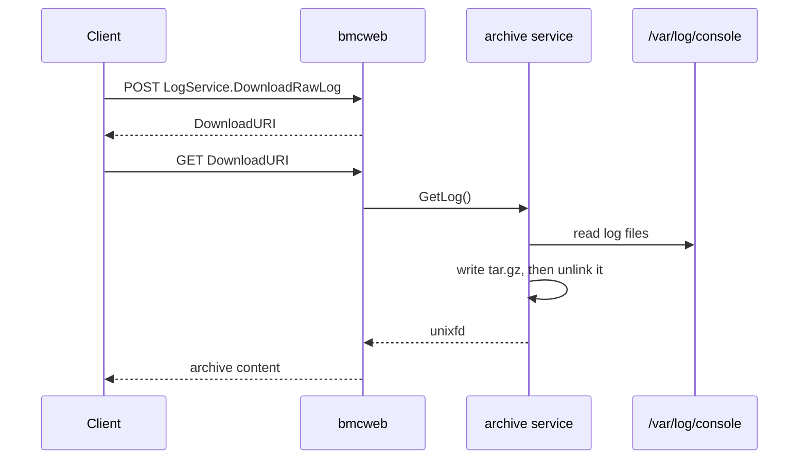

# Console Log Download

Author: Prithvi Pai

Created: October 2, 2026

## Problem Description

bmcweb exposes host console output through the Redfish `HostLogger` log service
as a collection of entries, one per line of console text. Retrieving a complete
console history that way means paging through the collection, with a Redfish
envelope around every line.

There is no way to download the console log files themselves. This design adds
one.

## Background and References

[obmc-console](https://github.com/openbmc/obmc-console) writes each console's
output to a log file. Machines place these under `/var/log/console`, which is
the directory bmcweb reads for the `HostLogger` entries.

The
[LogService v1.9.0 schema](https://redfish.dmtf.org/schemas/v1/LogService.v1_9_0.json)
exposes a `DownloadRawLog` action whose response, `DownloadRawLogResponse`,
carries a required `DownloadURI` property naming the location to download the
raw log from. The log is not returned in the action response itself.

## Requirements

- The BMC must provide a way to download the retained console logs in a single
  request.
- The archive must contain the log files as written, without reformatting or
  filtering them.
- Archives must be generated on demand. The BMC must not keep an archive after
  it has been downloaded, and must not accumulate archives that are never
  downloaded.
- Downloading must require at least the privilege needed to read console log
  entries.

## Proposed Design

[obmc-console](https://github.com/openbmc/obmc-console) gains a service that
collects the console log files into a compressed archive and returns it over
D-Bus. bmcweb advertises this as the Redfish `DownloadRawLog` action and serves
the content.

### D-Bus interface

`xyz.openbmc_project.Console.Archive` is served on
`/xyz/openbmc_project/console` and provides one method, `GetLog`, which takes no
arguments and returns a `unixfd` for a `tar.gz` of the console log files under
`/var/log/console`, the same files the `HostLogger` entries are read from. Some
of them are already compressed by log rotation. It reports `NoLogFilesFound`
when there are none, and the common file and internal failure errors otherwise.

The archive is unlinked before the method returns, so the descriptor sent to the
caller keeps it alive and the content is released when the caller closes it.

`GetLog` is called when the client fetches the download URI, not when the action
is invoked. Nothing is therefore held between the two requests, an archive that
is never downloaded is never built, and the BMC keeps no archive state. The
archive reflects the logs at the time of download rather than at the time the
action was invoked, which is sufficient here because the console log files are
append only.

The service runs as its own process rather than inside a console server.
`obmc-console` can be built to run one server instance per console, and in that
configuration no single server sees the log files of the others, so the archive
service cannot assume it is co-resident with every console.

### Redfish

bmcweb advertises `#LogService.DownloadRawLog` on the `HostLogger` log service
only when the `xyz.openbmc_project.Console.Archive` interface is present. The
action returns a `DownloadURI`, as the schema requires, and bmcweb serves the
archive at that location from the descriptor returned by `GetLog`.

`DownloadRawLog` was added in `LogService` 1.9.0, so the resource has to declare
at least that version. bmcweb currently reports the `HostLogger` log service as
`#LogService.v1_2_0.LogService` and needs to be moved forward.

Invoking the action follows the Redfish privilege registry, which requires
`ConfigureComponents` for a `POST` to a log service under a computer system.
Reading log entries requires only `Login`, so the action is not reachable by
every client that can read the same data through the entry collection.

## Alternatives Considered

- Having bmcweb build the archive itself. It already reads the same directory
  for the `HostLogger` entries, so no new D-Bus interface would be needed. Not
  chosen because it puts collection and compression of an unbounded amount of
  data in the web server.
- Returning the log content in the action response. The schema defines the
  response as a `DownloadURI`, so this would not conform.
- Following the dump pattern, where `xyz.openbmc_project.Dump.Entry` provides
  `GetFileHandle` and bmcweb serves the content from an attachment URI on a
  persistent entry resource. That shape suits a dump, which is a discrete
  artefact worth tracking and listing. Console logs are a continuously written
  file set with no natural entry to hang an archive from, and creating one would
  mean retaining archives on the BMC.

## Impacts

- The BMC collects and compresses the console logs when an archive is requested.
  The cost is proportional to the retained log volume and is incurred only on
  request.

### Organizational

The following repositories are involved in this feature:

- [obmc-console](https://github.com/openbmc/obmc-console) gains the archive
  service.
- [phosphor-dbus-interfaces](https://github.com/openbmc/phosphor-dbus-interfaces)
  gains the `xyz.openbmc_project.Console.Archive` interface.
- [bmcweb](https://github.com/openbmc/bmcweb) gains the `DownloadRawLog` action
  on the `HostLogger` log service.

## Testing

### Unit Test

- Archive generation with no log files, with one, and with several.
- Non-regular files and symbolic links are excluded.

### Integration Test

- `GET` the `HostLogger` log service and confirm the action is advertised only
  when the archive service is running.
- `POST` the action, follow the `DownloadURI`, and confirm the archive expands
  to the console log files on the system.
