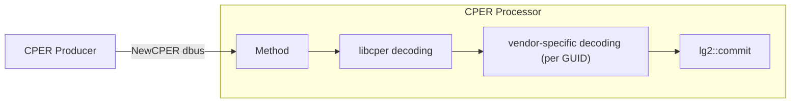

# CPER Event Logs

Author: [Patrick Williams][patrick-email] `<stwcx>`

Other Contributors:

- [Jayanth Othayoth][jayanth-email] `<Jayanth>`
- [Brad Bishop][brad-email] `<radsquirrel>`

[patrick-email]: mailto:patrick@stwcx.xyz
[jayanth-email]: mailto:ojayanth@gmail.com
[brad-email]: mailto:bradleyb@fuzziesquirrel.com

Created: 2026-08-10

## Problem Description

The industry standard [UEFI Specification][uefi-spec] defines a ["Common
Platform Error Record (CPER)"][cper-record-spec] as a standardized, uniform
format for capturing, describing, and reporting platform hardware errors. Many
hardware implementations, such as CPUs, GPUs, and NICs, are beginning to
generate CPERs. Platform owners expect to have access to these CPERs in order to
do system diagnostics and remediation.

OpenBMC took ownership of [`libcper`][libcper], which is a library for parsing
CPER binary data, and multiple companies are now contributing decoding of
additional (OEM) CPER sections. As mentioned in the [design
proposing][libcper-proposal] `libcper`, the scope of that proposal was narrow:

> While this design fits into a much more elaborate design... this document only
> requests the first step: creating a shared library implementation.

There have been a few recent attempts to extend the CPER capabilities of the
OpenBMC platform, but they have mostly been piece-meal enhancements. This
document proposes a complete end-to-end support for the CPER lifecycle: starting
from producer software, such as PLDM or vendor-specific support, through to
exposure via Redfish's standard [Event][redfish-event-ref] and
[LogEntry][redfish-logentry-ref] schemas.

## Background and References

### Overall Flow

The following ("...") is what this proposal is attempting to solve:


### Prior Art in OpenBMC

There have been numerous previous attempts to implement some amount of CPER
support. The vast majority of these have gone unmerged and do not present a
cohesive end-to-end design. The only one that has been merged is some support in
`pldm` for placing raw files into a specific directory (`/var/cper`) and OpenBMC
has no support for consuming it further.

- [AMD BMC RAS][amd-bmc-ras] design proposal.
- [CPER Repository][cper-repository] design proposal.
- [Arm CPER decoding][arm-cper-decode] in `bmcweb`.
- [FaultLog Attachment][fault-log-attachment] in `bmcweb`.
- Proposed CPER implementation in [`phosphor-debug-collector`][cper-pdc] and
  [`bmcweb`][cper-pdc-bmcweb].
- Raw CPER files in [`pldm`][cper-pldm].

[amd-bmc-ras]: https://gerrit.openbmc.org/c/openbmc/docs/+/68440
[arm-cper-decode]: https://gerrit.openbmc.org/c/openbmc/bmcweb/+/92341
[cper-pdc-bmcweb]: https://gerrit.openbmc.org/c/openbmc/bmcweb/+/55839
[cper-pdc]:
  https://gerrit.openbmc.org/c/openbmc/phosphor-debug-collector/+/55934
[cper-pldm]: https://gerrit.openbmc.org/c/openbmc/pldm/+/74490
[cper-repository]: https://gerrit.openbmc.org/c/openbmc/docs/+/83766
[fault-log-attachment]: https://gerrit.openbmc.org/c/openbmc/bmcweb/+/91085

### CPER Content

A Redfish LogEntry or Event can contain a `"CPER"` property which could have
data as represented below. There is very little "standard" data, as currently
documented by Redfish, so much of the data is left to implementations (in the
Oem property). The content below is contrived but conforming.

```jsonc
{
  "CPER": {
    "NotificationType": "039b42ef-be02-4d20-9c23-64714e17ea4d",
    "SectionType": "9876eead-de3c-4eaa-919d-cc614131d6d1",
    "Oem": {
      "ContosoElectronics": {
        "@odata.type": "#ContosoLogEntryExtensions.v1_0_0.CperFields",
        "ProcessorId": 0,
        "ErrorType": "CacheError",
        "PhysicalAddress": "0x00000000FED00000",
        "ValidationBits": "0x0000000000000007",
      },
    },
  },
}
```

Within OpenBMC, `libcper` is available for parsing CPER binary data and does
generate a [JSON output][libcper-output] but the structure is not aligned with
Redfish and would need to be transformed. This will likely require `libcper` or
OpenBMC OEM odata schemas to be defined.

[libcper-output]: https://github.com/openbmc/libcper/tree/main/examples

There are seemingly some differing opinions on the purpose of a CPER because in
many regards a CPER is just a packaging format for hardware data. In the current
`libcper` all examples are small (order 1KiB), but there were some [proposed
vendor GUIDs][large-cper-example] which are still unmerged that would have had
sections having tens of thousands of registers.

In the scope of this design we are differentiating between "small" and "large"
CPERs. Small CPERs (under 16KiB) are expected to be mostly well-understood error
reports by hardware that can be used directly for repair and remediation of a
failing system. Large CPERs (16KiB or more) are expected to be mostly unknown
errors that need a hardware vendor's support for further analysis. Large CPERs
should be treated in the same way that traditional "crashdump" support might be,
even though CPER is used as the packaging format, and should use
phosphor-debug-collector mechanics. Small CPERs are the target of this document.

[large-cper-example]:
  https://gerrit.openbmc.org/c/openbmc/libcper/+/75550/1/edk/Cper.h

### Proprietary Content

It is harder to provide justifying data, but there should be recognition that
not all hardware vendors are contributing to the `libcper` code base. Currently,
only three chip vendors, all with Arm hardware, are active contributors. AMD
[wrote][amd-bmc-ras] about CPER support in their proposal but have not
contributed. It is also highly probable that chip vendors would only contribute
support in `libcper` after their chips are generally available (if ever).
Restricting CPER support to only chips which have been contributed to `libcper`
puts significant burden on system integrators to maintain patches to `libcper`
and/or some amount of the OpenBMC software stack in order to get reliable error
reporting from the chips in their system.

CPER already has a mechanism to allow chip vendors to define chip-specific
sections in CPER: vendor GUIDs. This proposal will suggest providing first-class
support for vendor GUIDs in the OpenBMC stack in the same vein that we support
OEM commands for IPMI and/or PLDM. This encourages overall use of the OpenBMC
stack for diagnostics while providing an escape-hatch for vendors and system
integrators that are unable to solve the non-technical elements of open-sourcing
all details of their chip diagnostics.

The summary here is that a pragmatic decision to support a well-defined API for
closed-source vendor GUID support is argued to be more beneficial to the OpenBMC
community than trying to force upstream contributions for all chip vendors.

## Requirements

- Provide an end-to-end framework for saving CPERs within the BMC, decoding them
  into a consistent format, exposing them through Redfish, and reporting them
  through both push (Redfish Event) and pull (Redfish LogEntry) mechanics.
  - Specifically handling "small" CPERs of under 16KiB.

- Provide a mechanism for a CPER provider (such as PLDM) to collect a CPER from
  a hardware or satellite management controller and add it to the BMC's saved
  CPER records.

- Leverage `libcper` for processing of CPER binary data for common and/or
  supported GUIDs.
- Allow a vendor to supply alternative processing of CPER binary data for
  specified Vendor GUIDs.

- Redfish representations must conform to all Redfish specifications and have a
  MessageId from a valid Redfish message registry.
- Redfish representations must have a way to collect raw CPER binary data in
  addition to parsed CPER data. See the "CPER" property and the
  [requirements][redfish-logentry-cper-ref] on "AdditionalDataURI".

- The implementation must have reasonable performance characteristics in a
  similar vein as existing LogService and Event implementations(\*).

(\*) Specific performance metrics are purposefully precluded here. The primary
focus is on establishing functionality due to the present need. The design
sections will have discussions on specific optimizations that can and should be
pursued but an implementation the primary contributors deem as "good enough"
should be taken with "first mover" status and can be later optimized by such
interested parties in the future.

## Proposed Design

### High Level

The proposed solution consists of a new CPER processing daemon, an enhancement
to `phosphor-logging`, and some straight-forward changes to `bmcweb`.


We will be using existing events hosted by `phosphor-logging`, coupled with a
CPER extension, in order to leverage the existing support in `bmcweb` for
creating LogEntry and Event instances that will hold the CPER data. Since these
are existing events already supported by `phosphor-logging` it will ensure
conformance with Redfish specifications and MessageId requirements. Similarly it
will naturally have similar performance characteristics to BMC event logs, which
can already scale to holding thousands of events.

### Event Extensions

A recent improvement to the event logging design was the addition of [Event
Extensions][event-extensions-design]. Any existing event, which is already
correlated to Redfish Message Registry entries, can now be "extended" with
additional data from a dbus-interface. The design shows a simple API for this:

```cpp
    lg2::commit(PlatformError(...).extend(CPER::properties_t{...}));
```

When fully implemented in `phosphor-logging`, any dbus-interface can be used as
an extension to any event (supposing it is an interface supported as an
extension by `phosphor-logging`), which lends perfectly towards adding data such
as CPER content to an existing event. There are proposed two new dbus
interfaces:

- [`xyz.openbmc_project.Logging.Extension.CPERProcessed`][cperprocessed-gerrit]
- [`xyz.openbmc_project.Logging.Extension.CPERRaw`][cperraw-gerrit]

[cperprocessed-gerrit]:
  https://gerrit.openbmc.org/c/openbmc/phosphor-dbus-interfaces/+/90789
[cperraw-gerrit]:
  https://gerrit.openbmc.org/c/openbmc/phosphor-dbus-interfaces/+/93868
[event-extensions-design]:
  https://github.com/openbmc/docs/blob/master/designs/event-logging.md#event-extensions

### CPERProcessed

The "Processed" interface will contain the properties for the Redfish
`NotificationType`, `SectionType`, and `Oem` fields within the Redfish
`LogEntry`/`Event` representation. The proposal is for the `Oem` field to
contain a `dict[string, string]` where the key will represent a Vendor and the
string will be a Redfish-compliant JSON object (including an `@odata.type`
reference), allowing any "standard" or vendor-specific data to be presented in
the `CPER.Oem` field without extra support from `bmcweb`.

While we typically do not store protocol-specific data in dbus, the alternative
here is for the data to be in a "neutral format" and force `bmcweb` to perform
translation. This feels like extra complexity when the primary consumer is
Redfish and a "neutral format" leads to a natural coupling between `bmcweb` and
vendor-specific CPER content. If at a future time a new format is presented
(such as a protocol after Redfish) it is hoped that the effort to transform to
that new format would be straight-forward or else a new API could be determined
at that time. The roadmap for that work is likely far into the future.

### CPERRaw

The "Raw" interface will contain a byte-array of the raw CPER binary data. This
data will also be extended into the original source event and hosted by
`phosphor-logging`, enabling `bmcweb` to obtain the content for an
AdditionalDataURI on a CPER.

There might be concern about dbus supporting large arrays, but the specification
says:

> Arrays have a maximum length defined to be 2 to the 26th power or [64 MiB]...

All implementations of dbus broker and sd-bus seem to support this length. We
may find that storing large arrays is a constraint on dbus interfaces like
`org.freedesktop.DBus.Properties.GetAll` and as an optimization we may also
define an interface `GetCPERRaw` which can be hosted by `phosphor-logging`
instead of `CPERRaw` containing a method to get the array data via a
`memfd`-backed file descriptor.

Some important considerations around performance:

1. Event creation is a single and relatively infrequent operation. We are not
   expecting to support systems creating thousands of CPER records per second
   because this would quickly overfill the event log anyhow.

2. Event reading through Redfish is possibly frequent as some clients may read
   all event logs at specified time intervals.

With this in mind, the initial focus of optimization should be on (2) and not
(1).

### `phosphor-logging` Database

Recent work was done in `phosphor-logging` to move from Cereal to
`nlohmann::json` for serialization of the `phosphor-logging` file-based database
and Cereal support is being deprecated. Adding support for extensions should be
as straight-forward as adding a new `extensions` key to the JSON object.

It is estimated that the storage space required for CPER data is on the order of
1MiB in common implementations. Supposing we support 16k events in
`phosphor-logging` each with 16KiB of CPER data, we would need 256MiB of storage
space. This is certainly not feasible for any NOR-based BMC. A more realistic
expectation is a low percentage of events having CPER data, most of which are on
the order of 1KiB (based on examples in the CPER repository), leading to 1MiB of
storage space required (1k events at 1KiB). Systems needing more storage than
this would be encouraged to look to alternative storage like eMMC or UFS, both
of which are supported by BMC chip vendors and have working examples in the
OpenBMC codebase.

### CPER Processor

An important element of this proposal is a manner for consistent translation
from CPER binary data to Redfish CPER properties, including support for Vendor
GUIDs and Vendor fields in the `CPER.Oem` property. It is proposed that a new
daemon, `phosphor-cper-processor` is developed and its code resides in the
`phosphor-logging` repository (but we are open to other directions). This daemon
will heavily lean on `libcper` for parsing of CPERs, especially for generating
content for standard CPER headers and standard-specified GUIDs but also for any
GUIDs which have had support contributed.

The daemon will also have an API for vendor-proprietary CPER processing. These
will be structured similar to how we handle IPMI commands: a library provided by
the vendor in a well-known location will be `dlopen`. This will allow vendors to
provide proprietary routines for generating additional Oem fields within the
CPER.

The duties of this daemon are essentially a simple pipeline structured as
follows:



The CPER processor must support both full CPERs and individual CPER sections. In
some cases a provider, such as PLDM, may only have a single CPER section, while
in other cases it may have a full CPER. Both cases should be processed and
turned into an appropriate event.

- [`xyz.openbmc_project.Logging.CPER.Processor`][cperprocessor-gerrit]

[cperprocessor-gerrit]:
  https://gerrit.openbmc.org/c/openbmc/phosphor-dbus-interfaces/+/93484

### Redfish Compliance

The majority of this proposal leverages existing implementations in bmcweb which
are already known to be compliant with Redfish specifications. The only parts
that are expected to be new are around CPER data itself. A critical element of
this support is the required `@odata.type` fields and corresponding schemas for
any OEM property.

We have two different types of OEM fields:

1. Fields generated from libcper output.
2. Fields generated by vendors.

For (1), we should write schema JSON and CSDL in the `OpenBMC_CPER` namespace
for any section transformations performed by the CPER processor from `libcper`
output. In effect, we will define an OpenBMC-oriented and controlled set of
schemas as there are no current schemas from other organizations. If, in the
future, an organization such as DMTF or OCP were to publish an alternative
schema we would migrate to it. Considering that OpenBMC controls the `libcper`
repository and it is the de-facto implementation of CPER processing, also
providing a schema for that content is not unreasonable.

For (2), vendors should similarly provide JSON/CSDL for their custom GUID
transforms. It would be encouraged to use the [Redfish Schema
Creator][rf-schema-creator] tool for this purpose.

Both (1) and (2) must install their schema files into the well-known location
used by `bmcweb` to serve the content of these schemas.

To reiterate, a vendor-specific GUID is handled by:

- `phosphor-cper-processor` providing an API to register a set of known GUIDs
  handled by a library.
- A vendor installing their library into a well-known location and providing an
  implementation to register specific GUIDs with the CPER processor.
- The vendor installing schema files into a well-known location used by bmcweb
  for serving to Redfish clients.

[rf-schema-creator]: https://github.com/DMTF/Redfish-Schema-Creator

### `bmcweb`

There are two areas of change for `bmcweb`.

1. Adding CPER properties to existing LogEntry and Event interfaces.
2. Exposing the raw CPER data.

#### Adding CPER Properties

Since `phosphor-logging` is adding a new optional interface for `CPERProcessed`
and that interface will contain all of the data for the CPER property, adding
support is relatively straight-forward. `bmcweb` will query for the optional
interface for any `phosphor-logging`-hosted event and take those properties
as-is and populate them into the Redfish JSON payload. It is specified that no
additional processing is required on the data by `bmcweb` (i.e. the data is in
"Redfish native" format on dbus).

#### Exposing Raw CPER

There is one challenge in specification between the existing implementation and
the raw CPER data. The Redfish specification requires that if we use a
`DiagnosticDataType` as `CPER` or `CPERSection` then `AdditionalDataURI` should
contain a pointer to the raw CPER data. In the `phosphor-logging`
implementation, this `AdditionalDataURI` is already used for the raw BMC event
from the `phosphor-logging` file system and we should not take away this
functionality. Instead, we will keep the `DiagnosticDataType` as `OEM` and the
`AdditionalDataURI` will continue to be the raw `phosphor-logging` entry.

We propose a new `LogService` exclusively to hold the raw CPER data but not the
processed CPER data. If a client needs the raw data, it can follow an OData link
between the `LogEntry` created by the `phosphor-logging` data and the `LogEntry`
in this new `LogService` representing the raw CPER data. Only in that URI will
the `DiagnosticDataType` be `CPER` or `CPERSection` and the `AdditionalDataURI`
contain the raw CPER binary.

`bmcweb` will be able to populate these new `LogService` entries from the
`CPERRaw` (or `GetCPERRaw`) interface in a straight-forward manner.

### `phosphor-logging` Optimizations

#### Log Creation

Logs created by the CPER processing daemon will likely be large compared to the
existing event logs, but even the current event logs have a non-trivial amount
of key-value content passed via the `Logging.Create`'s `AdditionalData`
parameter. We will explore an alternative `Create` method that simply takes all
data as a `memfd`-backed `unixfd` to limit the data flowing through the
dbus-broker. We may shift the entire `lg2::commit` infrastructure to use this
interface if it shows performance improvement.

Since log creation is a lower-frequency operation, this optimization is lower
priority than the base implementation.

#### Raw CPER Exposure

Hosting a `CPERRaw` interface with a large byte-array property is likely to
cause performance issues for regular dbus operations such as
`org.freedesktop.DBus.Properties.GetAll`. We plan to implement special behavior
in `phosphor-logging` to expose a `GetCPERRaw` interface instead which will
allow consumers, such as `bmcweb`, to get the raw CPER data from a `unixfd`
instead of hosting it on a property and passing it through the dbus-broker.

#### Entry Cache

The `Logging.Entry.GetEntry` method currently opens the file backing the entry
and passes the `unixfd` back over dbus to the method caller. This has the
potential of delaying the VFS cache miss until the consumer (often `bmcweb`)
accesses the file contents. We will explore, for both the `Entry` and the
`GetCPERRaw` interface, providing an always-ready `memfd` backed cache file of
the content. This uses the performance penalty of reading the files at daemon
start-up, which needs to be done anyhow, as the point to populate the cache to
reduce Redfish response times.

## Alternatives Considered

### Separate CPER repository

One prior art proposal was to create an entirely separate repository for CPER
content similar to what is done for crashdump support in
`phosphor-debug-collector`. There are a few disadvantages to this approach:

- It bifurcates client access to diagnostic events: one for BMC reported events
  and one for "hardware" reported events. A Redfish client must be aware of and
  interact with two separate `LogServices`.

- There is currently no support for push-events in that implementation and
  implementing it would entail an entirely distinct implementation in `bmcweb`.

- This would not reuse the existing infrastructure for the Redfish Message
  Registry side of the implementation. CPER errors would not easily be
  attributable to already defined Redfish `MessageId`. Considering that DSP2065
  v2025.3 added a number of hardware-oriented events, such as
  `Platform.MemoryContainedError` and `Platform.PCIeLinkDown`, and future
  versions likely will contain new hardware errors, this seems like a critical
  miss.

### bmcweb single LogService

Another alternative is to have `bmcweb` drop the current `AdditionalDataURI`
behavior and switch to have that point to the raw CPER binary (when it exists).
This approach has a high probability of breaking existing clients that might be
dependent on the current behavior. There is some non-Redfish data in a full
`phosphor-logging` JSON that can only be obtained this way.

### bmcweb dedicated LogService for CPERs

Another alternative is to have `bmcweb` expose a separate `LogService` for CPERs
from existing BMC events even if they are served by a single `phosphor-logging`
queue. As an example, suppose we have event log 1 (BMC-reported) and event log 2
(CPER). In this suggested alternative, event log 1 would only be in the existing
`/redfish/v1/Managers/bmc/LogServices/EventLog/Entries/1` path but event log 2
might be in `/redfish/v1/Managers/bmc/LogServices/CPERLog/Entries/2`.

This requires additional work on `bmcweb` for filtering for little benefit and
has similar disadvantages to the "Separate CPER repository" proposal except that
the event infrastructure would be reused for `MessageId` support.

### Neutral format CPER content

One element of this proposal is that the CPER processing application is expected
to create Redfish-compliant JSON content and host it on dbus. An alternative
would be to have it host a "neutral format" of some sort. This would push
formatting into Redfish format into `bmcweb` and would make it more challenging
to support vendor-specific content. By keeping to a Redfish format, we can allow
vendor-specific CPER processing to provide vendor-specific CPER content without
any additional support from `bmcweb`.

## Impacts

- New dbus interfaces for CPER representation.
- New daemon for CPER processing.
- Support in `phosphor-logging` for storing CPER event-extensions.
- Support in `bmcweb` for the parsed and raw CPER representations.
- An estimated 1MiB of storage consumption for typical use-cases to hold CPER
  data.

## Organizational

- **Does this repository require a new repository?**
  - No (unless CPER processing belongs outside of phosphor-logging).
- **Who will be the initial maintainer(s) of this repository?**
  - N/A
- **Which repositories are expected to be modified to execute this design?**
  - libcper
  - phosphor-logging
  - bmcweb
  - Any CPER producer.

## Testing

- The new support in `phosphor-logging` and the CPER processing will have
  sufficient unit tests.

- The CPER processing support will include a build-time check using the "DMTF
  JSON Schema Response Validator" to validate the installed OEM schemas.

- Redfish compliance testing will be done on any `bmcweb` modifications.

- Principal contributors will run a full end-to-end test after integration.

- Principal contributors may add `openbmc-test-automation` tests for mocked CPER
  content.

[cper-record-spec]:
  https://uefi.org/specs/UEFI/2.11/Apx_N_Common_Platform_Error_Record.html
[libcper]: https://github.com/openbmc/libcper
[libcper-proposal]:
  https://github.com/openbmc/docs/blob/master/designs/cper-records.md
[redfish-event-ref]:
  https://github.com/openbmc/bmcweb/blob/7ca710793f5949eeaada46f5dcfafbb47757fb47/redfish-core/schema/dmtf/json-schema/Event.v1_13_0.json#L35
[redfish-logentry-ref]:
  https://github.com/openbmc/bmcweb/blob/7ca710793f5949eeaada46f5dcfafbb47757fb47/redfish-core/schema/dmtf/json-schema/LogEntry.v1_21_0.json#L35
[redfish-logentry-cper-ref]:
  https://github.com/openbmc/bmcweb/blob/7ca710793f5949eeaada46f5dcfafbb47757fb47/redfish-core/schema/dmtf/json-schema/LogEntry.v1_21_0.json#L194
[uefi-spec]: https://uefi.org/specifications
