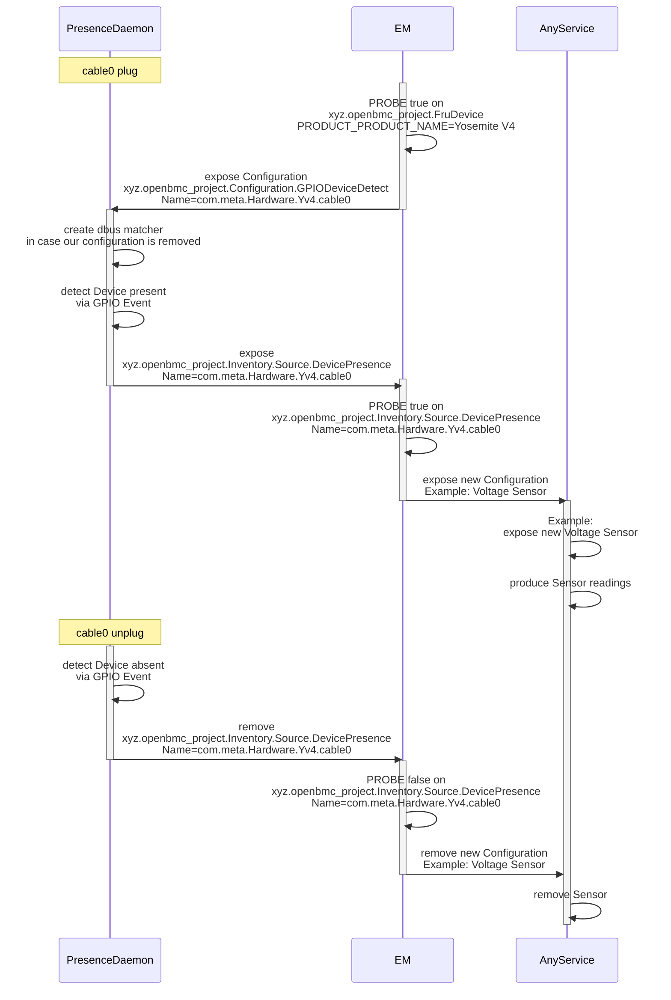

# GPIO based hardware inventory

Author: Alexander Hansen <alexander.hansen@9elements.com>

Other contributors: Chu Lin <linchuyuan@google.com> (through their previous
works), Amithash Prasad <amithash@meta.com>

Created: August 26, 2024

Reference:
[Chu Lin's gpio based cable presence detection](https://github.com/openbmc/docs/blob/46902afd6ebd20d1148379df99fe2c0c591f56ba/designs/gpio-based-cable-presence.md)

## Problem Description

Due to increasing complexity of server designs and different configurations of
the same system being possible, there is a need for a simple way to detect the
presence of cards, cables and other connected entities which may or may not be
plugged into a system. A subset of these entities support presence detection via
gpios. This design focuses on those.

Connected entities detectable via other means are out of scope of this design.

## Background and References

The existing design for the gpio based cable presence is partially implemented
and focuses on IPMI use-case.

[existing design by Chu Lin](https://github.com/openbmc/docs/blob/879601d92becfa1dbc082f487abfb5e0151a5091/designs/gpio-based-cable-presence.md)

Currently the way to do gpio based presence detection is via
phosphor-multi-gpio-presence and phosphor-inventory-manager.

The static inventory is declared and the inventory items are exposed at runtime
by phosphor-inventory-manager.

The presence daemon then toggles the 'Present' property on dbus interface
xyz.openbmc_project.Inventory.Item.

Additional item-specific properties are statically declared in the
phosphor-inventory-manager configuration.

An example of how this is currently done:

[presence daemon config](https://github.com/openbmc/openbmc/blob/1d438f68277cdb37e8062ae298402e9685882acb/meta-ibm/meta-sbp1/recipes-phosphor/gpio/phosphor-gpio-monitor/phosphor-multi-gpio-presence.json)

[phosphor-inventory-manager config](https://github.com/openbmc/openbmc/blob/1d438f68277cdb37e8062ae298402e9685882acb/meta-ibm/meta-sbp1/recipes-phosphor/inventory/static-inventory/static-inventory.yaml)

In the example we have inventory item **dimm_c0a1** which has following
phosphor-multi-gpio-presence configuration:

```json
{
  "Name": "DIMM_C0A1",
  "LineName": "PLUG_DETECT_DIMM_C0A1",
  "ActiveLow": true,
  "Bias": "PULL_UP",
  "Inventory": "/system/chassis/motherboard/dimm_c0a1"
}
```

and phosphor-inventory-manager configuration:

```yaml
- name: Add DIMMs
  description: >
    Add the DIMM inventory path.
  type: startup
  actions:
    - name: createObjects
      objs:
        /system/chassis/motherboard/dimm_c0a1:
          xyz.openbmc_project.Inventory.Decorator.Replaceable:
            FieldReplaceable:
              value: true
              type: boolean
          xyz.openbmc_project.State.Decorator.OperationalStatus:
            Functional:
              value: true
              type: boolean
          xyz.openbmc_project.Inventory.Item:
            PrettyName:
              value: "DIMM C0A1"
              type: string
            Present:
              value: false
              type: boolean
          xyz.openbmc_project.Inventory.Item.Dimm:
          xyz.openbmc_project.Inventory.Decorator.LocationCode:
            LocationCode:
              value: "CPU0_DIMM_A1"
              type: string
```

## Requirements

- Support the gpio based detection of inventory items without static
  configuration

- Allow configuration of the detectable inventory items through entity-manager
  configuration

  - e.g. cable
  - e.g. fan board
  - e.g. daughter board
  - entity-manager should expose all required Inventory interfaces
  - the properties for these inventory interfaces can be obtained through the
    exposes record in the json configuration

- When a device is detected as present using the GPIO configuration published by
  entity-manager, its probe match data is published to D-Bus, which triggers
  entity-manager to publish the associated configuration.

- Support for re-use of presence information in PROBE statements
  - detecting one entity as 'Present' should enable detecting other entities
    based on that info

## Proposed Design

The proposed design is to create a new daemon in the entity-manager repository,
which is 'gpio-presence-sensor'.

It can be inspired by implementations found in downstream forks such as the
[NVIDIA gpio presence sensor implementation](https://github.com/NVIDIA/dbus-sensors/blob/889abc1c9bfae9395690d1562f3e08453dfa12ba/src/GPIOPresenceSensorMain.cpp)

### Diagram



### Forward flow summary

- EM exposes configuration for 'gpio-presence-sensor'
- 'gpio-presence-sensor' creates a dbus matcher to watch for removal of it's
  configuration
- 'gpio-presence-sensor' uses gpios to detect hardware
- 'gpio-presence-sensor' creates a dbus interface when it detects hardware
- EM can probe new configuration files based on that dbus interface, via PROBE
  statement
- EM exposes the new configuration for the detected hardware

### Reverse flow summary

- 'gpio-presence-sensor' detects that the hardware is gone
- 'gpio-presence-sensor' takes down the respective dbus interface
- EM detects that via dbus matcher
- EM removes the configuration for that hardware from dbus

### Reverse flow summary (removal of configuration)

- EM exposes configuration for 'gpio-presence-sensor'
- 'gpio-presence-sensor' creates a dbus matcher to watch for removal of it's
  configuration
- 'gpio-presence-sensor' uses gpios to detect hardware
- 'gpio-presence-sensor' creates a dbus interface when it detects hardware
- EM removes the config for 'gpio-presence-sensor'
- 'gpio-presence-sensor' takes down any dbus interfaces it created for detecting
  hardware
- EM detects that via dbus matcher
- EM removes the configuration for that hardware from dbus

### Proposed DBus Interfaces

'gpio-presence-sensor' should consume configuration via dbus interface

`xyz.openbmc_project.Configuration.GPIODeviceDetect`

entity-manager already creates the needed dbus interfaces here. So there is no
need to make something new.

Below is a PDI yaml file to describe the proposed configuration interface:

```yaml
description: >
  Information to enable a daemon to probe hardware based on gpio values
properties:
  - name: Name
    type: string
    description: >
      Used by entity-manager to identify which hardware was detected. For
      internal use by entity-manager.
  - name: PresenceGPIONames
    type: array[string]
    description: >
      Names of the gpio lines.
  - name: PresenceGPIOPolarities
    type: array[uint64]
    description: >
      Polarities of the gpio lines. Active high is equivalent to '1' value.
      Active low is equivalent to '0' value. Choosing 'uint64' instead of 'bool'
      here for compatibility with how EM exposes configuration on dbus.
```

'gpio-presence-sensor' then exposes
`xyz.openbmc_project.Inventory.Source.DevicePresence` dbus interface of its own
if it detects the hardware:

```yaml
description: >
  Information for a daemon to expose if hardware has been detected based on
  xyz.openbmc_project.Configuration.GPIODeviceDetect interface
properties:
  - name: Name
    type: string
    description: >
      Used by entity-manager to identify which hw was detected. For internal use
      by entity-manager.
```

entity-manager can then consider the hardware as present and expose the
inventory interfaces for it.

### Handling removal of the device

In case the gpio state changes, 'gpio-presence-sensor' can remove the
`xyz.openbmc_project.Inventory.Source.DevicePresence` interface and
entity-manager can have a dbus matcher for that, to then remove the respective
inventory items and any inventory items detected below it aswell.

### Proposed changes in entity-manager

entity-manager needs to be extended to handle a new type 'GPIODeviceDetect'
Exposes record. It needs to then create the
`xyz.openbmc_project.Configuration.GPIODeviceDetect` dbus interface.

#### Proposed EM Configuration Schema

```json
{
  "$schema": "http://json-schema.org/draft-07/schema#",
  "$defs": {
    "GPIODeviceDetect": {
      "type": "object",
      "properties": {
        "Name": {
          "type": "string"
        },
        "Type": {
          "type": "string"
        },
        "PresenceGPIONames": {
          "type": "array",
          "items": {
            "type": "string"
          }
        },
        "PresenceGPIOPolarities": {
          "type": "array",
          "items": {
            "type": "number"
          }
        }
      },
      "required": [
        "Name",
        "Type",
        "PresenceGPIONames",
        "PresenceGPIOPolarities"
      ]
    }
  }
}
```

### Example EM Config Fragments

Below is an incomplete example of how such a config could look like.

The new part is the `"Type": "GPIODeviceDetect"` which is conveniently named the
same as the Dbus interface.

```json
{
  Exposes:
  [
    {
      "Name": "com.meta.Hardware.Yv4.cable0",
      "PresenceGPIONames": ["presence-cable0"],
      "PresenceGPIOPolarities": [1],
      "Type": "GPIODeviceDetect"
    },
    {
      "Name": "com.meta.Hardware.Yv4.ComputeCard",
      "PresenceGPIONames": ["presence-slot0a", "presence-slot0b"],
      "PresenceGPIOPolarities": [0, 1],
      "Type": "GPIODeviceDetect"
    },
    {
      "Name": "com.meta.Hardware.Yv4.SidecarExpansion",
      "PresenceGPIONames": ["presence-slot0a", "presence-slot0b"],
      "PresenceGPIOPolarities": [1, 0],
      "Type": "GPIODeviceDetect"
    },
    {
      "Name": "com.meta.Hardware.Yv4.AirBlocker",
      "PresenceGPIONames": ["presence-slot0a", "presence-slot0b"],
      "PresenceGPIOPolarities": [1, 1],
      "Type": "GPIODeviceDetect"
    },
    {
      "Name": "com.meta.Hardware.Yv4.fanboard0",
      "PresenceGPIONames": ["presence-fanboard0"],
      "PresenceGPIOPolarities": [0],
      "Type": "GPIODeviceDetect"
    },
    ...
  ],
  ...
  "Name": "Chassis",
  "Probe": "xyz.openbmc_project.FruDevice({'BOARD_PRODUCT_NAME': 'MYBOARDPRODUCT*'})",
  "Type": "Board",
}
```

Another configuration can then contain additional records for the newly detected
e.g. fan board.

```json
{
  Exposes:
  [
      {
        "Address": "0x28",
        "Bus": 5,
        "EntityId": 7,
        "EntityInstance": 0,
        "Name": "fanboard_air_inlet",
        "Name1": "fanboard_air_outlet",
        "Type": "NCT7802"
    },
    ...
  ],
  ...
  "Name": "My Fan Board 0",
  "Probe": "xyz.openbmc_project.Inventory.Source.DevicePresence({'Name': 'com.meta.Hardware.Yv4.fanboard0'})",
  "Type": "Board",
}
```

### Uniqueness of the "Name" property

There is a need to namespace configuration for devices probed via gpios,
according to their vendor or location in the system. "Name" is just a string but
it can be used to create namespacing with dots. This will prevent accidental
probing of unrelated configuration.

## Alternatives Considered

- The existing approach with phosphor-inventory-manager and static configuration
  Leaning away from that because it cannot support multiple different chassis
  configurations in one fw image.

- Presence detection integrated into entity-manager. There already exists a
  presence daemon, and it's an explicit non-goal of EM to implement any presence
  detection. Maintainers have confirmed that EM should not implement this
  feature internally.

- Another daemon which would expose inventory items based on EM configuration.
  This would mean EM does not need to expose the item-specific inventory
  interfaces and properties.

- Exposing the item-specific interfaces and properties in a generic way. This
  means EM would lose any semantic knowledge of the entities it exposes and
  become more like phosphor-inventory-manager

- Preventing duplication in case of multiple instances of e.g. fan
  board/daughter board/cable through an additional variable besides "Name" that
  could then be used in the the configuration file of the entity. This is
  already covered partially by `$index` but `$index` is not stable and depends
  on order and count of the devices probed successfully. But this feature is
  left out intentionally here to limit the scope. So multiple instances of a
  daughter board may need multiple slightly different configuration files.

- Comparing to Chu Lin's design, this design is not focused on the IPMI or
  redfish use-case. It is separate from the external interface. It is assumed
  the external interfaces can expose a cable inventory based on the
  [cable dbus interface](https://github.com/openbmc/phosphor-dbus-interfaces/commit/3c5b76491afb8401627fc343077fe420f8a5e7f9)
  which was created as part of Chu Lin's design.

- Comparing to Chu Lin's design, this design does not directly provide a cable
  inventory. So there is another daemon or configuration decorator needed to
  expose a cable inventory item.

- Comparing to Chu Lin's design, this design is not limited to cables.

## Impacts

### Organizational

- Does this repository require a new repository? No
- Who will be the initial maintainer(s) of this repository?
- Which repositories are expected to be modified to execute this design?
  - entity-manager
- Make a list, and add listed repository maintainers to the gerrit review.

## Testing

How will this be tested? How will this feature impact CI testing?

The feature can be tested in the entity-manager repository. We can use
dbus-run-session to run an actual entity-manager to provide the configuration or
simply provide a hardcoded configuration for 'gpio-presence-sensor'. For the
gpio interactions, we can use `CONFIG_GPIO_SIM` or alternatively abstract the
gpio interactions into a separate class which can then be stubbed.
