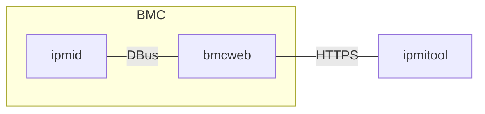

# IPMI HTTPS interface

Author: Lei Yu (LeiYU)

Other contributors: Zhang Jian (JianZhang3032)

Created: Apr 28, 2025

## Problem Description

IPMI lanplus is widely used in data center to support remote management of
servers. However, it has known vulnerabilities that is requires the BMC to store
the password by design. The password is encrypted and stored in BMC's persistent
storage, but it could be decrypted if file is extracted, causing data leakage
from data center.

IPMI lanplus uses udp protocol to communicate with BMC, and it has no QoS if the
traffic goes outside of the data center. Thus the packets could be dropped or
delayed in such environments, which makes IPMI communication unreliable.

In this design, a new HTTPS interface is proposed to solve the above problems.

## Background and References

IPMI lanplus protocol[1] involves RAKP, which is vulnerable in the cases below:

- CVE-2013-4786[2]: RAKP Message 2 introduces a vulnerability that allows an
  attacker to extract the HMAC and perform offline attacks to recover the
  plaintext password.
- The nature of RAKP requires the BMC to store the plaintext password or at
  least a reversible equivalent. In most cases, it's encrypted by a symmetric
  key, but the key is still stored in BMC. So an attacker who gains the rootfs
  of the BMC can recover the plaintext password by decrypting the key.

BMC network is usually isolated in datacenter to mitigate the risk of attack.
However, there are cases that the traffic goes outside of the data center, and
such vulnerability is still possible.

## Requirements

In this design, HTTPS interface is introduced to replace the lanplus protocol.
The BMC serves the `/ipmi` URI and provides a passthrough channel for IPMI
commands like how lanplus is implemented, but eliminates the lanplus' RAKP
authentication by re-using `bmcweb`'s user management. ipmitool could establish
the HTTPS connection and send IPMI commands to the BMC.

### Benefits

1. It does not require the BMC to store the password anymore.
2. It uses HTTPS (and underlying tcp) protocol to communicate with BMC, which is
   more reliable.
3. It re-uses the Redfish session, so it is possible to establish the fully
   "no-password" session, with mTLS, SSO or other authentication methods.

## Proposed Design

`ipmitool` establishes a HTTPS connection to the `bmcweb`, upgrades to
websocket, sends and receives IPMI commands over the websocket. `bmcweb`
forwards the IPMI requests to `ipmid` via DBus, get the response, and send it
back to the ipmitool.



As the diagram shows, this design mainly consists of the changes to ipmitool,
bmcweb, and ipmid.

### Protocol

The `/ipmi` URI is implemented in bmcweb, that could be upgraded to a websocket.
When the websocket is established, the client could send and receive binary data
that is defined as below C structure.

- URI

  ```http
  wss /ipmi
  ```

- Request

  ```c
  struct ipmi_rq_header {
      uint8_t netfn;
      uint8_t lun;
      uint8_t cmd;
      uint8_t target_cmd;
      uint16_t data_len;
      uint8_t* data;
  };
  ```

- Response

  ```c
  struct ipmi_rs {
  uint8_t ccode;
  uint8_t data[IPMI_BUF_SIZE];
  };
  ```

### ipmitool

ipmitool is not maintained by OpenBMC, but this design doc is intended to refer
both OpenBC as server side and the ipmitool as the client side.

For detailed changes to ipmitool, refer to
<https://codeberg.org/IPMITool/ipmitool/pulls/56>

Below are some design details of ipmitool.

#### HTTPS interface

ipmitool has a plugin mechanism to support different IPMI interfaces. HTTPS
interface will be added as a new plugin, implementing below functions:

```c
struct ipmi_intf ipmi_https_intf = {
        .name = "https",
        .desc = "OpenBMC HTTPS interface",
        .setup = ipmi_https_setup,
        .open = ipmi_https_open,
        .close = ipmi_https_close,
        .sendrecv = ipmi_https_sendrecv,
        .target_addr = IPMI_BMC_SLAVE_ADDR,
};
```

- `ipmi_https_open`: Construct the HTTPS websocket URI including optional port,
  and use libcurl to connect to the BMC.
- `ipmi_https_close`: Cleanup the curl context.
- `ipmi_https_sendrecv`: Construct the IPMI request, send the request and
  receive the response.

The connection shall use the Redfish session token for authentication.

#### libcurl

To support the HTTPS connection and to upgrade to websocket, libcurl is needed.
However, libcurl is built without websocket support by default, and it needs to
be enabled by building with `--with-websockets`, so it is better to link libcurl
statically.

#### SOL support

The SOL support on HTTPS interface is already implemented on OpenBMC as
websocket URI `/console/xxx`. So there is no changes to OpenBMC.

ipmitool shall add additional changes to re-use the URI to support SOL over
HTTPS.

In this design, only the sol activate command is supported. When invoked, it is
redirected to establish a WebSocket connection to the `/console/default` URI,
and then starts the same interactive loop as used in the lanplus implementation.

`sol deactivate` is not supported, user will have to enter `Enter ~ .` to quit
the session.

### bmcweb

#### `/ipmi` URI

bmcweb has existing support of websocket, e.g. the `/console/default` URI is
implemented as a websocket.

In bmcweb, `include/ipmi_https.hpp` is implemented to serve the `/ipmi` URI.

```c++
inline void requestRoutes(App& app)
{
    BMCWEB_ROUTE(app, "/ipmi")
        .privileges({{"Login"}})
        .websocket()
        .onopen([&](crow::websocket::Connection& conn) {
        sessions.try_emplace(&conn);
    })
        .onclose([&](crow::websocket::Connection& conn, const std::string&) {
        sessions.erase(&conn);
    }).onmessage(onMessage);
}
```

The `onMessage()` function implements the logic:

- Parse the request
- Make DBus call to ipmid
- Send the response

#### Authentication

The authentication is fully re-used from Redfish. The client shall provide a
session token on requesting the `ipmi` URI, and `bmcweb` could get the user info
of the session.

Then `bmcweb` will convert the user's role into IPMI's privilege level as below.

```c++
    std::string userRole = conn.getUserRole();
    int privilege = 0;
    if (userRole == "priv-admin")
    {
        privilege = 4;
    }
    else if (userRole == "priv-operator")
    {
        privilege = 3;
    }
    else if (userRole == "priv-user")
    {
        privilege = 2;
    }
```

The privilege level is then passed by the D-Bus call to `ipmid`, which could use
this information to know if the user has the privilege to execute the ipmi
command.

In short, the Redfish session token is used to authenticate the user and provide
the privilege level.

### ipmid

In ipmid, it has existing DBus method:

```c++
auto executionEntry(boost::asio::yield_context yield, sdbusplus::message_t& m,
                    NetFn netFn, uint8_t lun, Cmd cmd, ipmi::SecureBuffer& data,
                    std::map<std::string, ipmi::Value>& options);
iface->register_method("execute", ipmi::executionEntry);
```

Where it has the `options` that could be used to pass various information.

The `options` is used for `bmcweb` to carry the HTTPS interface related
information.

- ipmiHttps: Indicate it's call from HTTPS interface
- privilege: The privilege of the user
- currentSessionId: The session id of the HTTPS interface

Then it could handle the IPMI request and response to bmcweb, the same as
net-ipmid.

## Alternatives Considered

In the HTTPS connection, it is possible to use the json format to communicate
between ipmitool and bmcweb. However, a ipmitool command could involve quite a
lot of interactions (e.g. SEL/SDR commands), and this will result in a lot of
HTTPS requests and responses, which will cause a lot of overhead. We did
implement this json protocol with `keep-alive` enabled, the test shows the
significant performance degradation comparing to the lanplus interface.

For example, below is the comparison of running `sdr list` command on g220a in
QEMU with different interfaces:

| Interface  | Time (seconds) |
| ---------- | -------------- |
| lanplus    | 2.7 ~ 2.8      |
| https-json | 8.2 ~ 8.4      |
| https-ws   | 2.9 ~ 3.1      |

By using the binary protocol on a websocket, we see the similar performance
compared to the lanplus interface.

## Impacts

Below repos are impacted by this design:

- ipmitool: The new feature will be implemented, roughly 400 lines of code for
  the HTTPS interface and 300 lines of code for SOL over HTTPS.
- bmcweb: The `/ipmi` URI will be implemented as a websocket.
- ipmid: Minor changes to handle the HTTPS interface related information.

### Organizational

The above repos will be modified to support the HTTPS interface:

- ipmitool is maintained at codeberg.org[3], MRs will be sent to the upstream
  repo.
- bmcweb and ipmid changes will be sent to OpenBMC gerrit for review.

## Testing

With a system (e.g. g220a) and ipmitool implemented this design, user could test
the feature by `ipmitool -I https` argument.

```bash
# Regular usage
ipmitool -I https -H $bmc -P $token mc info

# Optional port
ipmitool -I https -H $bmc -p 8443 -P $token mc info

# SOL
ipmitool -I https -H $bmc -P $token sol activate

# Deactivate SOL
Enter ~.
```

Additional fuzzy tests shall be added to verify the binary API `/ipmi` is stable
and does not introduce vulnerabilities. E.g.

```bash
ipmitool -I https -H $bmc -P $token raw <fuzzy data>
```

[1]:
  https://www.intel.com/content/dam/www/public/us/en/documents/product-briefs/ipmi-second-gen-interface-spec-v2-rev1-1.pdf
[2]: https://nvd.nist.gov/vuln/detail/cve-2013-4786
[3]: https://codeberg.org/IPMITool/ipmitool.git
