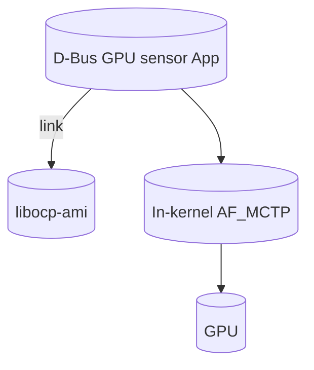

# libocp-ami

Author: Gilbert Chen

Other contributors: Deepak Kodihalli

Created: Created: November 22, 2024

## Problem Description

Enable applications, such as OpenBMC d-bus sensor apps, to read GPU sensors
using an OCP MCTP VDM protocol
[OCP GPU & Accelerator Management Interfaces Specification](https://www.opencompute.org/documents/ocp-gpu-accelerator-management-interfaces-v1-pdf).
A reusable libocp-ami library is proposed for applications to encode and decode
OCP MCTP VDM messages for GPU/accelerator management.

## Background and References

According to the MCTP OEM VDM section of
[OCP GPU & Accelerator Management Interfaces Specification](https://www.opencompute.org/documents/ocp-gpu-accelerator-management-interfaces-v1-pdf)
, the device vendors retrieve telemetry data over MCTP OEM VDM because the
additional OEM telemetry that will be harvested by the management controller
doesn't meet the existing definition of the PLDM Type 2 ecosystem. Therefore,
OpenBMC must obtain the additional OEM telemetry via the OCP MCTP OEM VDM
protocol.

As noted in the v1 spec (section 3.6), there are two ways to compose messages by
device vendors in order to be compliant with the OCP spec - PCIe ID based and
IANA based. Further, the command code itself can be vendor specific. There is
the option to define certain command codes in the OCP spec itself and have the
IANA set to OCP - this would be useful to avoid duplication of work to define
commands for telemetry that are common to multiple vendors.

The code in this repo will correspond to either a public release of the OCP base
spec or an OCP base spec compliant vendor spec (in the latter case code could
reside in a vendor/<company> directory).

## Requirements

There is motivation to separate out a library part from the main d-bus sensor
app for the OCP VDM message to enable reuse of the protocol specific code in the
following ways:

- Use the library in multiple OpenBMC apps.
- Use the library on non-OpenBMC BMC firmware stacks. Given the most common
  usage of the library is on OpenBMC-based BMCs, house the library repo in
  OpenBMC (similar to libcper, libpldm).

Given the motivation above, following are the requirements for this library:

- The library should provide APIs for encoding and decoding of messages.
- The library should be implemented in C and should not have any dependency
  other than the C library.
- The library should support architectures with any endianness.
- The library should not output any form of logs.
- The library should not maintain any state.
- Employ ABI controls, similar to libpldm, to indicate
  stable/deprecrated/testing symbols.
- Checklists, similar to the one for
  libpldm[https://github.com/openbmc/libpldm/tree/main/docs/checklists], will
  have to be followed.

## Proposed Design

- Develop a libocp-ami library within OpenBMC to encode and decode OCP VDM and
  vendor VDM messages, enabling user applications to communicate with GPUs.

  The API functions will have the following form:

  - ocpami*encode*<command>\_req()
  - ocpami*encode*<command>\_resp()
  - ocpami*<vendor>\_encode*<command>\_req()
  - ocpami*<vendor>\_encode*<command>\_resp()

- To demonstrate the use of libocp-ami in the OpenBMC framework, develop a D-Bus
  sensor app using the libocp-ami API and the in-kernel AF_MCTP stack to get GPU
  sensor readings and expose them to the xyz.openbmc_project.Sensor.Value D-Bus
  interface.

## Alternatives Considered

An alternative is to have the GPU management application and library implemented
as a single application, for example one that is in the dbus-sensors repo. This
approach might meet the needs of OpenBMC alone and has some advantages:

- no new repo needed
- simpler to maintain and test changes in the app and library together

However, there are also disadvantages of this alternative:

- Reusability of the library in multiple OpenBMC apps, non-OpenBMC BMC stacks
  and device firmware stacks is not easily possible.
- Separation of concerns is not met: it's harder to maintain the library
  independently. Issues in the applications can impact the library.

## Impacts

- New repo will be created within the organization.
- New recipe will be added to OpenBMC.
- This repo itself is not expected to result in D-Bus or other existing OpenBMC
  APIs from being modified.
- New development is required to design and implement the library APIs, and to
  write unit tests for the same. About 5K LOC addition is expected.
- Release documentation has to be updated for major libocp-ami releases.

### Organizational

- Does this repository require a new repository? Yes
- Who will be the initial maintainer(s) of this repository?
  - Ed Tanous
  - Additional Reviewers
    - Andrew Jefferey
    - Deepak Kodihalli
    - Gilbert Chen
    - Jae Hyun Yoo
- Which repositories are expected to be modified to execute this design?
  - openbmc/openbmc
  - openbmc/libocp-ami
  - openbmc/dbus-sensors

## Testing

1)Unit tests will be added in the repo to obtain code coverage and to ensure the
APIs are implemented as epxected. These tests will run as part of the OpenBMC
CI. 2)A cmdline utility will be developed to send and receive OCP AMI messages
over MCTP to an endpoint that supports this protocol to test the encode/decode
and other API functionality. This code will exist in the libocp-ami repo.
3)Automation functional tests will be implemented in the openbmc-test-automation
repo to verify telemetry retrieval based on this protocol. These tests will use
the utility from 2). 4)An app will be implemented in the d-bus sensors repo to
use libocp-ami and verify the end-to-end path with an accelertor device.
