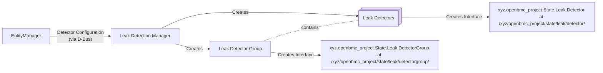

# Liquid Leak Detection

Author: Jagpal Singh Gill <paligill@gmail.com>

Created: July 26, 2024

## Problem Description

Liquid cooling is becoming a promising alternative to traditional air flow
cooling for high performance computing in data center environments. However,
this technique presents its own set of challenges, as liquids can be harmful to
electronic components. Therefore, it is crucial for any system that uses liquid
cooling to have a mechanism for detecting and reporting leaks so that
remediation actions can be taken. Currently, there is no service available in
openBMC to handle this task.

## Background and References

In this document, a leak is considered to be an entity with digital (present or
not-present) value. Currently, openBMC has a framework for sensors, but it is
primarily designed for numerical readings rather than detectors with digital
values. The
[phosphor-gpio-monitor](https://github.com/openbmc/phosphor-gpio-monitor) is too
generic in its design and does not meet most of the requirements.

## Requirements

1. Able to identify leak presence for GPIO-based detectors and generate
   corresponding redfish events.
2. Able to classify leaks events according to their severity levels based on
   certain attributes.

- For example, the physical location of detectors can be used to determine the
  severity level of a leak. A leak may be considered minor if it is contained
  within a tray, but its severity level increases as it spreads into a drip pan.

3. Capable of performing actions based on leak classification, which can be
   optionally delegated to another component.
4. Capable of generating a D-Bus interface that adheres to
   [Redfish Leak Detection](https://redfish.dmtf.org/schemas/v1/LeakDetection.v1_0_1.json)
   standards, allowing for the exposure of leak detection status to clients.

## Proposed Design

### Dbus interfaces

The DBus Interface for leak detection will consist of following -

| Interface Name                               | New/Existing |        Purpose/Updates         |
| :------------------------------------------- | :----------: | :----------------------------: |
| xyz.openbmc_project.State.Leak.DetectorGroup |     New      | Implements Leak Detector Group |
| xyz.openbmc_project.State.Leak.Detector      |     New      |    Implements Leak Detector    |

Refer to
[patch](https://gerrit.openbmc.org/c/openbmc/phosphor-dbus-interfaces/+/73151)
for related D-Bus changes.

### BMCWeb

This design involves implementing following Redfish schemas and associated
properties in BMCWeb.

|  Redfish Schema  |                               Properties                               |
| :--------------: | :--------------------------------------------------------------------: |
| ThermalSubsystem |                             LeakDetection                              |
|  LeakDetection   |            Name, Status, LeakDetectors, LeakDetectorGroups             |
|                  | LeakDetectorGroup: GroupName, Detectors, Detectors@odata.count, Status |
|   LeakDetector   |                      Name, DetectorState, Status                       |

NOTE: The ThermalSubsystem is required because it contains the LeakDetection
endpoint.

### Liquid Leak Detector



#### Entity Manager Configuration

##### Json Schema

For information on the configuration schema for leak detectors, please
[refer](https://gerrit.openbmc.org/c/openbmc/entity-manager/+/75734).

##### Configuration Example

An example of entity manager configuration for leak detector is as under -

```json
"Exposes": [
...
  {
  "Type": "GpioLiquidLeakDetector",
  "Name": "ManifoldFrontDetector",
  "SubType": "LeakSensingRope",
  "PinName": "DETECTOR1_GPIO",
  "Polarity": "ActiveLow",
  "Group": "Rack",
  "Level": "Critical",
  "DefaultAction": "RackPowerOff"
}
...
]
```

#### LeakDetection Manager

The LeakDetection Manager is responsible for processing input configuration
objects from the Entity Manager via DBus. Based on related interface signals, it
creates or deletes the corresponding groups and detectors D-Bus interfaces.
Additionally, it polls for events for detector GPIOs and executes the specified
Target if any detector registers a leak. It also raises or resolves the
appropriate leak-related alerts. This fulfills requirements #1 and #3.

### Error Reporting

A
[leak detection](https://gerrit.openbmc.org/c/openbmc/phosphor-dbus-interfaces/+/73707)
definition is proposed for events through Redfish based on
[event logging design](https://github.com/openbmc/docs/blob/master/designs/event-logging.md).

#### Leak Severity

The entity manager configuration specifies the severity level for a leak
detector. When the corresponding detector detects a leak, the LeakDetection
Manager generates an event message with the appropriate severity level as
defined in the configuration. This fulfills requirement# 2.

## Alternatives Considered

### phosphor-gpio-monitor

The current design of the phosphor-gpio-monitor is too generic and does not meet
most of the requirements, particularly Requirement #2 and #4. Any changes to the
phosphor-gpio-monitor to add these requirements would result in a monolithic
daemon that would need to be extended for every other such feature. Currently,
the phosphor-gpio-monitor performs generic tasks in a simple manner and does so
effectively, so it's better suited for that.

## Impacts

### API Impacts

- A new D-Bus interface for leak detection is being proposed as part of this
  design. This would require implementation in the BMCWeb.
- openBMC namespace specific leak events are being proposed since there are no
  standard redfish leak events at the moment.

### Performance Impacts

The design may cause a minor reduction in system performance due to the need for
processing leak detector GPIO events, but the impact is negligible.

### Organizational

- Does this repository require a new repository? No.
- Who will be the initial maintainer(s) of this repository? NA
- Which repositories are expected to be modified to execute this design? BMCWeb,
  dbus-sensors, phosphor-dbus-interfaces
- Make a list, and add listed repository maintainers to the gerrit review.

## Testing

### Unit Testing

All the functional testing of the reference implementation will be performed
using GTest.

### Integration Testing

The end to end integration testing involving Servers (for example BMCWeb) will
be covered using openbmc-test-automation.
