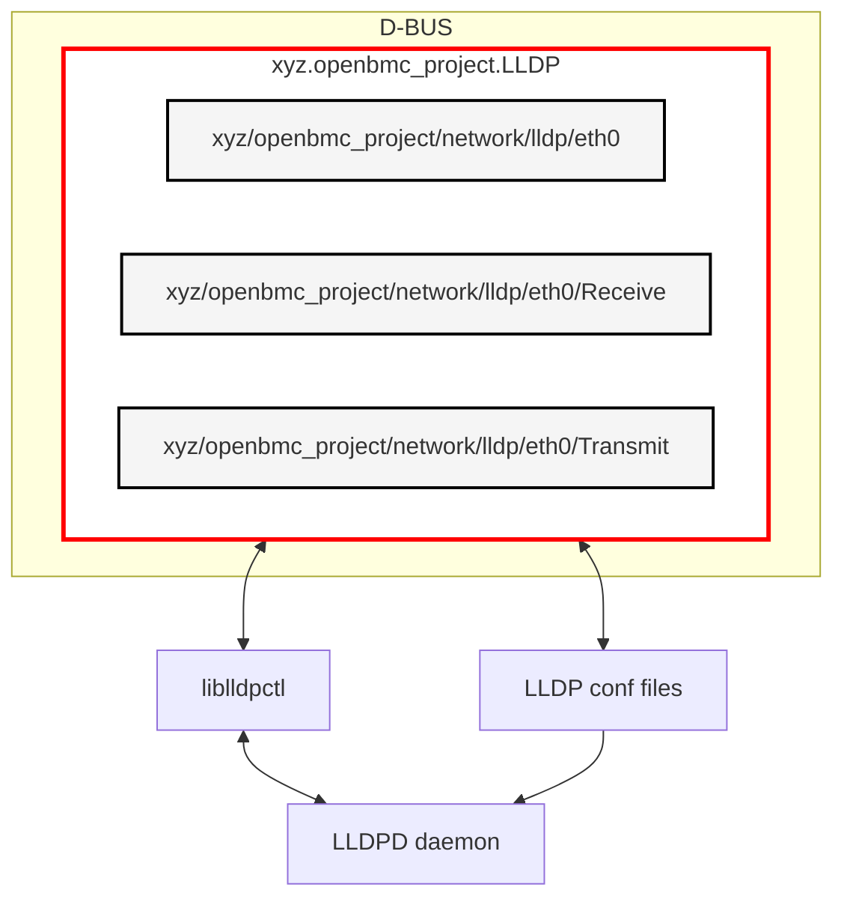

# Design proposal for LLDP management in OpenBMC

Author: Uri Goldfeld Created: 2025-08-12

## Problem Description

LLDP is a Layer-2 Ethernet protocol that enables devices to advertise and
exchange information with their neighbors on a network.

In OpenBMC, lldpd daemon provides LLDP functionality.

There is no D-BUS (or other access method) solution for comprehensive LLDP
management.

There is a need to implement a flexible and extensible LLDP D-BUS solution that
enables:

- Handling discovery of BMCs in the network by retrieving LLDP neighbor
  information.
- Standardized LLDP configuration through D-BUS interface.
- Dynamic control over LLDP packet contents during runtime.
- Unified interface for managing LLDP to enable easy integration with other
  access methods such as Redfish.

### Why LLDP over Other Discovery Protocols?

LLDP is preferred over other discovery protocols like Avahi because it operates
at Layer 2 making it independent of IP configuration and routing. Additionally,
LLDP is specifically designed for network equipment discovery, provides detailed
hardware and topology information, and it has DMTF Redfish compliance, making it
the appropriate choice for BMC network management.

## Background and References

lldpd daemon comes with 2 ways of controlling it:

1. The daemon reads configuration files in /etc/lldp.d/ directory during
   bring-up.
2. lldpcli is a commandline tool that can be used to control the daemon during
   runtime.
3. "liblldpctl.so provides a stable client API to query and configure LLDP state
   managed by the lldpd daemon..

A feature was added recently to `xyz.openbmc_project.Network` service to disable
or enable LLDP, by setting EmitLLDP D-BUS property on
xyz.openbmc_project.Network.EthernetInterface. The feature updates the daemon
configuration file and restarts it.

The commit is in:
`https://github.com/openbmc/phosphor-networkd/commit/f7116de80882b7edad729e7d8747639eff600b08`

## Requirements

1. Provide a unified method to control LLDP:
   - Dynamic update LLDP packet content for transmission.

   - Retrieve BMC transmitted LLDP packet content.

   - Retrieve neighbor received LLDP packet content.

   - Enable or disable LLDP per interface.

2. Provide an interface with easy integration to other access methods.

## Proposed Design

This proposal aims to implement LLDP functionality through a new D-BUS service
that will manage LLDP configuration. The service controls the lldpd daemon with
liblldpctl library and lldpd configuration files.

The interfaces were designed for compatibility with Redfish LLDP DMTF
specification in
`https://github.com/openbmc/bmcweb/blob/master/redfish-core/schema/dmtf/csdl/Port_v1.xml`.

The design introduces two main interfaces:

### D-BUS Interfaces

1. `xyz.openbmc_project.Network.LLDP.Settings`
   - Control over LLDP functionality for a network interface.
   - Properties:
     - `EnableLLDP` (bool): Enable or disable LLDP service.

2. `xyz.openbmc_project.Network.LLDP.TLVs`
   - This interface provides access to all LLDP TLV information
   - Properties:
     - `ChassisId` (string)
     - `ChassisIdSubtype` (uint8)
     - `ManagementAddressIPv4` (string)
     - `ManagementAddressIPv6` (string)
     - `ManagementAddressMAC` (string)
     - `ManagementVlanId` (uint16)
     - `PortId` (string)
     - `PortIdSubtype` (uint8)
     - `SystemCapabilities` (array[uint8])
     - `SystemName` (string)
     - `SystemDescription` (string)
   - These properties allow:
     - Reading and writing TLV values
     - Dynamic updates to LLDP packet contents
     - Integration with other BMC services

Interface Files:

These interface files are available in
`https://gerrit.openbmc.org/c/openbmc/phosphor-dbus-interfaces/+/83533`:

1. phosphor-D-BUS-interfaces/yaml/xyz/openbmc_project/Network/LLDP/Settings.interface.yaml
2. phosphor-D-BUS-interfaces/yaml/xyz/openbmc_project/Network/LLDP/TLVs.interface.yaml

### D-BUS Service

#### Service Name

LLDP service will be implemented in a new service `xyz.openbmc_project.LLDP`. It
will be added to existing repository phosphor-networkd.

#### Objects Names

There will be different transmit and receive D-BUS objects, and an additional
object for enabling and disabling LLDP. <if_name> represents the network
interface that is configured through the configuration files to send and receive
LLDP packets.

1. `/xyz/openbmc_project/network/lldp/<if_name>/transmit`

   Handles transmit operations . Implements the
   xyz.openbmc_project.Network.LLDP.TLVs interface.

2. `/xyz/openbmc_project/network/lldp/<if_name>/receive`

   Handles receive operation. Implements the
   xyz.openbmc_project.Network.LLDP.TLVs interface.

3. `/xyz/openbmc_project/network/lldp/<if_name>`

   Enable or disable LLDP for. Implements the
   xyz.openbmc_project.Network.LLDP.Settings interface.

#### Neighbor Object Discovery

Neighbor objects are created and deleted dynamically, based on received LLDP
packets. The service will detect when neighbors connect to or disconnect from
the BMC, and create or delete neighbor objects accordingly.

#### Operation

The LLDP service will be implemented as a D-BUS service that manages both
transmit and receive information.

1. Transmit Operations:
   - Sets and gets host LLDP properties from lldpd using liblldpctl.
   - Configures outgoing LLDP PDUs using the properties set in the TLVs
     interface.

2. Receive Operations:
   - Gets neighbor LLDP properties from lldpd using liblldpctl.

3. Enable/Disable LLDP
   - Enables or disables lldpd operation for the interface.
   - Uses lldpd configuration files to maintain the enable status between BMC
     resets.

The D-BUS service will update the properties only when the properties are
queried

### Configuration Files

The service will use the standard lldpd configuration files. These files will be
located in the standard /etc/lldpd.d directory. The purpose of the configuration
files is to maintain lldp state between BMC resets.

#### /etc/lldpd.d/status.conf

The service will use this file to enable or disable LLDP. It contains one of the
following configurations:

1. configure ports <if_name> lldp status disabled
2. configure ports <if_name> lldp status rx-and-tx

#### /etc/lldpd.d/ports.conf

This file configures the LLDP interfaces. The use case is to filter out
interfaces for which LLDP information is not relevant.

It contains the following configuration: configure system interface pattern
<if_name1>,<if_name2> ...

### High-Level Architecture Diagram

#### Compatibility with Redfish

The Redfish specification in
`https://github.com/openbmc/bmcweb/blob/master/redfish-core/schema/dmtf/csdl/Port_v1.xml`
defines three LLDP-related properties:

- `LLDPEnabled`: Controls LLDP functionality
- `LLDPTransmit`: Contains transmit-side LLDP information
- `LLDPReceive`: Contains receive-side LLDP information

These Redfish properties map to our D-BUS interfaces as follows:

- `LLDPEnabled` maps to `xyz.openbmc_project.Network.LLDP.Settings.EnableLLDP`
- `LLDPTransmit` properties map to `xyz.openbmc_project.Network.LLDP.TLVs` (via
  transmit D-BUS objects)
- `LLDPReceive` properties map to `xyz.openbmc_project.Network.LLDP.TLVs` (via
  receive D-BUS objects)

## Alternatives Considered

### Using `xyz.openbmc_project.Network.EthernetInterface`

This interface contains EmitLLDP property that is equivalent to EnableLLDP in
`xyz.openbmc_project.Network.LLDP.Settings`.

The problem:

EthernetInterface includes additional 18 properties that are irrelevant to LLDP
and would not be implemented by the proposed D-BUS objects.

Moreover the equivalent Redfish DMTF specification in
/redfish-core/schema/dmtf/csdl/EthernetInterface_v1.xml doesn't include LLDP
properties. Rather, LLDP properties are included in
redfish-core/schema/dmtf/csdl/Port_v1.xml.

So new matching LLDP interfaces are a more suitable solution.

### Extending `xyz.openbmc_project.Network` service

The xyz.openbmc_project.Network service can enable or disable LLDP. Instead of
creating a new service, xyz.openbmc_project.Network can manage the proposed
D-BUS objects.

The problem:

The xyz.openbmc_project.Network service focuses on managing Ethernet and IP
networking.

LLDP is a logical protocol, with a lot of configuration options.

This design focuses on the main configuration options that are defined by DMTF,
but additional features may be required in future such as limiting LLDP
directionality to transmit or receive, or saving the lldp state between BMC
resets buy updating lldp configuration files.

A dedicated LLDP service will be easier to maintain and extend, is more modular
and lets xyz.openbmc_project.Network development focus on its main objectives
instead of handling a vast array of options of a logical protocol.

## Impacts

The design proposes a new D-BUS service, so is no impact on other D-BUS
services.

There will be a minor additional memory overhead.

The D-BUS service will update the properties only when the properties are
queried . So the runtime overhead is also small.

## Organizational

### Does this design require a new repository?

No, changes will go into phosphor-networkd and phosphor-dbus-interfaces.

## Testing

### Integration testing

The D-BUS service can be tested with busctl commands and verified with lldpcli

For example:

This busctl command will set the property SystemName as "bmc":

busctl set-property xyz.openbmc_project.LLDP
/xyz/openbmc_project/network/lldp/eth0/transmit
xyz.openbmc_project.Network.LLDP.TLVs SystemName bmc

This busctl command will get the property SystemName, and it should be "bmc":

busctl get-property xyz.openbmc_project.LLDP
/xyz/openbmc_project/network/lldp/eth0/transmit
xyz.openbmc_project.Network.LLDP.TLVs SystemName

This shell command should also receive the SystemName information:

lldpcli show interface detail ports eth0
