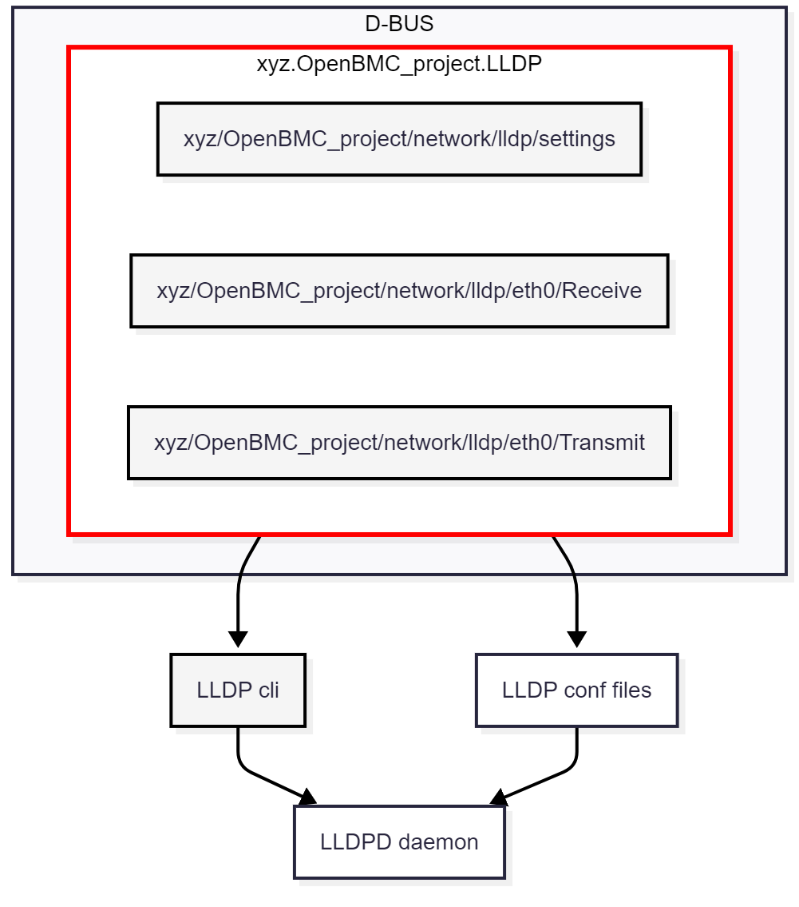

# Design proposal for LLDP management in OpenBMC

Author: Uri Goldfeld
Created: 2025-08-12

## Introduction 

LLDP is a Layer-2 Ethernet protocol that enables devices to advertise and exchange information with their neighbors on a network.

In OpenBMC, lldpd daemon provides LLDP functionality. 
 
The exisiting `xyz.OpenBMC_project.Network` service can only enable or disable the lldpd daemon.

There is no D-BUS (or other access method) solution for comprehensive LLDP management.
 
There is a need to implement a flexible and extensible LLDP D-BUS solution that enables:
- Handling discovery of BMCs in the network by retrieving LLDP neighbor information. 
- Standardized LLDP configuration through D-BUS interface.
- Dynamic control over LLDP packet contents.
- Unified interface for managing LLDP to enable easy integration with other access methods such as Redfish.

## Proposed Design for LLDP Enablement in OpenBMC

This proposal aims to implement LLDP functionality through a new D-BUS service that will manage LLDP configuration and TLV information. 
The service controls the lldpd daemon with lldpcli tool and lldpd configuration files.

The design introduces two main interfaces:

### D-BUS Interfaces

1. `xyz.openbmc_project.Network.LLDP.Settings`
   - This interface provides control over LLDP functionality.
   - Properties:
     - `EnableLLDP` (bool): Enable or disable LLDP service.

2. `xyz.openbmc_project.Network.LLDP.TLVs`
   - This interface provides access to all LLDP TLV information
   - Properties:
     - `ChassisId` (string)
     - `ChassisIdSubtype` (uint8)
     - `ManagementAddressIPv4` (string)
     - `ManagementAddressIPv6` (string)
     - `ManagementAddressMAC` (string)
     - `ManagementVlanId` (uint16)
     - `PortId` (string)
     - `PortIdSubtype` (uint8)
     - `SystemCapabilities` (array[uint8])
     - `SystemName` (string)
     - `SystemDescription` (string)
   - These properties allow:
     - Reading and writing TLV values
     - Dynamic updates to LLDP packet contents
     - Integration with other BMC services

Interface Files:

1. phosphor-D-BUS-interfaces/yaml/xyz/OpenBMC_project/Network/LLDP/Settings.interface.yaml
2. phosphor-D-BUS-interfaces/yaml/xyz/OpenBMC_project/Network/LLDP/TLV.interface.yaml

### D-BUS Service

#### Service Name:

LLDP service will be implemented in a new service `xyz.OpenBMC_project.LLDP`.
Source files will be in phosphor-networkd.

#### Objects:

There will be different transmit and receive D-BUS objects, and an additional object for enabling and disabling LLDP.
<if_name> represents the network interface that is configured through the configuration files to send and receive LLDP packets.

1. `/xyz/OpenBMC_project/network/lldp/<if_name>/transmit`

LLDP operation on the host side. Implements the xyz.openbmc_project.Network.LLDP.TLVs interface.

2. `/xyz/OpenBMC_project/network/lldp/<if_name>/receive`

 LLDP operation on the neighbor side. Implements the xyz.openbmc_project.Network.LLDP.TLVs interface.

3. `/xyz/OpenBMC_project/network/lldp/settings`

Enable or disable LLDP. Implements the xyz.openbmc_project.Network.LLDP.Settings interface.

#### Operation: 

The LLDP service will be implemented as a D-BUS service that manages both transmit and receive information.
To control the lldpd daemon, it will use the standard lldpcli tool and standard lldpd configuration files.

1. Transmit Operations:
   - Sets and gets host LLDP properties.
   - Configures outgoing LLDP PDUs using the properties set in the TLV interface.

2. Receive Operations:
   - Gets neighbor LLDP properties.

### Configuration Files

The service will use the standard lldpd configuration files.
These files will be located in the standard /etc/lldpd.d directory.

#### /etc/lldpd.d/status.conf
The service will use this file to enable or disable LLDP.
It contains one of the following configurations:

1. configure ports <if_name> lldp status disabled
2. configure ports <if_name> lldp status rx-and-tx

#### /etc/lldpd.d/ports.conf
This file configures the LLDP interface.
The service reads this file to obtain the <if_name> value.

It contains the following configuration: 
1. configure system interface pattern <if_name>

## High-Level Architecture Diagram

## Design Considerations

The interface files were designed for compatibility with Redfish LLDP DMTF specification in redfish-core/schema/dmtf/csdl/Port_v1.xml.
This will allow easier Redfish integration in the future.

Implementing a new LLDP service is preferred over extending Network service functionality.

LLDP is a logical protocol, with a lot of configuration options.

A dedicated D-BUS service for LLDP provides better modularity, maintainability, and extensibility. 
