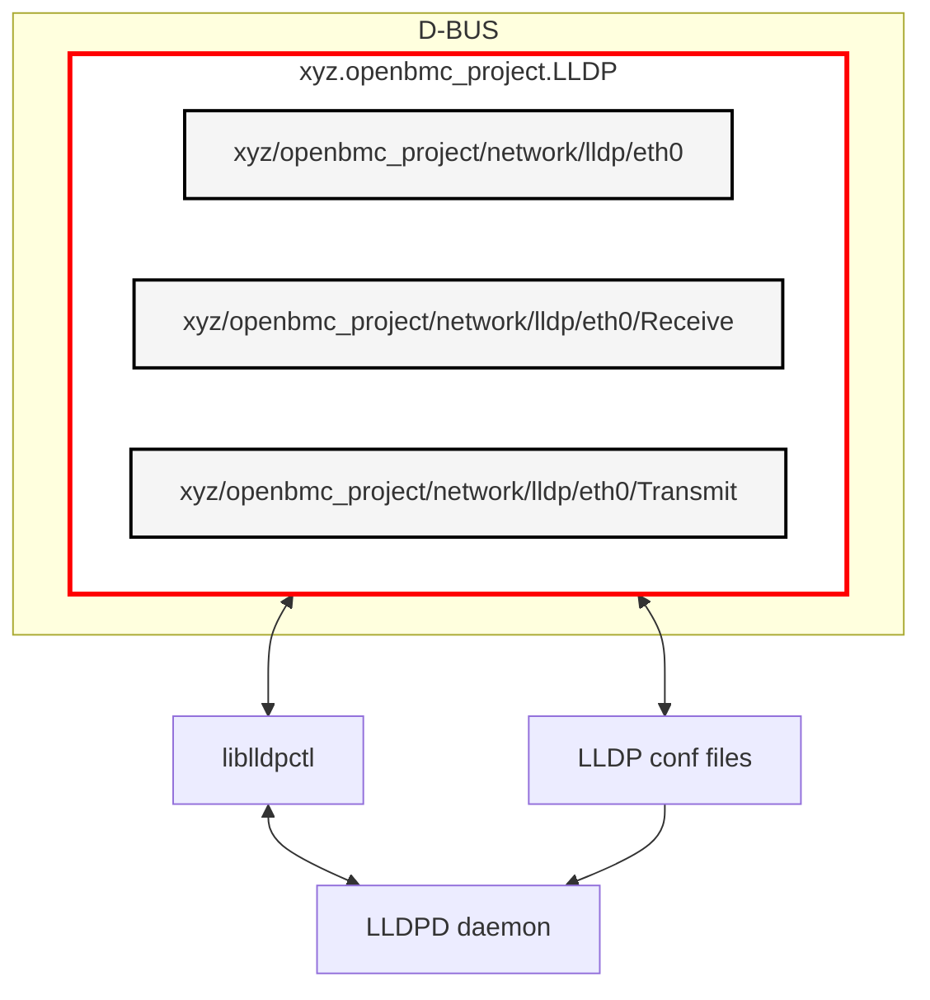

# Design proposal for LLDP management in OpenBMC

Author: Uri Goldfeld Created: 2025-08-12

## Problem Description

LLDP is a Layer-2 Ethernet protocol that enables devices to advertise and
exchange information with their neighbors on a network.

In OpenBMC, lldpd daemon provides LLDP functionality.

There is no D-BUS (or other access method) solution for comprehensive LLDP
management.

This service is indented for users that have a BMC connected to an L2 network with LLDP enabled, and require to monitor and manage LLDP via Redfish.

These users require a flexible and extensible LLDP D-BUS solution that enables:

1. Control of LLDP BMC advertisement:

   - Modifying packet contents during runtime.
   - Reading BMC LLDP advertisement data.

2. Getting LLDP neighbor information:

   - Handling discovery of LLDP neighbors.
   - Reading LLDP neighbor information.

3. Unified interface for managing LLDP to enable easy integration with Redfish.

### Why LLDP over Other Discovery Protocols?

LLDP is preferred over other discovery protocols like Avahi because it operates
at Layer 2 making it independent of IP configuration and routing. Additionally,
LLDP is specifically designed for network equipment discovery, provides detailed
hardware and topology information, and it has DMTF Redfish compliance, making it
the appropriate choice for BMC network management.

## Background and References

lldpd daemon comes with 2 ways of controlling it:

1. The daemon reads configuration files in /etc/lldp.d/ directory during
   bring-up.
2. lldpcli is a commandline tool that can be used to control the daemon during
   runtime.
3. liblldpctl.so provides a stable client API to query and configure LLDP state
   managed by the lldpd daemon.

A feature was added recently to `xyz.openbmc_project.Network` service to disable
or enable LLDP, by setting EmitLLDP D-BUS property on
xyz.openbmc_project.Network.EthernetInterface. The feature updates the daemon
configuration file and restarts it.

The commit is in:
<https://github.com/openbmc/phosphor-networkd/commit/f7116de80882b7edad729e7d8747639eff600b08>

The Redfish specification in
<https://github.com/openbmc/bmcweb/blob/master/redfish-core/schema/dmtf/csdl/Port_v1.xml>
defines three LLDP-related properties:

- `LLDPEnabled`: Controls LLDP functionality
- `LLDPTransmit`: Contains transmit-side LLDP information
- `LLDPReceive`: Contains receive-side LLDP information

These properties are the basis for the requirement and interface definitions.

## Requirements

1. Provide a unified method to control LLDP.

   - BMC advertisement :
     - Dynamic update LLDP packet content for transmission.
     - The packet contents correspond to Port_v1.xml `LLDPTransmit` property

   - Neighbor advertisement :
     - Retrieve BMC transmitted LLDP packet content.
     - The packet contents correspond to Port_v1.xml `LLDPReceive` property.

   - Enable or disable LLDP per interface

2. Provide an interface with easy integration to other access methods.

## Proposed Design

This proposal aims to implement LLDP functionality through a new D-BUS service
that will manage LLDP configuration. The service controls the lldpd daemon with
liblldpctl library and lldpd configuration files.

The D-BUS service expects lldpd daemon to be running. It does not control its
lifecycle.

Since there can be several network interfaces configured for LLDP,
each D-BUS object will manage a specific network interface.

The interfaces were designed for compatibility with Redfish LLDP DMTF properties in:
`https://github.com/openbmc/bmcweb/blob/master/redfish-core/schema/dmtf/csdl/Port_v1.xml`.

`LLDPTransmit` and `LLDPReceive` have the same properties so a single D-BUS interface `xyz.openbmc_project.Network.LLDP.TLVs` is used both for transmit
and receive.

`LLDPEnabled` controls lldp functionality for network interface turning it on or off. It controls both Tx and Rx at the same time.

The design introduces two main interfaces:

### D-BUS Interfaces

1. `xyz.openbmc_project.Network.LLDP.Settings`
   - Control over LLDP functionality for a network interface.
   - Properties:
     - `EnableLLDP` (bool): Enable or disable LLDP functionality

2. `xyz.openbmc_project.Network.LLDP.TLVs`
   - This interface provides access to all LLDP TLV information.
   - It is used by the transmit and receive D-BUS objects.
   - For the transmit object, the properties are readable and writable. writing
     updates the LLDP packet contents.
   - In the receive object the properties are read only.
   - Properties:
     - `ChassisId` (string)
     - `ChassisIdSubtype` (uint8)
     - `ManagementAddressIPv4` (string)
     - `ManagementAddressIPv6` (string)
     - `ManagementAddressMAC` (string)
     - `ManagementVlanId` (uint16)
     - `PortId` (string)
     - `PortIdSubtype` (uint8)
     - `SystemCapabilities` (array[uint8])
     - `SystemName` (string)
     - `SystemDescription` (string)

Interface Files:

These interface files are available in
<https://gerrit.openbmc.org/c/openbmc/phosphor-dbus-interfaces/+/83533>:

1. phosphor-D-BUS-interfaces/yaml/xyz/openbmc_project/Network/LLDP/Settings.interface.yaml
2. phosphor-D-BUS-interfaces/yaml/xyz/openbmc_project/Network/LLDP/TLVs.interface.yaml

### D-BUS Service

#### Service Name

LLDP service will be implemented in a new service `xyz.openbmc_project.LLDP`. It
will be added to existing repository phosphor-networkd.

#### Objects Names

There will be different transmit and receive D-BUS objects, and an additional
object for enabling and disabling LLDP. <if_name> represents the network
interface that is configured through the configuration files to send and receive
LLDP packets.

1. `/xyz/openbmc_project/network/lldp/<if_name>/transmit`

   Handles transmit operations . Implements the
   xyz.openbmc_project.Network.LLDP.TLVs interface.

2. `/xyz/openbmc_project/network/lldp/<if_name>/receive`

   Handles receive operation. Implements the
   xyz.openbmc_project.Network.LLDP.TLVs interface.

3. `/xyz/openbmc_project/network/lldp/<if_name>`

   Enable or disable LLDP for the specified network interface. Implements the
   xyz.openbmc_project.Network.LLDP.Settings interface.

#### Neighbor Object Discovery

The D-BUS service creates and deletes Neighbor D-BUS objects based on
on syncing with the lldpd daemon neighbor list.
lldpd daemon neighbor list is updated when a new neighbor send a
LLDP packet, or an existing neighbor did not send LLDP packets for a set
amount of time.

#### Operation

The LLDP service will be implemented as a D-BUS service that manages both
transmit and receive information.

1. Transmit Operations:
   - Sets and gets host LLDP properties from lldpd using liblldpctl.
   - Configures outgoing LLDP PDUs using the properties set in the TLVs
     interface.

2. Receive Operations:
   - Gets neighbor LLDP properties from lldpd using liblldpctl.

3. Enable/Disable LLDP
   - Enables or disables lldpd operation for the interface.
   - Uses lldpd configuration files to maintain the enable status between BMC
     resets.

The D-BUS service will update the properties only when the properties are
queried

### Configuration Files

The service will use the standard lldpd configuration files. These files will be
located in the standard /etc/lldpd.d directory. The purpose of the configuration
files is to maintain lldp state between BMC resets.

#### /etc/lldpd.d/status.conf

The service will use this file to enable or disable LLDP. It contains one of the
following configurations:

1. configure ports <if_name> lldp status disabled
2. configure ports <if_name> lldp status rx-and-tx

#### /etc/lldpd.d/system.conf

The file configures the system description.

It contains the following configuration: configure system description
`description`

### High-Level Architecture Diagram

```mermaid
flowchart TD

    subgraph DBUS [D-BUS]
        direction BT
        subgraph xyz.openbmc_project.LLDP [xyz.openbmc_project.LLDP]
            direction LR
            Settings[xyz/openbmc_project/network/lldp/eth0]
            Receive[xyz/openbmc_project/network/lldp/eth0/Receive]
            Transmit[xyz/openbmc_project/network/lldp/eth0/Transmit]
        end
    end

    xyz.openbmc_project.LLDP<-->LIB[liblldpctl]
    xyz.openbmc_project.LLDP<-->Conf[LLDP conf files]
    LIB<-->daemon[LLDPD daemon]
    Conf-->daemon
    style Settings fill:#f5f5f5,stroke:#000000,stroke-width:2px
    style Receive fill:#f5f5f5,stroke:#000000,stroke-width:2px
    style Transmit fill:#f5f5f5,stroke:#000000,stroke-width:2px
    style xyz.openbmc_project.LLDP fill:#ffffff,stroke:#ff0000,stroke-width:3px
```

#### Compatibility with Redfish

The Redfish specification in
`https://github.com/openbmc/bmcweb/blob/master/redfish-core/schema/dmtf/csdl/Port_v1.xml`
defines three LLDP-related properties:

- `LLDPEnabled`: Controls LLDP functionality
- `LLDPTransmit`: Contains transmit-side LLDP information
- `LLDPReceive`: Contains receive-side LLDP information

These Redfish properties map to our D-BUS interfaces as follows:

- `LLDPEnabled` maps to `xyz.openbmc_project.Network.LLDP.Settings.EnableLLDP`
- `LLDPTransmit` properties map to `xyz.openbmc_project.Network.LLDP.TLVs` (via
  transmit D-BUS objects)
- `LLDPReceive` properties map to `xyz.openbmc_project.Network.LLDP.TLVs` (via
  receive D-BUS objects)

## Alternatives Considered

### Using `xyz.openbmc_project.Network.EthernetInterface`

This interface contains EmitLLDP property that is equivalent to EnableLLDP in
`xyz.openbmc_project.Network.LLDP.Settings`.

The problem:

EthernetInterface includes additional 18 properties that are irrelevant to LLDP
and would not be implemented by the proposed D-BUS objects.

Moreover the equivalent Redfish DMTF specification in
/redfish-core/schema/dmtf/csdl/EthernetInterface_v1.xml doesn't include LLDP
properties. Rather, LLDP properties are included in
redfish-core/schema/dmtf/csdl/Port_v1.xml. The schemas are linked. For example
in the redfish mockups:
`https://github.com/DMTF/Redfish-Publications/blob/main/mockups/public-rackmount1/Managers/BMC/DedicatedNetworkPorts/index.json`
`https://github.com/DMTF/Redfish/blob/master/mockups/public-rackmount1/Managers/BMC/EthernetInterfaces/eth0/index.json`

So new matching LLDP interfaces are a more suitable solution.

### Extending `xyz.openbmc_project.Network` service

The xyz.openbmc_project.Network service can enable or disable LLDP. Instead of
creating a new service, xyz.openbmc_project.Network can manage the proposed
D-BUS objects.

The problem:

The xyz.openbmc_project.Network service focuses on managing Ethernet and IP
networking.

LLDP is a logical protocol, with a lot of configuration options.

This design focuses on the main configuration options that are defined by DMTF,
but additional features may be required in future such as limiting LLDP
directionality to transmit or receive, or saving the lldp state between BMC
resets buy updating lldp configuration files.

A dedicated LLDP service will be easier to maintain and extend, is more modular
and lets xyz.openbmc_project.Network development focus on its main objectives
instead of handling a vast array of options of a logical protocol.

## Impacts

The design proposes a new D-BUS service, so is no impact on other D-BUS
services.

There will be a minor additional memory overhead.

The D-BUS service will update the properties when object are created, destroyed,
or when properties are queried . So the runtime overhead is small.

## Organizational

### Does this design require a new repository?

No, changes will go into phosphor-networkd and phosphor-dbus-interfaces.

## Testing

### Integration testing

The D-BUS service can be tested with busctl commands and verified with lldpcli

For example:

This busctl command will set the property SystemName as "bmc":

busctl set-property xyz.openbmc_project.LLDP
/xyz/openbmc_project/network/lldp/eth0/transmit
xyz.openbmc_project.Network.LLDP.TLVs SystemName bmc

This busctl command will get the property SystemName, and it should be "bmc":

busctl get-property xyz.openbmc_project.LLDP
/xyz/openbmc_project/network/lldp/eth0/transmit
xyz.openbmc_project.Network.LLDP.TLVs SystemName

This shell command should also receive the SystemName information:

lldpcli show interface detail ports eth0
