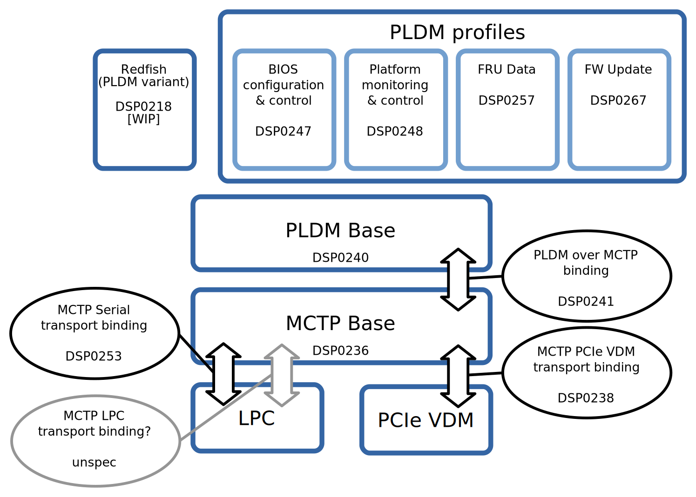

# OpenBMC platform communication channel: MCTP & PLDM

Author: Jeremy Kerr <jk@ozlabs.org> <jk>

Other contributors: Sumanth Bhat, Richard Thomaiyar

## Problem Description

With IPMI standards body no longer operational, DMTF's PMCI working group
defines standards to address `inside the box` communication interfaces between
the components of the platform management subsystem, including host-BMC
communication.

This design aims to implement Management Component Transport Protocol (MCTP)
to provide a common transport layer protocol for application layer
protocols providing platform manageability solutions and to provide an
opportunity to move to newer host/BMC messaging protocols to overcome
some of the limitations we've encountered with IPMI (Sensor limit, h/w channel
limitations etc.).

## Background and References

MCTP defines a standard transport protocol, plus a number of separate
physical layer bindings for the actual transport of MCTP packets. These
are defined by the DMTF's Platform Management Working group; standards
are available at:

  https://www.dmtf.org/standards/pmci

The following diagram shows how these standards map to the areas of
functionality that we may want to implement for OpenBMC. The DSP numbers
provided are references to DMTF standard documents.

One of the key concepts here is that separation of transport protocol
from the physical layer bindings; this means that an MCTP "stack" may be
using either a I2C, PCI, Serial or custom hardware channel, without the
higher layers of that stack needing to be aware of the hardware
implementation.  These higher levels only need to be aware that they are
communicating with a certain entity, defined by an Entity ID (MCTP EID).
These entities may be any element of the platform that communicates
over MCTP - for example, the host device, the BMC, or any other
system peripheral - static or hot-pluggable.

This document is focused on the "transport" part of the platform design.
While this does enable new messaging protocols (mainly PLDM), those
components are not covered in detail much; we will propose those parts
in separate design efforts. For example, the PLDM design at
[pldm-stack.md].

As part of the design, the references to MCTP "messages" and "packets"
are intentional, to match the definitions in the MCTP standard. MCTP
messages are the higher-level data transferred between MCTP endpoints,
which packets are typically smaller, and are what is sent over the
hardware. Messages that are larger than the hardware Maximum Transmit
Unit (MTU) are split into individual packets by the transmit
implementation, and reassembled at the receive implementation.

## Requirements

BMC needs to provide MCTP transport service which can be consumed by application
layer protocols such as PLDM, SPDM or Vendor Defined Messaging protocols. The
MCTP Daemon will abstract the physical layer specific functionalities from the
upper layer protocols.

The MCTP Service should:

* Provide a MCTP core component library(libmctp) to enable implementations
in host firmware, which have widely varying runtime capabilities.
* Support both MCTP Bus Owner and Endpoint roles.
* Support multiple physical bindings (PCIe, SMBus, Serial, OEM etc.).
* Provide a way for the upper layer protocols to send messages to an endpoint
(EID) and receive messages from endpoints. (Tx/Rx mechanism)
* Discover MCTP protocol supported devices when BMC is the Bus Owner of the
physical medium and assign Endpoint IDs (EID)
* Advertise the supported MCTP types, when BMC is the endpoint device of the
physical medium.

## Proposed Design

The MCTP core specification just provides the packetisation, routing and
addressing mechanisms. The actual transmit/receive of those packets is
up to the hardware binding of the MCTP transport.

For OpenBMC, we would introduce a MCTP daemon, which implements the transport
over a configurable hardware channel (eg., Serial UART, I2C or PCIe), and
provides a socket-based interface for other processes to send and
receive complete MCTP messages. This daemon is responsible for the
packetisation and routing of MCTP messages from external endpoints, and
handling the forwarding these messages to and from individual handler
applications. This includes handling local MCTP-stack configuration,
like local EID assignments.

This daemon has a few components:

 1) the core MCTP stack

 2) one or more binding implementations (eg, MCTP-over-serial), which
    interact with the hardware channel(s).

 3) Two types of interfaces - d-bus based, and unix-domain socket. The intention
to have two types is to cater for different needs. Unix domain sockets cater
for Host-BMC usecase and d-bus based interfaces can suit Add-In-Card use cases.
Add-In-Card use case needs mechanisms to handle discovery of cards, removal of
cards, discover card supported protocols (MCTP Message Types) etc; and these
can be better handled in d-bus. Option to choose D-bus OR socket interface
can be a compile time flag.

 4) Control Message library - The control commands get activated based on BMC
configuration - If BMC is bus owner, then BMC is Control Command Requester.
If BMC is end-point device, then BMC will be Control Command Responder.

 5) MCTP Device Discovery - In case BMC is the bus owner on the physical medium,
it will discover other MCTP capable devices on the bus.

<pre>
+--------------------------------------------------------------------------+
|                                                                          |
|                                                                          |
|                          MCTP Daemon - Demux with socket                 |
|                                       OR                                 |
|                          MCTP Daemon - D-bus based                       |
|                                                                          |
|        +---------------------------------------------------------+       |
|        |  +------------------------------------------------+     |       |
|        |  |                Control Commands                |     |       |
|        |  +------------------------------------------------+     |       |
|        |  +------------------------------------------------+     |       |
|        |  |                Device Discovery                |     |       |
|        |  +------------------------------------------------+     |       |
|        |  +------------------------------------------------+     +--------------> libmctp
|        |  |            Message TX/RX Handlers              |     |       |
|        |  +------------------------------------------------+     |       |
|        |                                                         |       |
|        | +-------+  +--------+   +----------+   +----------+     |       |
|        | |  LPC  |  | Serial |   |  SMBus   |   |   PCIe   |     |       |
|        | +-------+  +--------+   +----------+   +----------+     |       |
|        +---------------------------------------------------------+       |
|                                                                          |
+--------------------------------------------------------------------------+

</pre>

The proposed implementation produces an MCTP "library" component which
provides the packetisation and routing functions, between:

 - an "upper" messaging transmit/receive interface, for tx/rx of a full
   message to a specific endpoint (ie, (1) above)

 - a "lower" hardware binding for transmit/receive of individual
   packets, providing a method for the core to tx/rx each packet to
   hardware, and defines the parameters of the common packetisation
   code (ie. (2) above).

The lower interface would be plugged in to one of a number of
hardware-specific binding implementations. Most of these would be
included in the library source tree, but others can be plugged-in too,
perhaps where the physical layer implementation does not make sense to
include in the platform-agnostic library.

The reason for a library is to allow the same MCTP implementation to be
used in both OpenBMC and host firmware; the library should be
bidirectional. To allow this, the library would be written in portable C
(structured in a way that can be compiled as "extern C" in C++
codebases), and be able to be configured to suit those runtime
environments (for example, POSIX IO may not be available on all
platforms; we should be able to compile the library to suit). The
licence for the library should also allow this re-use; a dual Apache &
GPLv2+ licence may be best.

These "lower" binding implementations may have very different methods of
transferring packets to the physical layer. For example, a serial
binding implementation for running on a Linux environment may be
implemented through read()/write() syscalls to a PTY device. An I2C
binding for use in low-level host firmware environments may interact
directly with hardware registers to perform packet transfers.

The application specific handlers can connect to MCTP Daemon over two
interfaces -

### Connect to the MCTP daemon over a UNIX domain socket
Each of these would register with the MCTP daemon to
receive MCTP messages of a certain type, and would transmit MCTP
messages of that same type.

The daemon's sockets to these handlers is configured for non-blocking
IO, to allow the daemon to be decoupled from any blocking behaviour of
handlers. The daemon would use a message queue to enable message
reception/transmission to a blocked daemon, but this would be of a
limited size. Handlers whose sockets exceed this queue would be
disconnected from the daemon.

One design intention of the multiplexer daemon is to allow a future
kernel-based MCTP implementation without requiring major structural
changes to handler applications. The socket-based interface facilitates
this, as the unix-domain socket interface could be fairly easily swapped
out with a new kernel-based socket type.

MCTP handlers (ie, clients of the demultiplexer) connect using a
unix-domain socket, at the abstract socket address:

  \0mctp-demux

The socket type used should be `SOCK_SEQPACKET`.

Once connected, the client sends a single byte message, indicating what
type of MCTP messages should be forwarded to the client. Types must be
greater than zero.

Subsequent messages sent over the socket are MCTP messages sent/received
by the demultiplexer, that match the specified MCTP message type.
Clients should use the send/recv syscalls to interact with the socket.

Each message has a fixed small header:

   `uint8_t eid`

For messages coming from the demux daemon, this indicates the source EID
of the outgoing MCTP message. For messages going to the demux daemon,
this indicates the destination EID.

The rest of the message data is the complete MCTP message, including
MCTP message type field.

The daemon does not provide a facility for clients to specify or
retrieve values for the tag field in individual MCTP packets.

### Connect to the MCTP Daemon over D-Bus interface

The applications can also connect to the MCTP Daemon over D-Bus.

The design principles behind MCTP Daemon:

1. Support multiple binding in single (MCTP Daemon) application.
2. Execute separate instance (of MCTP Daemon) for each physical interface.
This is to limit any problems of the offending bus isolated to that application.
This also enables parallel execution as many limitations apply to the physical
medium.
3. Start MCTP Daemon as user space application, which will be exposing
D-Bus objects for the MCTP devices discovered. Upper application must have a
wrapper layer, which will hide the lower level D-Bus calls, so that in future
we can migrate to sockets. (Switching between socket-based driver).
4.  Binding support (smbus, pcie) and control commands will be added to libmctp.
5.  Entity-manager will be used to advertise the configuration required, which
the mctp-start.service(more details on this below) will use to instantiate the
needed MCTP Daemons by querying the objects exposed and calling the instance.
MCTP Daemons, will query the object to know further about whether it must work
as bus owner/endpoint,and under what physical interface (SMBUS/ PCIE) etc.
Option to do the same using configuration file instead of Entity-manager.
6.  PLDM, SPDM, PCI VDM, NVME-MI application will run as separate daemon
interacting with the MCTP Daemons (through D-BUS / Socket – abstracted
library).

Entity Manager will advertise MCTP configurations specific to the platform. This
will be used by mctp-start.service which will start multiple instances
of MCTP Daemons. The same mctp-start.service can be used to start upper layer
protocols (PLDM/SPDM etc.) based on the platform configurations.

The MCTP Daemon instance can either start in `Endpoint mode` or in `Bus Owner
mode`. When the MCTP daemon instance comes up in `Endpoint mode`, BMC will
come up with the special EID 0; the bus owner in that physical medium needs to
assign EID to BMC. When the MCTP daemon instance comes up in `Bus Owner mode`,
BMC will discover MCTP capable devices on the physical medium and assigns
EIDs from a pre-configured EID pool.

#### D-Bus Interfaces

* binding interface: This interface will have properties related to a MCTP
binding; and it will expose a method for upper layer protocols to transmit
MCTP message. It will also provide a signal to indicating upper layers about
arrival of a MCTP message. In case the upper layer needs to transfer/receive a
large payload, then instead of dumping the payload on D-Bus, the payload can be
dumped into a file and file descriptor can be passed to/from the MCTP Service.

* physical layer specific interface: This interface will have properties/methods
/signals specific to the physical layer. (E.g. - SMBus ARP method can be exposed
if ARP master daemon needs to be run and assign SMBus addresses)

* bus owner interface: This interface will have properties/methods/signals when
the daemon runs in bus owner mode. (E.g. - EID pool)

* mctp_device interface: This interface will have properties/methods/signals
when the daemon runs in endpoint device mode (E.g. - EID, Supported MCTP
Types etc.)

The daemon process will be written in C++, and shall inherit the standard
OpenBMC frameworks (D-Bus/boost/asio etc.).

More details about the interfaces will be added.

## Alternatives Considered

There have been two main alternatives to this approach:

Continue using IPMI, but start making more use of OEM extensions to
suit the requirements of new platforms. However, given that the IPMI
standard is no longer under active development, we would likely end up
with a large amount of platform-specific customisations. This also does
not solve the hardware channel issues in a standard manner.

Redfish between host and BMC. This would mean that host firmware needs a
HTTP client, a TCP/IP stack, a JSON (de)serialiser, and support for
Redfish schema. While this may be present in some environments (for
example, UEFI-based firmware), this is may not be feasible for all host
firmware implementations (for example, OpenPOWER). It's possible that we
could run a simplified Redfish stack - indeed, MCTP has a proposal for a
Redfish-over-MCTP channel (DSP0218), which uses simplified serialisation
format and no requirement on HTTP. However, this may involve a large
amount of complexity in host firmware.

In terms of an MCTP daemon structure, an alternative is to have the
MCTP implementation contained within a single process, using the libmctp
API directly for passing messages from the core code to
application-level handlers. The drawback of this approach is that this
single process needs to implement all possible functionality that is
available over MCTP, which may be quite a disjoint set. This would
likely lead to unnecessary restrictions on the implementation of those
application-level handlers (programming language, frameworks used, etc).
Also, this single-process approach would likely need more significant
modifications if/when MCTP protocol support is moved to the kernel.

The interface between the demultiplexer daemon and clients is currently
defined as a socket-based interface. The reason for the choice of
sockets rather than dbus is that the former allows a direct transition
to a kernel-based socket API when suitable. However, dbus option is also
provided to enable certain usecases like Add-In-Cards. Socket interface
currently does not provide a way to discover addition of a card, removal of a
card to upper layers, and thus dbus based solution is provided until
kernel-based socket API has these capabilities.

## Impacts

Development would be required to implement the MCTP transport, plus any
new users of the MCTP messaging (eg, a PLDM implementation). These would
somewhat duplicate the work we have in IPMI handlers.

We'd want to keep IPMI running in parallel, so the "upgrade" path should
be fairly straightforward.

Design and development needs to involve potential host, management
controllers and managed device implementations.

## Testing

For the core MCTP library, we are able to run tests there in complete
isolation (I have already been able to run a prototype MCTP stack
through the afl fuzzer) to ensure that the core transport protocol
works.

For MCTP hardware bindings, we would develop channel-specific tests that
would be run in CI on both host and BMC.

For the OpenBMC MCTP daemon implementation, testing models would depend
on the structure we adopt in the design section.
