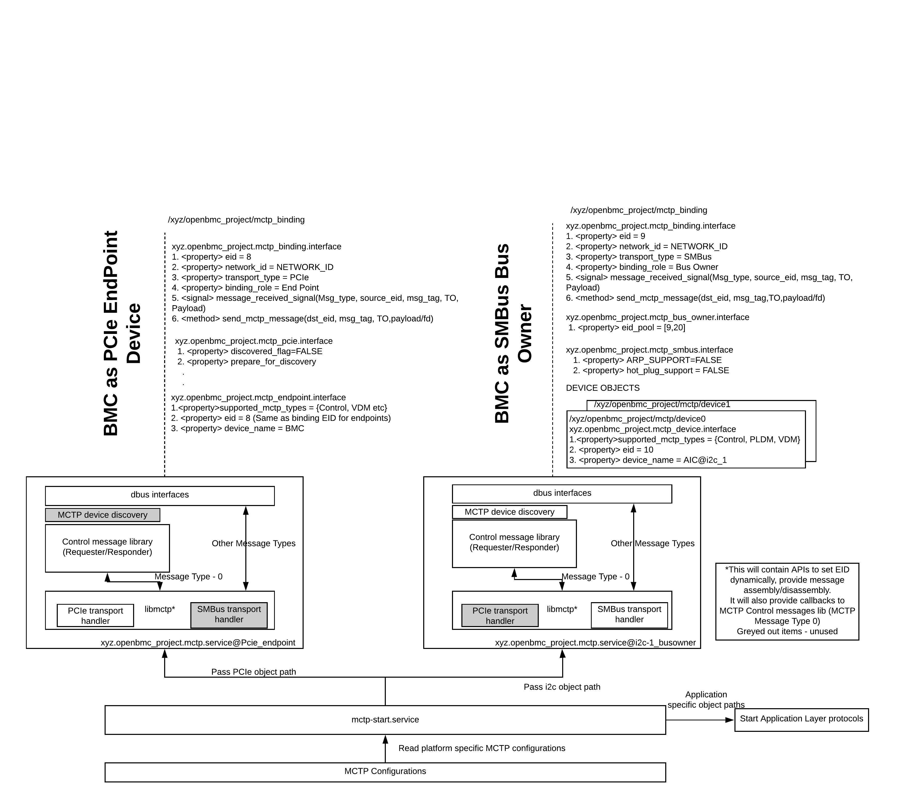
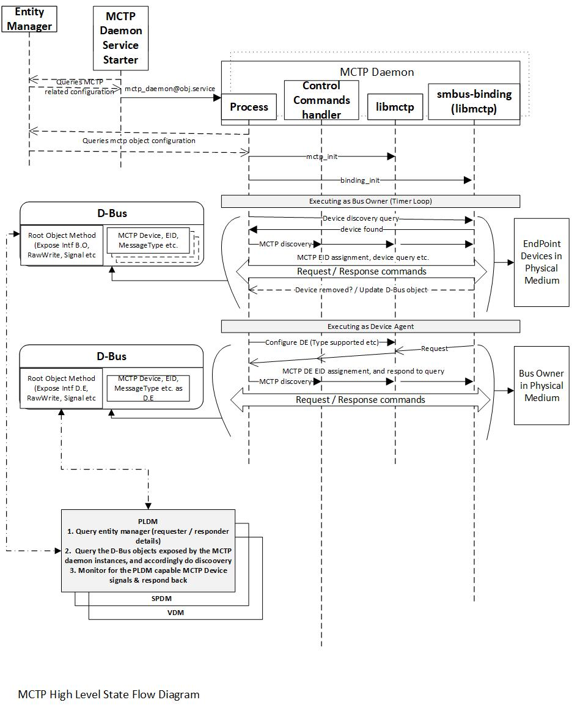

# OpenBMC MCTP Design

Author: Richard Thomaiyar <!rthomaiy123>

Primary assignee: Sumanth Bhat

Other contributors: Sumanth Bhat, Iwona Winiarska, Piotr Matuszczak

Created: 2019-December-12

## Problem Description

With IPMI standards body no longer operational, DMTF's PMCI working group
defines standards to address `inside the box` communication interfaces between
the components of the platform management subsystem.

This design aims to implement Management Component Transport Protocol (MCTP)
to provide a common transport layer protocol for application layer
protocols providing platform manageability solutions.

## Background and References

[MCTP Base Specification](https://www.dmtf.org/sites/default/files/standards/documents/DSP0236_1.3.0.pdf)

[MCTP SMBus Binding Specification](https://www.dmtf.org/sites/default/files/standards/documents/DSP0237_1.1.0.pdf)

[MCTP PCIe Binding Specification](https://www.dmtf.org/sites/default/files/standards/documents/DSP0238_1.0.1.pdf)

## Requirements

BMC needs to provide MCTP transport service which can be used by application
layer protocols such as PLDM, SPDM or Vendor Defined Messaging protocols. The
MCTP service will abstract the physical layer specific functionalities from
the upper layer protocols.

The MCTP Service should:

* Support both MCTP Bus Owner and Endpoint roles.
* Support multiple physical bindings (PCIe, SMBus, Serial, OEM etc.).
* Provide a way for the upper layer protocols to send messages to an endpoint
(EID) and receive messages from endpoints. (Tx/Rx mechanism)
* Discover MCTP protocol supported devices when BMC is the Bus Owner of the
physical medium and assign Endpoint IDs (EID)
* Advertise the supported MCTP types, when BMC is the endpoint device of the
physical medium.

## Proposed Design

Following basic principles in design are considered:

1. Support multiple binding in single (MCTP service) application.
2. Execute separate instance (of MCTP Service) for each physical interface.
This is to limit any problems of the offending bus isolated to that application.
This also enables parallel execution as many limitations apply to the physical
medium.
3. Start MCTP service as user space application, which will be exposing
D-Bus objects for the MCTP devices discovered. Upper application must have a
wrapper layer, which will hide the lower level D-Bus calls, so that in future
we can migrate to sockets. (Switching between socket-based driver).
4.	Binding support (libmctp-smbus, libmctp-pcie), control commands, core mctp
(assembly / disassembly) will be written as library and combined, so that based
on the need the MCTP service can be built.
5.	Entity-manager will be used to advertise the configuration required, which
the mctp-start.service will use to instantiate the needed MCTP services by
querying the objects exposed and calling the instance. MCTP services, will query
the object to know further about whether it must work as requester/responder,
and under what physical interface (SMBUS/ PCIE) etc. Option to do the same
using configuration file instead of Entity-manager.
6.	PLDM, SPDM, PCI VDM, NVME-MI application will run as separate daemon
interacting with the MCTP services (through D-BUS / Socket – abstracted
library).

### MCTP Service High Level Overview

Entity Manager will advertise MCTP configurations specific to the platform. This
will be used by mctp-start.service which will start multiple instances
of MCTP Service. The same service can be used to start upper layer protocols
(PLDM/SPDM etc.) based on the platform configurations.

The MCTP service instance can either start in `Endpoint mode` or in `Bus Owner
mode`. When the MCTP service instance comes up in `Endpoint mode`, BMC will
come up with the special EID 0; the bus owner in that physical medium needs to
assign EID to BMC. When the MCTP service instance comes up in `Bus Owner mode`,
BMC will discover MCTP capable devices on the physical medium and assigns
EIDs from a pre-configured EID pool.

MCTP Service will expose interfaces to enable upper layer protocols to discover,
send and receive MCTP messages.

The below image illustrates tentative MCTP service interfaces; the service will
expose following interfaces (Needs to be ratified, for illustration only)

### D-Bus Interfaces

* binding interface: This interface will have properties related to a MCTP
binding; and it will expose a method for upper layer protocols to transmit
MCTP message. It will also provide a signal to indicating upper layers about
arrival of a MCTP message. In case the upper layer needs to transfer/receive a
large payload, then instead of dumping the payload on D-Bus, the payload can be
dumped into a file and file descriptor can be passed to/from the MCTP Service.

* physical layer specific interface: This interface will have properties/methods
/signals specific to the physical layer. (E.g. - SMBus ARP method can be exposed
if ARP master daemon needs to be run and assign SMBus addresses)

* bus owner interface: This interface will have properties/methods/signals when
the service runs in bus owner mode. (E.g. - EID pool)

* mctp_device interface: This interface will have properties/methods/signals
when the service runs in endpoint device mode (E.g. - EID, Supported MCTP
Types etc.)

* bridging interface: This is WIP.

### MCTP Service design

MCTP Service shall have multiple libraries enabling different functionalities
of MCTP protocol. The libmctp, MCTP control commands, which provides core MCTP
functionalities, and the physical bindings can be implemented as C library to
enable porting to host/other controllers. (TBD, this is to align with up-stream)

The daemon process will be written in C++, and shall inherit the standard
OpenBMC frameworks (D-Bus/boost/asio etc.).

The following figure illustrates the internals of MCTP Service.

### State Flow

### MCTP Bridging, Top Most Bus Owner

TBD - Will be revisited later. In high level, the top most bus owner
service will update the EID pool to the bus owner MCTP service.

## Alternatives Considered

* MCTP socket - Kernel driver (instead of D-Bus) - socket mechanism currently
doesn't provide documented way of notifying addition / removal / updating
objects (like signals advertised when new MCTP device is plugged / unplugged /
updated.). Kernel based approach will have increased performance over D-Bus,
but, any minor bugs will crash the entire kernel causing the BMC to reboot.
Hence to start with MCTP as a service is planned and in parallel or later
it will be moved to socket based driver approach.
In order to support the switch, abstraction layer will be used for all the
D-Bus communications in the upper layer applications like PLDM, SPDM etc.

## Impacts
MCTP design impacts the way upper layer protocols like PLDM (and its types),
SPDM works.

## Testing
Testing can be done on existing MCTP capable devices (Add-In-Cards, MCTP enabled
ME/Host)
