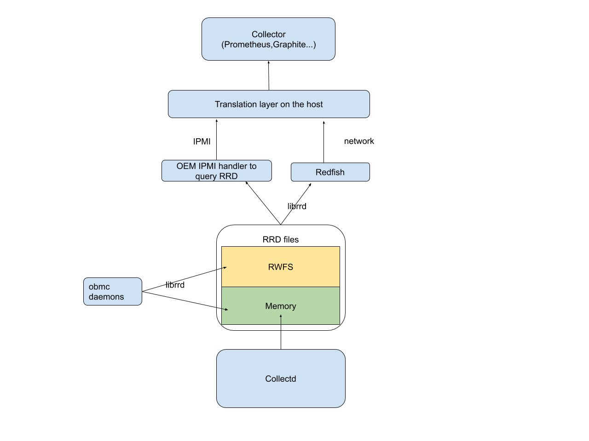
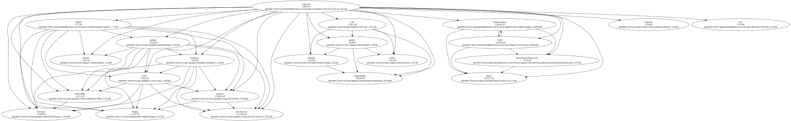

# OpenBMC Metrics Framework Design

Author: Kun Yi <kunyi@google.com>

Primary assignee: Kun Yi <kunyi@google.com>

Other contributors: Gabriel Matute <gabomatute@gmail.com>

Created: June 4, 2019

## Problem Description

Design a configurable BMC telemetry and health monitoring backend framework for
OpenBMC platforms. Specifically, this doc proposes

*   a general format for BMC metrics
*   how to integrate collectd/librrd to scrape and listen to metrics
*   how other components connect to the metrics data pipeline

The doc tries **not** to cover:

*   how metrics are logged
    *   A daemon may log metrics/events using one of the available logging
        mechanisms, but it should be optional instead of part of metrics.
*   how metrics are acted upon
    *   The metrics collection framework tries to be agnostic to the meaning of
        the metrics data. Instead, the system 'owner' can decide to have
        additional hooks that act based on collected metrics on a case-by-case
        basis.
*   which metrics should be reported
    *   Again, this is going to be highly variable between platforms. The whole
        point of the collection mechanism is to make it customizable.

## Background and References

Wikipedia defines metric as "a degree to which a software system or process
possesses some property" [1], while in cloud service monitoring, the term
"metrics" is often mentioned together with 'logs' and 'events'. One can find
several references distinguishing the concepts [2][3], and for context of this
design doc, the terms are defined as:

Logs: Freeform, often human readable, strings created by the system over time.

Metrics: Values about the system over time.

Events: Something interesting happening at particular points in time.

In comparison:

Property                      | Log                                              | Metric                                                                                 | Event
----------------------------- | ------------------------------------------------ | -------------------------------------------------------------------------------------- | -----
Generally numeric             | No                                               | Yes                                                                                    | Maybe
Time sensitivity              | No                                               | Somewhat                                                                               | Yes
Urgency                       | No                                               | No                                                                                     | Maybe
Target                        | Human                                            | Automation                                                                             | Human/Automation
Impact of losing a data point | Medium                                           | Low                                                                                    | High
Examples                      | dmesg/kmesg<br>systemd journal<br>rsyslog<br>... | CPU load<br>memory usage<br>disk usage<br>daemon restart count<br>system uptime<br>... | catastrophic GPIO
Existing OpenBMC collection   | journal<br>rsyslog<br>Redfish logging            | ?                                                                                      | IPMI SEL<br>Redfish event logs

Events and metrics are both meant to be consumed by programs, but the two have
several distinctctions: the former is irregular and may need human readable
logging and urgent actions. As will be discussed in the following sections,
using collectd/RRD files allows for **aggregation** of metrics data, which
enables space-efficient storage of data.

Metrics based monitoring shines if it can be integrated with a monitoring
architecture like Prometheus [4]. When BMC health telemetry/metrics are exposed
in this way, the monitoring architecture would be able to quantifiably provide
answers to questions like:

*   How much performance improved over the fleet when the BMCs are updated?
*   Is there a risk of BMC persistent storage getting full slowly overtime?
*   How many times do BMCs report thermal throttling on a group of machines
    running a heavy load?

None of which are easily acquirable on a small number of machines.

Also note that multiple open-source metrics collection frameworks already exist
[4][5] and it is possible to run them on a BMC system. However, these frameworks
are not optimized for embedded systems, thus not fitting the bill. Section
"Alternatives Considered" provides a more detailed discussion.

[1]: https://en.wikipedia.org/wiki/Software_metric
[2]: https://www.sumologic.com/blog/logs-metrics-overview/
[3]: https://thenewstack.io/what-is-the-difference-between-metrics-and-events/
[4]: https://prometheus.io/
[5]: https://graphiteapp.org/

## Assumptions and Requirements

### Assumptions on the BMC system

The design is specifically targeting an OpenBMC system, which is an embedded
Linux distro with Systemd/D-Bus available.

We also need to keep in mind that the OpenBMC often lives in an embedded system
that is memory, storage, compute and I/O bound. This implies restrictions such
as limited max number of metrics to collect, limited ability to store data on
the R/W filesystem, etc.

The design also assumes the BMC userspace is operating (or at least recoverable
to a normal state) when the metrics are collected and reported. How to recover
BMC in catastrophic situations is beyond the scope of this doc.

### Requirements

Given the assumptions, we layi out the requirements for the framework as the
following:

*   Simple
    *   We keep features at a minimum with the mindset that the framework will
        be used as a building block, not the do-it-all infrastructure
    *   The baseline is that monitoring should **not** impact BMC stability and
        reliability
*   Both push/poll models are supported for collection
    *   Daemons and short-lived processes can push metrics to the collector
    *   Collector spawns a separate thread that can scrape metrics from
        kernel/userspace interfaces
*   Optional
    *   We aim to provide compile-time and run-time knobs such that when
        monitoring is not needed, it can be turned off with minimal performance
        overhead on the system
*   Best-of-effort perseverance of critical metrics
    *   Given the embedded nature of BMCs, it is nonsensical for it to hold an
        extremely long time worth of data points, or carry extensive computation
        to compress/aggregate the data
        *   Corollary: there must be an entity polling data from BMC constantly
            to guarantee there is no data loss
    *   However, poller unresponsiveness is still very common (think about a
        host reboot for updating) and BMC should persist critical data
        accounting for the time it takes to resume polling
        *   As a hypothetical scenario, for events happening at a 1/minute
            frequency, storing one day's worth of data points requires 1440 data
            points, which is not unreasonable

## Integrating Collectd/librrd

Collectd is a daemon which collects system and application performance metrics
periodically and provides mechanisms to store the values in a variety of ways,
for example in RRD files. [1]

Round Robin Database (RRD) is a format specially designed to handle timeseries
data, and collectd includes tools and libraries around it such as librrd,
rrdtool and rrdcached.

There are several advantages of using the collectd/librrd framework:

*   There are many plugins available for input/output already [2]
*   Collectd and most plugins are implemented in C, which reduces memory usage
    and binary size
*   RRD files are designed to be constant size over time, which suits BMC
    systems with limited storage
*   librrd can be used to implement a push model where different daemons can
    create RRD files either in memory or on the persistent storage
*   With collectd and RRD it is easy to implement basic data aggregation such as
    taking average or maximum of values over time

[1]: https://collectd.org/
[2]: https://collectd.org/wiki/index.php/Table_of_Plugins

## Proposed Design

#### Collecting via collectd

For metrics that are already capable of being collected via collectd, almost
nothing needs to be done in addition to enabling and configuring the collectd
plugin.

#### Collecting via librrd

OpenBMC processes can create arbitrary metric files with librrd (which is a
dependency of the collectd rrdtool plugin).

However, to make the API easier to use, we propose to add:

*   a C++ language binding "librrdplus" that provides object-oriented API for
    RRD file creation and querying

If we need to differentiate between metrics and only selectively persist them,
it can be done by creating separate calls to create files in different
filesystem partitions (for example, rrd_create() will send files to /tmp and
rrd_create_rw() will send them to /var/lib).

#### Querying metrics via Redfish

There are some relevant Redfish Schema available and can be implemented.
See[1][2][3]. There is also a in-progress design review for Redfish telemetry
metrics interface [4].

[1]: https://redfish.dmtf.org/schemas/v1/MetricDefinition.json
[2]: https://redfish.dmtf.org/schemas/v1/MetricReportCollection.json
[3]: https://redfish.dmtf.org/schemas/v1/MetricReportDefinitionCollection.json
[4]: https://gerrit.openbmc-project.xyz/c/openbmc/docs/+/23758

#### Export metrics to another collection endpoint

Sending metrics to another collectd network socket is natively supported via
collectd "network" plugin. More efforts are needed to scope the work for
transporting metrics to other collection frameworks.

#### Querying metrics via inband IPMI

In some cases, there is no network connection to the BMC. We propose an
interface on top of the phosphor-ipmi-blobs interface
(https://github.com/openbmc/phosphor-ipmi-blobs) to query the metrics:

BmcBlobEnumerate BmcBlobOpen BmcBlobRead BmcBlobWrite BmcBlobCommit BmcBlobClose
BmcBlobDelete

Host would transfer the metrics query protobuf to BMC, and BMC IPMI blob handler
will parse the protobuf, query the underlying RRD files, and prepare a protobuf
response.

### Example System Diagram



## Alternatives Considered

Run existing infra like Prometheus on the BMC Although this is feasible, we feel
like it is not the best option since:

1.  Systems like Prometheus assumes at least ample storage for timeseries data,
    which obligates the use of external storage like eMMCs/SD cards for a BMC
    chip. Many BMC systems only have an SPI EEPROM with a few MBs of available
    space to start with.
2.  Performance cost is too high when each of the metric to be collected must
    exist as an HTTP endpoint to be scraped.

Use structured logs based on phosphor-logging or systemd journal Although it's
possible (in fact, the free-form nature of logging means any metrics can be
encoded as logs), we feel like there are two important requirements that are
hard to achieve:

1.  Guarantee quality of service for each individual metric. With this design, a
    metric event being thrashed will not prevent other metrics being logged,
    which is extremely important since BMC is limited in memory and storage.

2.  Configure persistence on a per-metric basis. Persistence for logging is
    usually configured on a severity or source level basis. In this case we have
    many metrics coming from the same source, but each of them may need
    different persistent level. For example, it makes sense to persist BMC boot
    count across reboots, but maybe not about BMC uptime.

## Impacts

### Collectd footprint

There were some concerns and open questions on how large the collectd footprint
is, so we did some initial study on the impact of enabling collectd.

#### Additional dependencies

It is possible to see the dependency graph for collectd by with `bitbake -g
collectd`, however this doesn’t account for the set of recipes that are already
a part of openbmc. Below there’s a graphical representation of NEW dependencies
when building `MACHINE=palmetto`, that is filtering out all nodes that are part
of ‘obmc-phosphor-image’ dependency graph.



It is worth noting that many of the packages required can be stripped out if
needed. For example, rrdtool by default depends on a few graphics libraries for
plotting results, which is a functionality we can spare.

#### Image size

With the default Collectd configuration the squashfs rootfs increases from ~16MB
to ~23MB, which a considerable increase of >7MB. However, this includes many
plugins that are built and included by default with Collectd as well as many
dependencies which default configuration is not size optimized (as in they
include many optional dependencies).

We believe it should be possible to reduce the effect on the image size, as the
disk usage utility when ran in the BMC showed a variety of new libraries and
binaries that had been included after the addition of Collectd. Below you can
see a summary as reported by `du` by `df`.

```
Filesystem           Type       1K-blocks    Before     After  Mounted on
tmpfs                tmpfs         117896     14960     23164  /run
/dev/mtdblock4       squashfs       15616     15616     21376  /run/initramfs/
/dev/mtdblock5       jffs2           4096       336       536  /run/initramfs/
cow                  overlay         4096       336       536  /
```

#### Runtime

As monitored when running the default configuration over a period of 5 minutes,
the memory usage as shown `/proc/PID/status` was consistent at 4832kB (VmRSS) or
as shown by `top` 44% MEM (VSZ/MemTotal), while the CPU usage never went above
1%.

#### Storage Usage

Assuming the metrics will be preserved in the BMC using the RRD plugin in
Collectd, the default configuration creates a variety of files (one per metric)
each 145-430 kB. However, this configuration assumes that metric aggregations
will be kept for hourly, daily, weekly, monthly and yearly summaries, which is
unrealistic in most setups.

In a more realistic setting, keeping 1 metric update every 30s and total history
of 24 hours, the RRD file size is ~23kB.

## Testing

There will be accompanying unit tests for each deliverable module.
