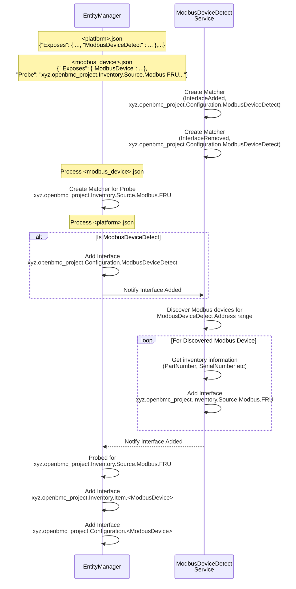

# Modbus based hardware inventory

Author: Jagpal Singh Gill <paligill@gmail.com>

Other contributors: Amithash Prasad <amithash@meta.com>

Created: 14th January 2025

## Problem Description

Certain devices can be connected to the BMC via Modbus interface, either RTU or
TCP. However, openBMC currently lacks support for discovering these devices and
exposing their relevant inventory and sensor access details. This proposal aims
to introduce a Modbus-based hardware inventory model. The scope of this document
will focus on RTU (Serial) connections, but the design is extensible to
accommodate TCP connections in the future.

## Background and References

- [Modbus Specification](https://www.modbus.org/docs/Modbus_Application_Protocol_V1_1b3.pdf)
- [Belimo Flow Meter Modbus Interface](https://www.belimo.com/mam/general-documents/system_integration/Modbus/belimo_Modbus-Register_22PF_V4_2_en-gb.pdf)

## Requirements

- Able to detect and identify Modbus devices connected to the system, including
  those daisy-chained on a serial link with varying device types.
- Able to read and expose static inventory information from the discovered
  devices.
- Able to handle the removal of Modbus devices, ensuring proper cleanup of
  device inventory and associated data.
- Able to expose Modbus registers for sensors, status flags, and firmware
  information, enabling appropriate services to monitor and manage relevant
  features.

## Proposed Design

### Proposed End to End flow



### Proposed D-Bus Interfaces

The DBus Interface for Modbus hardware inventory will consist of following -

- [xyz.openbmc_project.Configuration.ModbusDeviceDetect](https://gerrit.openbmc.org/c/openbmc/phosphor-dbus-interfaces/+/77293)

  - Provides configuration details, including Modbus address range and inventory
    registers, to facilitate the discovery of Modbus devices.

- [xyz.openbmc_project.Inventory.Source.Modbus.FRU](https://gerrit.openbmc.org/c/openbmc/phosphor-dbus-interfaces/+/77294)
  - Provides device access details, including Modbus address and LinkTTY
    information, along with inventory data for all discovered Modbus devices.
- [xyz.openbmc_project.Configuration.ModbusDevice](https://gerrit.openbmc.org/c/openbmc/phosphor-dbus-interfaces/+/77299)
  - Provides configuration details such as sensor, status bit and firmware
    registers for inventory modbus devices to be utilized by the sensor
    monitoring and firmware management services.

### Proposed EM Schema Definitions

#### ModbusDeviceDetect

For details on the schema definition, please
[refer](https://gerrit.openbmc.org/c/openbmc/entity-manager/+/77223). Below is
an example of entity manager configuration for this schema -

```json
"Exposes": [
...
{
  "Type": "ModbusDeviceDetect",
  "Name": "Flow Meter 1",
  "AddressRangeStart": [
    12,
    50
  ],
  "AddressRangeEnd": [
    20,
    100
  ],
  "ConnectionType": "RTU",
  "RTUBaudRate": 115200,
  "DataParity": "Odd",
  "DataEndianness": "Little",
  "RegisterNames": [
    "PartNumber",
    "SerialNumber"
  ],
  "RegisterAddresses": [
    100,
    200
  ],
  "RegisterSizes": [
    6,
    4
  ],
  "RegisterFormats": [
    "String",
    "String"
  ]
}
...
]
```

#### ModbusDevice

For details on the schema definition, please
[refer](https://gerrit.openbmc.org/c/openbmc/entity-manager/+/77289). Below is
an example of entity manager configuration for this schema -

```json
"Exposes": [
...
{
  "Type": "ModbusDevice",
  "Name": "Flow_Meter_1_12",
  "Address": 12,
  "ConnectionType": "RTU",
  "LinkTTY": "ttyUSB1",
  "RTUBaudRate": 115200,
  "DataParity": "None",
  "DataEndianness": "Little",
  "SensorRegisterNames": [
    "AbsoluteVolumetricFlow",
    "GycolConcentration"
  ],
  "SensorRegisterAddresses": [
    7,
    25
  ],
  "SensorRegisterSizes": [
    2,
    2
  ],
  "SensorRegisterFormats": [
    "Float",
    "Integer"
  ],
  "FirmwareVersionRegisterAddress": 103,
  "StatusBitNames": ["MeterFaulty"],
  "StatusBitRegisterAddress": [37378],
  "StatusBitPosition": [1]
}
...
]
```

## Alternatives Considered

## Impacts

### Performance Impacts

The design may result in a slight decrease in system performance due to periodic
checks for the Modbus device's presence, but this impact is negligible.

### Organizational

- Does this proposal require a new repository?
  - Yes
- Who will be the initial maintainer(s) of this repository?
  - Patrick Williams, Jagpal S Gill, Amithash Prasad
- Which repositories are expected to be modified to execute this design?
  - EntityManager
- Make a list, and add listed repository maintainers to the gerrit review.

## Testing

### Unit Testing

All the functional testing of the reference implementation will be performed
using GTest.

### Integration Testing

The end to end integration testing involving Servers (for example BMCWeb) will
be covered using openbmc-test-automation.
