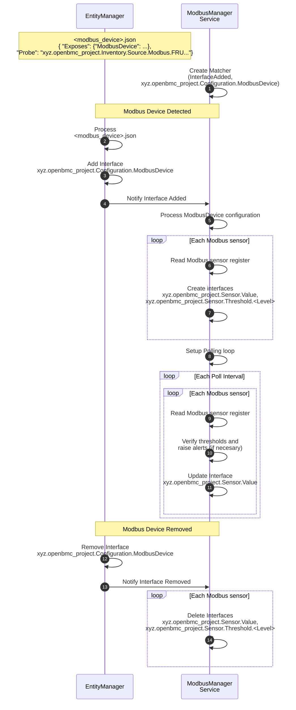

# Modbus sensors and management

Author: Jagpal Singh Gill <paligill@gmail.com>

Other contributors: Amithash Prasad <amithash@meta.com>

Created: 21st January 2025

## Problem Description

There are devices that can connect to the BMC via Modbus interface. However,
openBMC currently lacks a service to monitor sensors and perform management
functions like firmware updates for these devices. This proposal aims to define
a service that will monitor and manage Modbus-based devices. The primary focus
of this design is on Modbus RTU (Serial) connections, but it is designed to be
flexible and extensible to support other Modbus interfaces, such as TCP, in the
future.

## Background and References

A related design has been proposed for
[Modbus based HW Inventory](https://gerrit.openbmc.org/c/openbmc/docs/+/77318),
which aims to discover corresponding Modbus devices and create related inventory
items. This design is built upon the foundation of Modbus inventory design.

For further reference, please see:

- [Modbus Specification](https://www.modbus.org/docs/Modbus_Application_Protocol_V1_1b3.pdf)
- [Belimo Flow Meter Modbus Interface](https://www.belimo.com/mam/general-documents/system_integration/Modbus/belimo_Modbus-Register_22PF_V4_2_en-gb.pdf)

## Requirements

1. Able to define device access configuration, for example, Modbus registers for
   sensor data.
2. Able to specify sensor thresholds for monitoring, with the ability to trigger
   and resolve events when threshold limits are exceeded or restored.
3. Able to read and provide the firmware version of the Modbus device to
   clients.
4. Capable of updating firmware for Modbus devices.
5. Able to report Redfish events specific to a device, such as:
   - Reporting the open/close status of a Coolant Valve Train.
   - Reporting a faulty status for a Coolant Flow Meter.
6. Supports Modbus RTU over a serial link (with limited capabilities), using a
   master-slave model where the master can only communicate with one slave at a
   time in unicast mode.
7. Capable of efficiently polling Modbus devices over a serial connection, such
   as RS485, which can support up to 32 daisy-chained devices.
8. Exposes sensor, firmware, and status information via a Redfish-based REST
   interface for client access.

## Proposed Design

### Proposed End to End Flow



### Proposed D-Bus Interfaces

- [xyz.openbmc_project.Configuration.ModbusDevice](https://gerrit.openbmc.org/c/openbmc/phosphor-dbus-interfaces/+/77299)
  - Provides configuration details such as sensor, status bit and firmware
    registers for modbus devices to be utilized by the sensor monitoring and
    firmware management services.

In addition to the above, the following existing interfaces will be created at
the /xyz/openbmc_project/sensors/\<ModbusDeviceType\>/\<SensorName\>
objectPath -

- xyz.openbmc_project.Association.Definitions
  - Implement
    [sensors](https://github.com/openbmc/phosphor-dbus-interfaces/blob/master/yaml/xyz/openbmc_project/Inventory/Item.interface.yaml#L92)
    association to inventory item.
- xyz.openbmc_project.State.Decorator.Availability
- xyz.openbmc_project.State.Decorator.OperationalStatus
- xyz.openbmc_project.Sensor.Value
- xyz.openbmc_project.Sensor.Threshold.Critical
  - A better alternative can be xyz.openbmc_project.Common.Threshold
- xyz.openbmc_project.Sensor.Threshold.Warning
  - A better alternative can be xyz.openbmc_project.Common.Threshold

_\<ModbusDeviceType\>_ refers to Inventory item types such as flow_meter,
rack_pumping_unit, etc, whereas \*\<SensorName\>\_ is from EntityManager
configuration.

### Proposed Events

TBD

### ModbusDevice EM Schema Definitions

For details on the schema definition, please
[refer](https://gerrit.openbmc.org/c/openbmc/entity-manager/+/77289). Below is
an example of entity manager configuration for this schema -

```json
"Exposes": [
...
{
  "Type": "ModbusDevice",
  "SubType": "FlowMeter",
  "Name": "Flow_Meter_1_12",
  "Address": 12,
  "ConnectionType": "RTU",
  "LinkTTY": "ttyUSB1",
  "RTUBaudRate": 115200,
  "DataParity": "None",
  "DataEndianness": "Little",
  "SensorRegisterNames": [
    "AbsoluteVolumetricFlow",
    "GycolConcentration"
  ],
  "SensorRegisterAddresses": [
    7,
    25
  ],
  "SensorRegisterSizes": [
    2,
    2
  ],
  "SensorRegisterFormats": [
    "Float",
    "Integer"
  ],
  "FirmwareVersionRegisterAddress": 103,
  "StatusBitNames": ["MeterFaulty"],
  "StatusBitRegisterAddress": [37378],
  "StatusBitPosition": [1]
}
...
]
```

### Handle Modbus RTU serial link limitations

The Modbus RTU serial link communication operates on a master-slave model, where
the master can only communicate with one slave at a time in unicast mode. To
overcome this limitation, all communications sent to the serial line are
serialized through a processing queue. The master retrieves messages from this
queue and processes them sequentially, ensuring exclusive access to a single
slave in unicast mode. This addresses requirement# 6.

### Efficient Modbus Access

As previously above, maintaining a processing queue per serial link enables the
master to communicate with multiple serial lines simultaneously, resulting in
improved performance compared to a single-queue model. This addresses
requirement# 7.

### Redfish Interface

#### Flow Meter

The following Redfish Schemas need to be implemented in BMCWeb for flow meter
support -

- Thermal Subsystem
- Coolant Loop
- Coolant Connector

## Future Enhacements

Requirement# 2 is an enhancement will be added to the design in subsequent
patches.

## Alternatives Considered

TBD

## Impacts

### Performance Impacts

### Organizational

- Does this proposal require a new repository?
  - Yes
- Who will be the initial maintainer(s) of this repository?
  - Patrick Williams, Jagpal S Gill, Amithash Prasad
- Which repositories are expected to be modified to execute this design?
  - EntityManager
- Make a list, and add listed repository maintainers to the gerrit review.

## Testing

### Unit Testing

All the functional testing of the reference implementation will be performed
using GTest.

### Integration Testing

The end to end integration testing involving Servers (for example BMCWeb) will
be covered using openbmc-test-automation.
