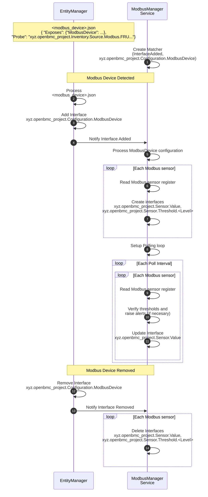

# Modbus sensors and management

Author: Jagpal Singh Gill <paligill@gmail.com>

Other contributors: Amithash Prasad <amithash@meta.com>

Created: 21st January 2025

## Problem Description

There are devices capable of connecting to the BMC via the Modbus interface.
However, openBMC currently lacks a service to monitor sensors and perform
management functions such as firmware inventory and updates for these devices.
This proposal outlines a service designed to monitor and manage Modbus-based
devices. The primary focus is on Modbus RTU (Serial) connections, with the
flexibility to support other Modbus interfaces like TCP in the future. Although
the design focuses on use cases for Modbus-based flow meters, it is extensible
and can be adapted to add support for new device types.

## Background and References

A related design has been proposed for
[Modbus based HW Inventory](https://gerrit.openbmc.org/c/openbmc/docs/+/77318),
which aims to discover corresponding Modbus devices and create related inventory
items. This design is built upon the foundation of Modbus inventory design.

For further reference, please see:

- [Modbus Specification](https://www.modbus.org/docs/Modbus_Application_Protocol_V1_1b3.pdf)
- [Belimo Flow Meter Modbus Interface](https://www.belimo.com/mam/general-documents/system_integration/Modbus/belimo_Modbus-Register_22PF_V4_2_en-gb.pdf)

## Requirements

1. Able to define device access configuration, for example, Modbus registers for
   sensor data.
2. Able to specify sensor thresholds for monitoring, with the ability to trigger
   and resolve events when threshold limits are exceeded or restored.
3. Able to read and provide the firmware version of the Modbus device to
   clients.
4. Capable of updating firmware for Modbus devices.
5. Able to report Redfish events/errors specific to a device, such as:
   - Reporting a fault status for a temperature sensor in liquid cooling
     apparatus.
   - Reporting wrong flow direction in liquid cooling apparatus.
6. Supports Modbus RTU over a serial link (with limited capabilities), using a
   master-slave model where the master can only communicate with one slave at a
   time in unicast mode.
7. Capable of efficiently polling Modbus devices over a serial connection, such
   as RS485, which can support up to 32 daisy-chained devices.
8. Exposes sensor, firmware, and status information via a Redfish-based REST
   interface for client access.

## Proposed Design

### Proposed End to End Flow



### Proposed D-Bus Interfaces

- [xyz.openbmc_project.Configuration.ModbusDevice](https://gerrit.openbmc.org/c/openbmc/phosphor-dbus-interfaces/+/77299)
  - Provides configuration details such as sensor, status bit and firmware
    registers for modbus devices to be utilized by the sensor monitoring and
    firmware management services.

Additionally, the following existing interfaces will also be used -

- xyz.openbmc_project.Association.Definitions
  - Implement
    [inventory](https://github.com/openbmc/phosphor-dbus-interfaces/blob/master/yaml/xyz/openbmc_project/Inventory/Item.interface.yaml#L97)
    association to inventory item. A better alternative can be
    [monitoring](https://github.com/openbmc/phosphor-dbus-interfaces/blob/master/yaml/xyz/openbmc_project/Inventory/Item.interface.yaml#L74)
    association.
- xyz.openbmc_project.State.Decorator.Availability
- xyz.openbmc_project.State.Decorator.OperationalStatus
- xyz.openbmc_project.Sensor.Value
- xyz.openbmc_project.Sensor.Threshold.Critical
  - A better alternative can be xyz.openbmc_project.Common.Threshold
- xyz.openbmc_project.Sensor.Threshold.Warning
  - A better alternative can be xyz.openbmc_project.Common.Threshold

The interfaces will be created at the
/xyz/openbmc*project/sensors/\<SensorType\>/\<SensorName\> objectPath, where
*\<SensorType\>_ and _\<SensorName\>\_ correspond to properties defined in the
ModbusDevice EM configuration. The table below illustrates some possible sensor
types and associated information for liquid cooling apparatus.

| Sensor Type   | Sensor Object Path                         | Unit              |
| ------------- | ------------------------------------------ | ----------------- |
| LiquidFlow    | /xyz/openbmc_project/sensors/liquid_flow   | LPM               |
| Temperature   | /xyz/openbmc_project/sensors/temperature   | DegreesC          |
| Volume        | /xyz/openbmc_project/sensors/volume        | CM (Cubic Meters) |
| Concentration | /xyz/openbmc_project/sensors/concentration | Percent           |

For further details, please
[refer](https://gerrit.openbmc.org/c/openbmc/phosphor-dbus-interfaces/+/77542).

### ModbusDevice EM Schema Definitions

For details on the schema definition, please
[refer](https://gerrit.openbmc.org/c/openbmc/entity-manager/+/77289). Below is
an example of entity manager configuration for this schema -

```json
"Exposes": [
...
{
{
  "Type": "ModbusDevice",
  "Name": "Flow_Meter_1_12",
  "SubType": "FlowMeter",
  "Address": 12,
  "ConnectionType": "RTU",
  "LinkTTY": "ttyUSB1",
  "RTUBaudRate": 115200,
  "DataParity": "None",
  "DataEndianness": "Little",
  "SensorNames": [
    "AbsoluteFlow",
    "GycolConcentration"
  ],
  "SensorTypes": [
    "LiquidFlow",
    "Concentration"
  ],
  "SensorRegisterAddresses": [
    7,
    25
  ],
  "SensorRegisterSizes": [
    2,
    2
  ],
  "SensorRegisterFormats": [
    "Float",
    "Integer"
  ],
  "SensorPrecisions": [
    5,
    NaN
  ],
  "SensorScaleFactors": [
    2,
    NaN
  ],
  "FirmwareVersionRegisterAddress": 103,
  "StatusBitNames": [
    "CoolantLoopBlocked"
  ],
  "StatusBitRegisterAddress": [
    37378
  ],
  "StatusBitPosition": [
    1
  ]
}
}
...
]
```

### Handle Modbus RTU serial link limitations

The Modbus RTU serial link communication operates on a master-slave model, where
the master can only communicate with one slave at a time in unicast mode. To
handle this limitation, all communications sent to the serial line can be
serialized through a processing queue. The master retrieves messages from this
queue and processes them sequentially, ensuring exclusive access to a single
slave in unicast mode. This addresses requirement# 6.

### Efficient Modbus Access

Building on the previous section, maintaining a processing queue per serial link
enables the master to communicate with multiple serial lines simultaneously,
resulting in improved performance compared to a single-queue model. This
addresses requirement# 7.

### Redfish Interface

The following Redfish Schemas need to be implemented in BMCWeb for flow meter
support -

- [ThermalSubsystem](https://redfish.dmtf.org/schemas/v1/ThermalSubsystem.v1_3_3.json)
- [CoolantConnector](https://redfish.dmtf.org/schemas/v1/CoolantConnector.v1_1_0.json)
- [CoolingLoop](https://redfish.dmtf.org/schemas/v1/CoolingLoop.v1_0_3.json)

### Proposed Events

#### Redfish Environmental Errors and Events for Liquid Cooling Apparatus

The following categories of errors and events are defined for liquid cooling
apparatus based on the
[Standard Redfish Environmental](https://www.dmtf.org/sites/default/files/standards/documents/DSP2065_2024.4.pdf)
specification:

- _Flow Rate_: Errors and events related to the flow rate of the liquid coolant.
- _Fluid Level_: Errors and events related to the level of the liquid coolant.
- _Temperature_: Errors and events related to the temperature of the liquid
  coolant.

#### OpenBMC Namespace Errors and Events for Liquid Cooling Apparatus

In addition to the standard Redfish environmental errors and events, the
following custom errors and events needs to be defined for the openBMC namespace
for liquid cooling apparatus:

- _Temperature Sensor Faulty_: Error indicating a faulty temperature sensor in
  the liquid cooling apparatus.
- _Reverse Flow_: Errors indicating wrong direction of flow in the liquid
  cooling apparatus.
- _Wrong Coolant Type_: Errors indicating the use of an incorrect or
  incompatible coolant type in the liquid cooling apparatus.

### Firmware Inventory and Update

The _FirmwareVersionRegisterAddress_ has been proposed in the
[Entity Manager configuration](https://gerrit.openbmc.org/c/openbmc/entity-manager/+/77289)
for modbus_device. This field will specify the Modbus address of the firmware
register, enabling the Modbus daemon to retrieve the device's firmware version
and display it via D-Bus Version interface. For more details on firmware
inventory and update design, please
[refer](https://github.com/openbmc/docs/blob/master/designs/code-update.md).

## Alternatives Considered

An alternative design option is to divide the Modbus daemon into smaller,
device-specific daemons (e.g., for flow meters, rack pumping units, etc.).
However, this approach is limited by the RTU constraints mentioned in
requirement #6, as multiple devices of different types and addresses can coexist
on the same link. Therefore, a single Modbus daemon master is a more suitable
choice.

## Impacts

### Performance Impacts

Periodic polling of Modbus sensors may cause a minor decrease in system
performance, but this can be mitigated by adjusting the polling duration through
configurable settings.

### Organizational

- Does this proposal require a new repository?
  - Yes
- Who will be the initial maintainer(s) of this repository?
  - Patrick Williams, Jagpal S Gill, Amithash Prasad
- Which repositories are expected to be modified to execute this design?
  - EntityManager
- Make a list, and add listed repository maintainers to the gerrit review.

## Testing

### Unit Testing

All the functional testing of the reference implementation will be performed
using GTest.

### Integration Testing

The end to end integration testing involving Servers (for example BMCWeb) will
be covered using openbmc-test-automation.
