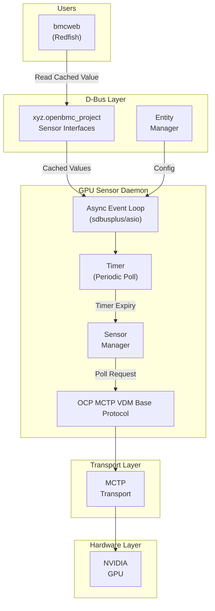
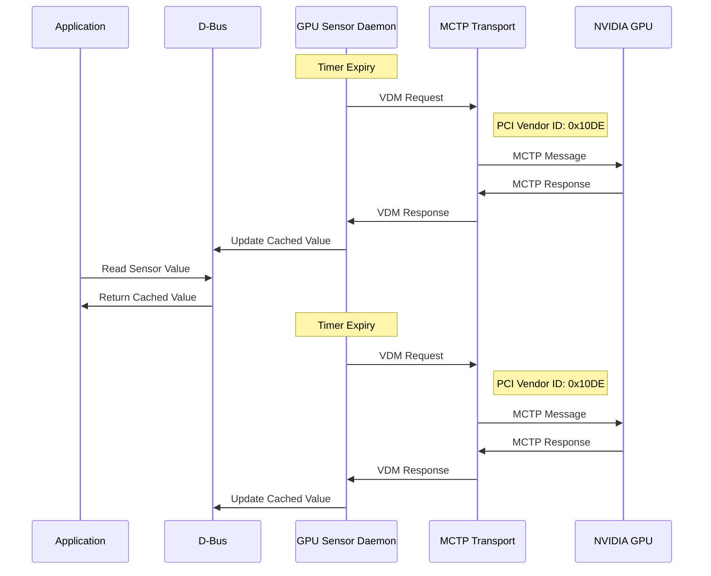

# NVIDIA GPU Sensor Support in dbus-sensors

- Authors: Deepak Kodihalli
- Created: March 14, 2024

## Problem Description

Enable OpenBMC's dbus-sensors to read GPU sensors using an OCP MCTP VDM
protocol.

## Background and References

The
[OCP GPU & Accelerator Management Interfaces Specification](https://www.opencompute.org/documents/ocp-gpu-accelerator-management-interfaces-v1-pdf)
defines a protocol framework for MCTP OEM VDM that allows device vendors to
implement their own monitoring and control interfaces. The specification
acknowledges that device vendors will have additional OEM sensors that don't fit
into existing PLDM Type 2 definitions.

### OCP MCTP VDM Base Specification

The base specification provides:

1. **Message Bindings**

   - PCI Vendor ID-based messages (using vendor's PCI ID)
   - IANA Enterprise ID-based messages (using OCP's IANA ID: 42623)

2. **Protocol Features**

   - Message type identification
   - Support for request/response and event messages
   - Instance ID tracking for message pairing
   - Completion codes and error handling
   - Timing specifications (retry counts, timeouts)

3. **Bulk Telemetry Format**
   - Support for multiple sensors in a single response

The specification does not define specific sensor types, leaving that to vendor
extensions.

### NVIDIA Extensions

NVIDIA implements vendor-specific extensions to define various sensor types
using the PCI Vendor ID binding (0x10DE). The following is a non-exhaustive
list, also referenced
[here](https://docs.nvidia.com/datacenter/dcgm/latest/user-guide/feature-overview.html#):

1. Thermal Telemetry:

   - GPU temperature
   - Memory temperature

2. Power Management:

   - Current power draw
   - Maximum observered power
   - Energy count
   - Voltage readings
   - Power limits

3. Performance Metrics:

   - GPU utilization
   - GPU performance metrics
   - Memory utilization
   - GPU clock frequencies
   - Memory clock frequencies

4. Memory Subsystem:
   - ECC status and configuration
   - Memory error counts

### Relationship with NVIDIA's nsmd

While this implementation will draw inspiration from
[NVIDIA's nsmd](https://github.com/NVIDIA/nsmd), which provides a reference for
GPU sensor collection, the OpenBMC implementation will follow the dbus-sensors
architecture:

- Use the established dbus-sensors patterns and infrastructure
- Integrate with entity-manager for configuration
- Implement async event handling
- Follow OpenBMC coding and CI standards
- Use of standard OpenBMC D-Bus interfaces, and existing ones, where possible

## Requirements

The GPU sensor implementation in dbus-sensors should:

1. Follow existing dbus-sensors architecture patterns:

   - Isolated daemon for GPU sensors
   - Async single-threaded
   - Support for entity-manager configuration

2. Implement OCP MCTP VDM base protocol framework:

   - Support both PCI Vendor ID and IANA Enterprise ID message bindings
   - Handle message framing for various sensors
   - Implement completion code and error handling
   - Support bulk sensors message format
   - Follow timing specifications for retries and timeouts

3. Support NVIDIA Extensions:

   - Implement verified NVIDIA VDM commands for fetching sensor readings
   - Handle NVIDIA-specific sensor data formats

4. Integrate with existing OpenBMC interfaces (few examples below):
   - xyz.openbmc_project.Sensor.Value
   - xyz.openbmc_project.Sensor.Threshold.Critical
   - xyz.openbmc_project.Sensor.Threshold.Warning

## Proposed Design

### Architecture

### Component Details

1. **Main Event Loop**

   - Handles D-Bus method calls
   - Manages sensor update intervals
   - Coordinates between components

2. **Sensor Manager**

   - Creates and updates sensor objects
   - Manages sensor thresholds
   - Handles sensor value scaling/conversion
   - Implements sensor interfaces

3. **OCP MCTP VDM Base Protocol Implementation**

   - Implements OCP MCTP VDM base protocol
   - Handles message framing for various sensor types
   - Manages request/response pairing
   - Implements retry logic and timeouts

4. **Entity Manager Integration**
   - Reads GPU configuration

### Message Flow

## Alternatives Considered

1. **Separate Repository Approach**
   - Pros:
     - Code reuse
   - Cons:
     - Repository maintenance overhead for minimal OCP spec code
     - Repository maintenance overhead for Nvidia specific code
     - Potential divergence from dbus-sensors patterns
2. **Direct Port of nsmd**

   - Pros:
     - Proven downstream implementation
     - Complete feature set
   - Cons:
     - Not integrated with OpenBMC architecture
     - Different design patterns

3. **PLDM-based Implementation**
   - Pros:
     - Standard protocol
     - Existing OpenBMC support
   - Cons:
     - Missing GPU-specific features
     - Longer standardization and adoption timeline

## Impacts

- New D-Bus interfaces will have to be defined for missing sensors
- GPU sensor daemon will be implemented (expected LOC 5K)
- Openbmc meta layer and recipes will be added
- Entity manager schema updates
- Redfish (bmcweb) code additions for missing GPU sensor related schema

### Organizational

- Does this repository require a new repository? No
- Which repositories are expected to be modified to execute this design?
  - openbmc/bmcweb
  - openbmc/dbus-sensors
  - openbmc/entity-manager
  - openbmc/openbmc
  - openbmc/phosphor-dbus-interfaces

## Testing

1. Unit Tests:

   - Protocol message encoding/decoding

2. Integration Tests:

   - D-Bus interface verification
   - Entity manager configuration
   - Redfish API validation

3. System Tests:
   - Multi-GPU configurations
   - Stress testing
   - Error recovery
   - Performance validation
