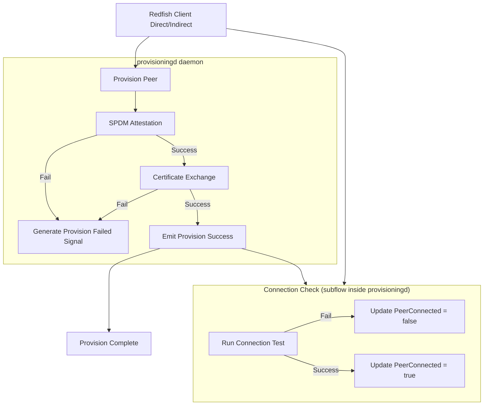

# Provisioningd

Author: Abhilash Raju <abhilash.kollam@gmail.com>

Other contributors:

Created: September 11th, 2025

## Problem Description

In a distributed BMC network, new BMCs may need to be added dynamically. To
ensure security and trustworthiness of the overall system, any new BMC joining
the network must undergo a **provisioning process**. This process guarantees
that the new device is authentic, uncompromised, and capable of establishing
secure communications.

Currently, there is no OpenBMC service that provides end-to-end provisioning of
new BMCs, including integrity validation, certificate management, and secure
connectivity validation.

## Background and References

- **Attestation**: Mechanism to validate the integrity of hardware and firmware
  of a new BMC. Protocols such as
  [SPDM (Security Protocol and Data Model)](https://www.dmtf.org/standards/spdm)
  can be leveraged to perform remote attestation.
- **Secure Communication**: For peer-to-peer communication between BMCs,
  **Mutual TLS (mTLS)** must be used, requiring trusted certificates issued by a
  common or mutually trusted CA.
- **Dbus**: Once provisioned, the BMC should expose its provisioning state and
  related logs/events through Dbus APIs.

## Requirements

1. **Integrity Attestation**: Validate the hardware and firmware integrity of a
   new BMC before adding it to the network.
2. **Certificate Exchange**: Support CA certificate distribution and trust store
   update for secure mTLS connections.
3. **mTLS Connection Test**: Establish and verify a secure channel with the new
   BMC using exchanged certificates.
4. **Provisioning Status Tracking**: Provide a mechanism (via D-Bus) to track
   provisioning progress and final state.
5. **This design does not prescribe a specific network topology**: it only
   assumes that any BMC already in the network can provision newly added BMCs.

## Proposed Design

### Provisioning Flow

### Key Design Points

- **Provisioningd Service** A systemd-managed daemon that performs provisioning
  steps for a peer BMC.

- **Integrity Validation** SPDM attestation ensures only uncompromised BMCs are
  admitted. Failures trigger provisioning failure events.

- **Certificate Exchange** After successful attestation, trusted certificates
  are exchanged and stored. This step is mandatory for establishing mTLS-based
  peer connections.

- **Provision Success** Emitted once certificates are successfully exchanged.
  This marks the completion of provisioning.

- **Connection Check Subflow** Can be triggered both directly by other services
  or automatically after provisioning success.
  - On success, the `PeerConnected` property is set to `true`.
  - On failure, the `PeerConnected` property is set to `false`.
  - This check does not cause provisioning to fail.

- **D-Bus States and Signals**
  - Provisioning state (`Provisioned` boolean).
  - Peer connection status (`PeerConnected` boolean).
  - Events for failures and successes.

## Impact

- A new repository will be created to host the provisioningd service and related
  code.
- A new systemd service (`provisioningd.service`) will be launched to manage the
  provisioning workflow for BMCs.

### Organizational

- Does this proposal require a new repository? Yes
- Initial maintainer(s): Abhilash Raju , Ravi Teja
- Repositories expected to be modified to execute this design:
  - openbmc/openbmc
  - A new repository to host the provisioningd service and related code

## Testing

### Unit testing

- Validate DBus traffic generated by the daemon (method calls, properties,
  signals).
- Cover success and failure paths for attestation, certificate exchange, and
  connection check.

### Integration testing

- Manual validation on test hardware or emulated BMCs.
- Tests exercise full end-to-end interactions with real or integrated components
  (SPDM implementation, CA, networked peer BMCs, and Redfish).
