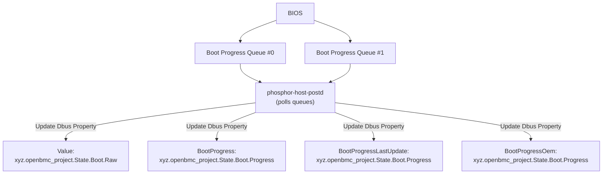

# Queued System Boot Progress on OpenBMC

Author: Prithvi Pai

Other contributors: Rohit Pai

Created: July 1, 2025

## Problem Description

The current implementation in phosphor-host-postd supports only single host
postcode access through LPC interface. This implementation faced challenges such
as dependency on BMC readiness for post/error codes reception, risking boot
delays or lost error data during early-stage failures.

## Background and References

OpenBMC's boot progress reporting has evolved from direct, real-time messaging
(such as IPMI over SMBus/SSIF) to a more robust, queue-based approach.
Traditional methods depended on the BMC being ready to receive messages during
all boot phases, risking data loss or delays during early-stage failures or BMC
resets. These legacy mechanisms also struggled with multi-socket systems, where
multiple firmware sources could emit progress codes concurrently, leading to
synchronization and collision challenges.

To address these limitations, the queued boot progress architecture introduces
hardware-backed circular queues—typically implemented as scratch registers on
each processor socket or package. Platform firmware components write boot
progress and error codes, each with an associated timestamp, into these queues
throughout the boot sequence. The BMC then acts as an asynchronous consumer,
polling these queues at configurable intervals over an interface (such as I2C or
USB). This decouples boot event capture from BMC readiness and ensures that no
critical telemetry is lost, even during BMC initialization or resets.

The BMC merges and sorts log entries from all queues, reconstructing a single,
time-ordered boot log. Each entry consists of a timestamp and a code. In the
event of a platform reset, firmware may apply a timestamp offset to maintain a
monotonic timeline, which the BMC incorporates during log reconstruction. The
merged log is then stored in non-volatile memory for persistence across reboots
and is exposed to administrators and external tools via the Redfish Log Service
API. This API provides both raw and interpreted views of the boot sequence,
supporting diagnostics, performance monitoring, and compliance validation.

It is essential to note that no industry-wide standard currently defines a universal hardware-backed mechanism for boot progress or error code queues. The actual hardware implementation — such as the use of scratch registers, memory-mapped queues, or circular buffers—is OEM-specific. Each platform vendor is responsible for defining the structure, semantics, and access methods for these queues. The OpenBMC implementation is designed to be adaptable to both Arm SBMR-compliant and OEM-defined hardware. The Arm Server Base Manageability Requirements (SBMR)[https://developer.arm.com/documentation/den0069/latest/] specification provides requirements and recommendations for server manageability, including standard interfaces and protocols (Redfish, IPMI) for communication between the host and the BMC. However, SBMR does not define or require a hardware-backed queue mechanism for boot progress or error code reporting; instead, it standardizes software interfaces and protocols for manageability, leaving the hardware mechanism for boot/event code storage and retrieval as implementation-defined and OEM-specific.

## Requirements

The BMC is responsible for periodically polling platform-provided scratch
registers or equivalent memory-mapped queues via a configurable external
interface such as I2C or USB. These registers or queues reside on each processor
socket or package and store boot progress and error codes in circular queue
structures. The BMC must access all available queues to ensure complete
retrieval of all boot log entries.

Once the BMC retrieves log entries from the queues, it must merge them into a
single, time-ordered log. Each entry consists of a timestamp and a boot progress
or error code. To preserve the chronological integrity of the log, the BMC must
sort these entries based on their timestamps. In the event of a reset, the
firmware may apply a timestamp offset to maintain monotonic time tracking. The
BMC must incorporate this offset when reconstructing the boot sequence timeline
to ensure accuracy and consistency.

After the logs are merged and sorted, the BMC must store them locally in
non-volatile memory. This storage should support efficient access, filtering,
and retention across system reboots and power cycles. The BMC must also expose
this information to system administrators and external tools through the Redfish
Log Service API. This interface should provide both raw and interpreted views of
boot events, enabling diagnosis of boot failures, performance metrics, and
validation of firmware behavior.

In summary, the BMC must act as the central aggregation and reporting agent for
boot progress logging. Its responsibilities include reliable data collection,
chronological reconstruction, persistent storage, standards-compliant exposure,
and readiness for future enhancements.

### High Level Design

### Low Level Design

#### 1. Initiation of Boot Progress Reporting

When the host system is powered on, platform firmware components across sockets
and subsystems begin emitting boot progress codes. These codes represent
critical checkpoints, errors, or events during the boot sequence. Unlike legacy
systems that relied on real-time messaging protocols like IPMI over SMBus, this
design leverages hardware-backed queues stored in scratch registers. This
approach eliminates dependencies on BMC readiness during early boot stages,
ensuring no critical failure data is lost—even if the BMC is initializing.

#### 2. Configurable Polling Mechanism

The BMC operates asynchronously from the host, polling boot progress queues at
fixed intervals defined by system integrators. This interval is configurable as
meson option `boot-progress-poll-interval`.

#### 3. Queue Metadata and Register Architecture

Two dedicated hardware queues (`Queue#0` and `Queue#1`) store boot progress
entries, each managed through a control register.

#### 4. Queue Processing Workflow

The BMC follows a deterministic sequence to retrieve entries:

1. **Read Control Registers**: Fetch start/end indices and queue size.
2. **Calculate Entries to Process**:
   `entries = (end_idx - start_idx) % queue_size`.
3. **Iterate Through Entries**:
   - For each entry, read the 8-byte block (4-byte timestamp + 4-byte code) from
     scratch RAM.
   - Handle circular buffer wraparound via modular arithmetic.
4. **Update Indices**: Advance the start index after processing to prevent
   redundant reads.

#### 5. Temporal Sorting and Event Reconstruction

Boot progress codes from heterogeneous sources (e.g., CPU firmware, PCIe device
ROMs) are timestamped using a shared clock source. The BMC maintains an
in-memory `std::map<timestamp, code>` to sort entries chronologically. This map:

- **Ensures Monotonic Order**: Critical for reconstructing an accurate timeline
  of boot events.
- **Handles Concurrent Logs**: Entries from multiple queues or sockets are
  interleaved correctly.

#### 6. DBus Integration for System Monitoring

Processed boot progress data is exposed via OpenBMC's DBus interface:

- **Properties Updated**:
  - `xyz.openbmc_project.State.Boot.Progress.BootProgress` (current stage).
  - `xyz.openbmc_project.State.Boot.Raw` (raw codes for debugging).
- **Signals Emitted**: Notify
  [subscribers](https://github.com/openbmc/phosphor-post-code-manager/tree/master)
  of new entries or errors.

## Alternatives Considered

- **Direct IPMI/SSIF Messaging:** Required BMC to be ready during early boot,
  risking lost data and complex multi-socket handling.

- **Vendor-Specific Registers:** Proprietary and non-portable, requiring
  platform-specific code

## Organizational

The following repository is expected to be modified to enable this feature:

- [phosphor-host-postd](https://github.com/openbmc/phosphor-host-postd)

## Impacts

The BMC would consume progress codes at a significantly slower rate than the
rate at which firmware components produce them, due to the following reasons:

1. The interface such as I2C or USB are much slower than SoC bus accesses.
2. The BMC may not access the boot progress queue continuously, leading to
   further delays.

## Testing

### Unit Test

- Unit tests should be implemented to ensure the infrastructure functions
  reliably, regardless of the underlying transport mechanisms.

### Integration Test

- GET properties of a `BootProgress.LastState` under
  `redfish/v1/Systems/<system>` resource.
- GET `PostCodes` as per
  [redfish-postcodes](https://github.com/openbmc/docs/blob/master/designs/redfish-postcodes.md)
