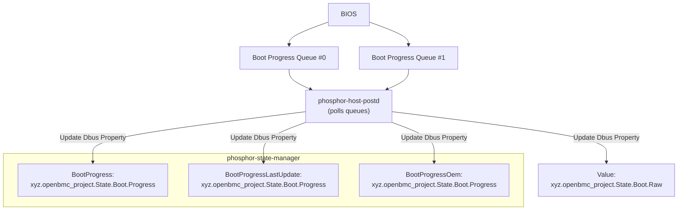

# Queued System Boot Progress on OpenBMC

Author: Prithvi Pai

Other contributors: Rohit Pai

Created: July 1, 2025

## Problem Description

The current implementation in phosphor-host-postd supports single-host postcode
access through the LPC interface, although support for multi-host systems is
provided via `ipmi-snoop`. Despite this, the implementation faces challenges
such as dependency on BMC readiness for post/error code reception, which can
cause boot delays or loss of error data during early-stage failures.

## Background and References

OpenBMC’s current boot progress reporting has primarily utilized real-time
messaging methods (such as IPMI over SMBus/SSIF, see
[gerrit.openbmc.org/c/openbmc/openbmc/+/81517](https://gerrit.openbmc.org/c/openbmc/openbmc/+/81517)),
which can be vulnerable to data loss if the BMC is not ready to receive updates
during early boot stages or resets. These challenges are further amplified in
multi-socket platforms, where simultaneous firmware sources generate progress
codes, complicating synchronization.

To address these challenges, this proposal defines a flexible, hardware-backed
circular queue mechanism—typically implemented via scratch registers at the
socket level. Host firmware asynchronously records boot progress and error codes
with timestamps. The BMC periodically polls these queues, fetches and sorts the
entries, and updates the
[Raw interface](https://github.com/openbmc/phosphor-dbus-interfaces/blob/8d09e7d0849cc955e59a340fedea81af7c7b0a91/yaml/xyz/openbmc_project/State/Boot/Raw.interface.yaml)
with a time-ordered post/error code consolidated from all queues. This
OEM-driven approach, specifically developed for NVIDIA’s protocol, improves
reliability and simplifies code aggregation, particularly in multi-socket
systems. This solution will be incorporated for the NVIDIA Vera CPU, leveraging
its hardware features to optimize boot management and system initialization.

## Requirements

### **Polling Boot Progress Queues**

- The BMC **must periodically poll** boot progress queues implemented as
  hardware-backed circular buffers (e.g., scratch registers) on each processor
  socket or package.
- The polling interface may be I2C, USB, or other platform-specific external
  interfaces, selectable via entity-manager configuration or build-time options.
- The polling interval **must be configurable** by system integrators via the
  Meson option `boot-progress-poll-interval`.

### **Complete Retrieval of Boot Logs**

- The BMC **must retrieve all available boot progress and error codes** from
  every queue on all sockets or packages to ensure a comprehensive boot log.
- Each log entry retrieved from a queue **must include a timestamp(msecs)** and either
  a **boot progress code** or an **error code**, as logged by the host firmware.
- For systems with multiple sockets (e.g., a dual-socket platform), this means
  polling each associated queue independently (e.g., `#Queue1` and `#Queue2`) to
  capture the complete set of boot events from all sources.

### **Log Processing and D-Bus Updates**

- The BMC **must merge and sort** collected boot entries into a single,
  time-ordered log based on timestamps.
- The BMC **must update relevant D-Bus properties** with the latest merged and
  sorted boot progress and error codes to ensure system components can access
  up-to-date boot status information. Refer to the interface definitions here:
  [Raw.interface.yaml](https://github.com/openbmc/phosphor-dbus-interfaces/blob/8d09e7d0849cc955e59a340fedea81af7c7b0a91/yaml/xyz/openbmc_project/State/Boot/Raw.interface.yaml)
  and
  [Progress.interface.yaml](https://github.com/openbmc/phosphor-dbus-interfaces/blob/8d09e7d0849cc955e59a340fedea81af7c7b0a91/yaml/xyz/openbmc_project/State/Boot/Progress.interface.yaml)

### High Level Design



### Low Level Design

### Host Firmware Logging Behavior

- During boot, each processor socket's firmware logs checkpoints and error codes
  into hardware-backed circular queues (typically scratch registers).
- Each boot log entry is composed of **two 32-bit (4-byte) writes**:
  - One `uint32_t` for the **timestamp**
  - One `uint32_t` for the **condensed boot progress or error code**
- These two values together represent a single log entry, written in a defined
  sequence (e.g., timestamp followed by code).
- The registers are typically addressed as a circular buffer, with queue indices
  tracked via platform-defined metadata (e.g., head/tail pointers).
- In multi-socket systems, each socket maintains its own queue (e.g., `#Queue0`,
  `#Queue1`), and logs independently.

```text
+-------------------+-------------------+-------------------+-------------------+
| 32b compressed boot progress code in big-endian format                        |
+-------------------+-------------------+-------------------+-------------------+
|      Byte 1       |      Byte 1       |      Byte 2       |     Bytes 3-4     |
|     bits 7:6      |     bits 5:0      |                   |                   |
+-------------------+-------------------+-------------------+-------------------+
| Status Code Type  | Class             | Subclass          | Operation         |
|-------------------|-------------------|-------------------|-------------------|
| 0x1 = Progress    | 0x00 =            | 0x00-0x7F =       | 0x0000-0x0FFF =   |
| Code              | EFI_COMPUTING_    | Defined or        | Shared by all     |
|                   | UNIT              | reserved by PI    | sub-classes in a  |
| 0x2 = Error Code  | 0x01 =            | specification     | class             |
|                   | EFI_PERIPHERAL    |                   |                   |
| 0x3 = Debug Code  | 0x02 = EFI_IO_BUS | 0x80-0xFF =       | 0x1000-0x7FFF =   |
|                   | 0x03 =            | Reserved for OEM  | Subclass Specific |
| Compressed from   | EFI_SOFTWARE      |                   |                   |
| 8 bits in SBMR    | 0x04-0x1F = EFI   | Sub-ranges:       | 0x8000-0xFFFF =   |
| spec to 2 bits    | reserved          | 0x80-0xBF =       | OEM specific      |
|                   | 0x20-0x3F = OEM   | OEM/ODM range     |                   |
| (specifications   | specific          | 0xC0-0xDF = SiP   | Sub-ranges:       |
| don't define any  |                   | range             | 0x8000-0xBF00 =   |
| other             | Sub-ranges:       | 0xE0-0xFF = SBMR  | OEM/ODM range     |
| enumeration)      | 0x20-0x2F =       | range             | 0xC000-0xDFFF =   |
|                   | OEM/ODM range     |                   | SiP range         |
|                   | 0x30-0x37 = SiP   | Unchanged from    | 0xE000-0xFFFF =   |
|                   | range             | EFI/SBMR spec     | SBMR range        |
|                   | 0x38-0x3F = SBMR  |                   |                   |
|                   | range             |                   | Unchanged from    |
|                   |                   |                   | EFI/SBMR spec     |
| Compressed from   | Compressed from   |                   |                   |
| 8 bits in SBMR    | 8 bits in         |                   |                   |
| spec to 6 bits    | EFI/SBMR spec     |                   |                   |
+-------------------+-------------------+-------------------+-------------------+
```

#### Boot Queue Polling Mechanism

- BMC asynchronously polls queues implemented as hardware circular buffers
  (scratch registers) on each socket/package.
- Polling interface (I2C, USB, etc.) selected via entity-manager config or
  build-time options.
- Polling interval configurable by system integrators via Meson option
  `boot-progress-poll-interval`.

#### Retrieval of Progress/Error Code

- The BMC must poll **all queues** from **all sockets/packages** to retrieve a
  complete boot sequence.
- Example: On dual-socket systems, poll both `#Queue0` and `#Queue1`.
- Each entry read from a queue consists of:
  - 4-byte `uint32_t` timestamp
  - 4-byte `uint32_t` boot progress or error code
- The BMC accesses control registers per queue to read:
  - `start_idx` (consumer head), `end_idx` (producer tail), and `queue_size`.
- Number of entries to process are calculated as:
  `entries = (end_idx - start_idx) % queue_size`
- The BMC reads all new entries, applying modular arithmetic to handle circular
  wraparound.
- After reading, the BMC updates its internal `start_idx` to avoid duplicates.

#### Merging, Sorting, and D-Bus Updates

- Boot events from multiple queues are merged into a **single log** sorted
  chronologically by timestamp.
- Events are stored in-memory as an ordered structure like:
  `std::map<uint32_t timestamp, uint32_t code>`
- The `phosphor-host-postd` updates the following D-Bus properties with the
  latest merged data:
  - [xyz.openbmc_project.State.Boot.Progress.BootProgress](https://github.com/openbmc/phosphor-dbus-interfaces/blob/8d09e7d0849cc955e59a340fedea81af7c7b0a91/yaml/xyz/openbmc_project/State/Boot/Progress.interface.yaml)
    hosted by `phosphor-state-manager`.
  - [xyz.openbmc_project.State.Boot.Raw](https://github.com/openbmc/phosphor-dbus-interfaces/blob/8d09e7d0849cc955e59a340fedea81af7c7b0a91/yaml/xyz/openbmc_project/State/Boot/Raw.interface.yaml)

## Alternatives Considered

- **Direct IPMI/SSIF Messaging:** Required BMC to be ready during early boot,
  risking lost data.

## Organizational

The following repository is expected to be modified to enable this feature:

- [phosphor-host-postd](https://github.com/openbmc/phosphor-host-postd)

## Impacts

- A new OEM compile-time option will be introduced in `phosphor-host-postd` to
  support platform-specific boot progress queue polling and decoding.
- The BMC takes on the additional responsibility of periodically polling,
  decoding, and sorting hardware-logged boot progress and error codes,
  increasing its runtime processing and memory overhead.
- Firmware components must write boot logs in the agreed 32-bit timestamp+code
  format to ensure proper interpretation and sorting by the BMC.

## Testing

### Unit Test

- Unit tests will be implemented to ensure that the fetch functionality works
  correctly, regardless of the underlying transport interface (e.g., I2C, USB).

### Integration Test

- GET properties of a `BootProgress.LastState` under
  `redfish/v1/Systems/<system>` resource.
- GET `PostCodes` as per
  [redfish-postcodes](https://github.com/openbmc/docs/blob/master/designs/redfish-postcodes.md)
