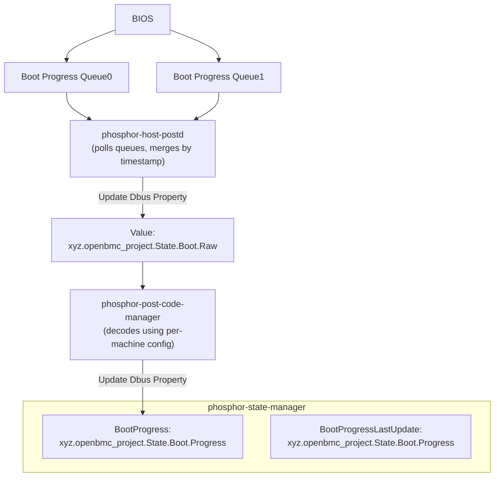

# Queued Boot Progress for the NVIDIA Vera CPU

Author: Prithvi Pai

Other contributors: Rohit Pai

Created: July 1, 2025

## Problem Description

This design adds support for the boot progress mechanism of the NVIDIA Vera CPU.
The queue that holds the codes, and the protocol used to read it, are NVIDIA
definitions that no open specification covers. The codes themselves use the
EFI/PI and SBMR field definitions compressed into 32 bits, with NVIDIA values in
the SiP ranges. It is not proposed as a general solution and it does not change
how any other platform reports boot progress.

Vera does not report boot progress over any transport OpenBMC supports today. It
does not drive post codes over LPC or eSPI, and it does not use the IPMI or
snoop paths that
[phosphor-host-postd](https://github.com/openbmc/phosphor-host-postd) already
handles. Instead each processor socket records progress and error codes, with
timestamps, into a hardware-backed circular queue held in scratch registers, and
the BMC reads those queues over a platform-specific interface.

The consequence is that OpenBMC reports no boot progress at all on a Vera based
system. This design closes that gap, so that operators running Vera can observe
boot progress and early boot failures through the same D-Bus and Redfish
surfaces they already use elsewhere.

## Background and References

The status code format used here is built on the Arm Server Base Manageability
Requirements
([SBMR, DEN0069](https://developer.arm.com/documentation/den0069/latest/)) and
the UEFI Platform Initialization ([PI](https://uefi.org/specifications))
specification, which define the status code fields and most of their values. The
compressed 32-bit layout NVIDIA defines on top of them is given under
[Host Firmware Logging Behavior](#host-firmware-logging-behavior) below. The
queue itself, and the protocol used to read it, are NVIDIA definitions with no
public specification.

Boot progress transports that OpenBMC supports today, such as LPC post codes and
IPMI over SMBus/SSIF, deliver each code as it is produced, which requires the
BMC to be listening at the moment the host emits it. Vera does not implement any
of these transports, so none of them apply here.

Vera instead buffers the codes in hardware. Each socket's firmware records
progress and error codes, with timestamps, into a circular queue held in scratch
registers, and that queue retains entries until the BMC reads them. Because the
hardware holds the history, the BMC does not have to be listening when a code is
produced, and codes emitted before the BMC is ready are still recoverable.

This design specifies how OpenBMC reads those queues: the BMC polls each
socket's queue, merges the entries from all sockets into a single time-ordered
sequence, and publishes them on the
[Raw interface](https://github.com/openbmc/phosphor-dbus-interfaces/blob/8d09e7d0849cc955e59a340fedea81af7c7b0a91/yaml/xyz/openbmc_project/State/Boot/Raw.interface.yaml).

## Requirements

### Polling Boot Progress Queues

- The BMC must periodically poll boot progress queues implemented as
  hardware-backed circular buffers (e.g., scratch registers) on each processor
  socket or package.
- The polling interface may be I2C, USB, or other platform-specific external
  interfaces, selectable per machine.
- The polling interval must be configurable by system integrators.
- Polling must adapt to the boot state rather than run at one fixed rate, so
  that codes are captured promptly during the boot burst without polling at that
  rate for the life of the system.

### Complete Retrieval of Boot Logs

- The BMC must retrieve all available boot progress and error codes from every
  queue on all sockets or packages to ensure a comprehensive boot log.
- Each log entry retrieved from a queue must include a timestamp(msecs) and
  either a boot progress code or an error code, as logged by the host firmware.
- For systems with multiple sockets (e.g., a dual-socket platform), this means
  polling each associated queue independently (e.g., `Queue0` and `Queue1`) to
  capture the complete set of boot events from all sources.
- A queue has finite depth, so entries can be lost if the BMC falls behind the
  host firmware. Such a loss must be detectable by the BMC and must be signalled
  to consumers rather than passing as a silent gap.

### Log Processing and D-Bus Updates

- The BMC must merge and sort collected boot entries into a single, time-ordered
  log based on timestamps.
- `phosphor-host-postd` must publish the merged codes unmodified on
  [Raw.interface.yaml](https://github.com/openbmc/phosphor-dbus-interfaces/blob/8d09e7d0849cc955e59a340fedea81af7c7b0a91/yaml/xyz/openbmc_project/State/Boot/Raw.interface.yaml).
  It does not interpret them.
- Mapping a code to a
  [Progress.interface.yaml](https://github.com/openbmc/phosphor-dbus-interfaces/blob/8d09e7d0849cc955e59a340fedea81af7c7b0a91/yaml/xyz/openbmc_project/State/Boot/Progress.interface.yaml)
  stage must be data driven and must live in
  [`phosphor-post-code-manager`](https://github.com/openbmc/phosphor-post-code-manager).
  The mapping must be selectable per machine so that a new processor generation,
  or an OEM that adds its own codes, needs a configuration change and not a code
  change.

## Proposed Design

### High Level Design


```mermaid
flowchart TD
    BIOS1[BIOS] --> Q0[Boot Progress Queue0]
    BIOS1 --> Q1[Boot Progress Queue1]
    Q0 --> POSTD["phosphor-host-postd<br/>(polls queues, merges by timestamp)"]
    Q1 --> POSTD

    POSTD -- Update Dbus Property --> D1["Value:<br/>xyz.openbmc_project.State.Boot.Raw"]

    D1 --> PCM["phosphor-post-code-manager<br/>(decodes using per-machine config)"]

    subgraph phosphor-state-manager
        direction TB
        BootProgress["BootProgress:<br/>xyz.openbmc_project.State.Boot.Progress"]
        BootProgressLastUpdate["BootProgressLastUpdate:<br/>xyz.openbmc_project.State.Boot.Progress"]
    end

    PCM -- Update Dbus Property --> BootProgress
```

### Low Level Design

#### Host Firmware Logging Behavior

- During boot, each processor socket's firmware logs checkpoints and error codes
  into hardware-backed circular queues (typically scratch registers).
- Each boot log entry is composed of two 32-bit (4-byte) writes:
  - One `uint32_t` for the timestamp
  - One `uint32_t` for the condensed boot progress or error code
- These two values together represent a single log entry, written in a defined
  sequence (e.g., timestamp followed by code).
- The registers are typically addressed as a circular buffer, with queue indices
  tracked via platform-defined metadata (e.g., head/tail pointers).
- In multi-socket systems, each socket maintains its own queue (e.g., `Queue0`,
  `Queue1`), and logs independently.

```text
+------------------+-------------------+-------------------+-------------------+
| 32b compressed boot progress code in big-endian format                       |
+------------------+-------------------+-------------------+-------------------+
|      Byte 1      |      Byte 1       |      Byte 2       |     Bytes 3-4     |
|     bits 7:6     |     bits 5:0      |                   |                   |
+------------------+-------------------+-------------------+-------------------+
| Status Code Type | Class             | Subclass          | Operation         |
|------------------|-------------------|-------------------|-------------------|
| 0x1 = Progress   | 0x00 =            | 0x00-0x7F =       | 0x0000-0x0FFF =   |
| Code             | EFI_COMPUTING_    | Defined or        | Shared by all     |
|                  | UNIT              | reserved by PI    | sub-classes in a  |
| 0x2 = Error Code | 0x01 =            | specification     | class             |
|                  | EFI_PERIPHERAL    |                   |                   |
| 0x3 = Debug Code | 0x02 = EFI_IO_BUS | 0x80-0xFF =       | 0x1000-0x7FFF =   |
|                  | 0x03 =            | Reserved for OEM  | Subclass Specific |
| Compressed from  | EFI_SOFTWARE      |                   |                   |
| 8 bits in SBMR   | 0x04-0x1F = EFI   | Sub-ranges:       | 0x8000-0xFFFF =   |
| spec to 2 bits   | reserved          | 0x80-0xBF =       | OEM specific      |
|                  | 0x20-0x3F = OEM   | OEM/ODM range     |                   |
| (specifications  | specific          | 0xC0-0xDF = SiP   | Sub-ranges:       |
| don't define any |                   | range             | 0x8000-0xBFFF =   |
| other            | Sub-ranges:       | 0xE0-0xFF = SBMR  | OEM/ODM range     |
| enumeration)     | 0x20-0x2F =       | range             | 0xC000-0xDFFF =   |
|                  | OEM/ODM range     |                   | SiP range         |
|                  | 0x30-0x37 = SiP   | Unchanged from    | 0xE000-0xFFFF =   |
|                  | range             | EFI/SBMR spec     | SBMR range        |
|                  | 0x38-0x3F = SBMR  |                   |                   |
|                  | range             |                   | Unchanged from    |
|                  |                   |                   | EFI/SBMR spec     |
|                  | Compressed from   |                   |                   |
|                  | 8 bits in EFI/    |                   |                   |
|                  | SBMR spec to 6    |                   |                   |
|                  | bits              |                   |                   |
+------------------+-------------------+-------------------+-------------------+
```

#### Timestamps

- Each entry carries a 32-bit timestamp in milliseconds, derived from a free
  running microsecond counter that is local to the package which logged the
  entry. Every firmware component on a package reads the same counter, so
  entries coming from one package are strictly ordered with respect to each
  other.
- A boot scoped offset is added to that counter so that timestamps remain
  monotonic across the internal resets that happen during boot. The offset holds
  the last timestamp recorded before the reset and is preserved in the same
  scratch area as the queues.
- The counters are not synchronised between packages. Each package starts its
  own counter independently, so on a multi-socket system the skew between two
  queues is bounded only by how far apart the packages come out of reset. The
  BMC sorts the merged log by timestamp on the assumption that this skew is
  small relative to the interval between boot progress codes. Entries from
  different packages that fall within the skew may therefore be ordered
  incorrectly relative to each other; ordering within a single package is always
  correct. The SiP subrange of the `Class` field carries the package number, so
  a consumer that needs a per package view can recover one from the code itself.
- The BMC does not attempt to correct for this skew. It has no common time
  reference with the host packages, and introducing one would require a host
  firmware change that is out of scope for this design.

#### Boot Queue Polling Mechanism

- A configurable base polling interval is scaled according to the host state:
  - the base interval while the host is booting, when codes arrive in bursts
  - a long interval once the host is running and boot has completed, and no
    polling while the host is powered off, when new codes are rare or cannot
    arrive at all
- The BMC follows the host `OperatingSystemState`, host power state and current
  boot progress stage to decide which applies, and reacts to their property
  change signals.

#### Retrieval of Progress/Error Code

- Each entry read from a queue consists of:
  - 4-byte `uint32_t` timestamp
  - 4-byte `uint32_t` boot progress or error code
- The BMC accesses control registers per queue to read `start_idx`, `end_idx`
  and `queue_size`. All three are written by the host firmware; the BMC only
  reads them, and assumes no fixed queue depth.
- The BMC keeps its own read index and a copy of the `start_idx` it last saw. It
  reads forward from its read index to `end_idx`, applying modular arithmetic to
  handle circular wraparound, and advances its read index as it goes so that
  entries are not read twice. `start_idx` is where the firmware says the live
  data now begins, not where the BMC has read to.
- Because the firmware is the only writer of the indices and the BMC is the only
  reader, the two need no lock. This does not remove the race described below;
  it only means neither side has to wait for the other.
- If `start_idx` has moved past the BMC's read index since the previous cycle,
  the firmware has overwritten entries the BMC had not yet read and they are
  lost. The BMC emits `0xFFFFFFFF` to mark the gap and resumes from the current
  `start_idx`. That value is not produced by any firmware on this platform, so
  it is unambiguous here, but it is a well formed code under the format above
  rather than a value the format reserves.
- The marker is emitted with the maximum timestamp value, so it orders at the
  end of the merged log rather than at the point where the loss occurred. It
  records that entries were lost, not where.

#### Merging, Sorting, and D-Bus Updates

Entries from every queue on every socket are accumulated in one vector and
ordered with a stable sort on the timestamp, so codes that share a timestamp
keep the order in which the firmware logged them.

- `phosphor-host-postd` publishes each merged entry on
  [xyz.openbmc_project.State.Boot.Raw](https://github.com/openbmc/phosphor-dbus-interfaces/blob/8d09e7d0849cc955e59a340fedea81af7c7b0a91/yaml/xyz/openbmc_project/State/Boot/Raw.interface.yaml),
  the code in the primary array as four bytes big-endian with the secondary
  array empty. `Raw.Value` is `struct[array[byte], array[byte]]`, so the
  interface imposes no code width; conversion happens at the read step and a
  queue that logs wider codes changes only that step.
- The timestamp is used only to order the entries and is not published.
  `BootProgressLastUpdate` is maintained by `phosphor-state-manager`, which sets
  it whenever `BootProgress` changes, so it marks stage transitions rather than
  the time the host firmware logged a code.

#### Decoding in phosphor-post-code-manager

`phosphor-post-code-manager` consumes the codes from `State.Boot.Raw` and drives
the
[BootProgress](https://github.com/openbmc/phosphor-dbus-interfaces/blob/8d09e7d0849cc955e59a340fedea81af7c7b0a91/yaml/xyz/openbmc_project/State/Boot/Progress.interface.yaml)
stage through its existing
[post code handler](https://github.com/openbmc/phosphor-post-code-manager/blob/master/README.md)
mechanism. The handler set is data driven and is supplied by the machine layer,
so a new processor generation or an added OEM code is a configuration change.
Codes with no handler leave the stage at `OEM`.

## Alternatives Considered

- Having the host firmware drive a transport OpenBMC already supports, such as
  LPC post codes or IPMI over SSIF. Vera provides no such interface to the BMC,
  so this was not available.

## Impacts

- The BMC takes on the additional responsibility of periodically polling and
  sorting hardware-logged boot progress and error codes, increasing its runtime
  processing and memory overhead.

### Organizational

The following repositories are involved in this feature:

- [phosphor-host-postd](https://github.com/openbmc/phosphor-host-postd) is
  modified for the queue polling, merging and publication of raw codes.
- [phosphor-post-code-manager](https://github.com/openbmc/phosphor-post-code-manager)
  consumes `State.Boot.Raw` and maps a code to a `BootProgress` stage. The
  intent is that its existing post code handler mechanism covers this and no
  change is needed there.

## Testing

### Unit Test

- Unit tests in `phosphor-host-postd` will cover the fetch and merge
  functionality, regardless of the underlying transport interface (e.g., I2C,
  USB), including circular buffer wraparound and multi-socket ordering.

### Integration Test

- GET properties of a `BootProgress.LastState` under
  `redfish/v1/Systems/<system>` resource, which exercises the machine layer
  handler set.
- GET `PostCodes` as per
  [redfish-postcodes](https://github.com/openbmc/docs/blob/master/designs/redfish-postcodes.md)
