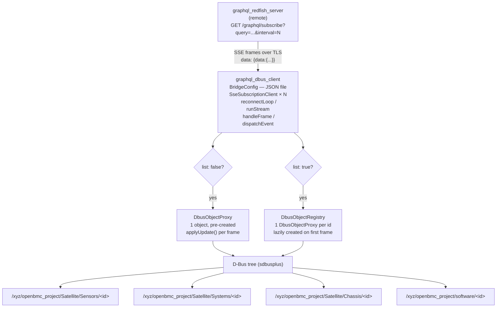

# Redfish GraphQL D-Bus Client Design

Author: Abhilash Raju <abhilash.kollam@gmail.com>

Other contributors: None

Created: 2026

## Problem Description

Modern server platforms increasingly attach one or more Satellite BMCs alongside
the primary BMC. A Satellite BMC manages a discrete hardware domain and
exposes its resources over Redfish as its primary management protocol. Since
OpenBMC currently provides only limited capability for acting as a Redfish
client, applications running on the primary BMC have no direct access to
resources owned by a Satellite BMC. In some cases this access is mandatory:
thermal calibration requires live sensor readings from the satellite, and
threshold monitoring must observe satellite sensor values to emit event logs.
Additionally, platform owners may enforce naming and filtering rules on how
satellite resources are exposed outside the primary BMC, requiring a middle
layer that decouples the satellite vendor's Redfish representation from the rest
of the stack.

This design proposes a **D-Bus client daemon** (`graphql_dbus_client`) that
bridges a Satellite BMC's Redfish data into the primary BMC's D-Bus tree by
subscribing to the GraphQL server described in
[redfish-graphql-server.md](./redfish-graphql-server.md). The client daemon
consumes push updates from the GraphQL subscription endpoint and publishes them
as standard OpenBMC D-Bus objects, making Satellite BMC resources
indistinguishable from locally hosted resources to all BMC applications.

## Background and References

- What is a Satellite Management Controller?
  [SMC Specification](https://www.opencompute.org/documents/smc-specification-1-0-final-pdf-1)
- [DMTF Redfish schema DSP0268](https://www.dmtf.org/sites/default/files/standards/documents/DSP0268_2024.4.html)
- GraphQL subscription over SSE:
  [GraphQL over SSE transport](https://the-guild.dev/graphql/sse)
- [OpenBMC sdbusplus](https://github.com/openbmc/sdbusplus)
- [Redfish GraphQL Server Design](./redfish-graphql-server.md)
- Reference implementation:
  [coroserver redfish_graphql_dbus_client example](https://github.com/abhilashraju/coroserver/tree/main/examples/redfish_graphql_dbus_client)

## Requirements

BMC applications must be able to access, directly or indirectly, any standard
Redfish resource exposed by a Satellite BMC. Examples of resource types of
interest include, but are not limited to:

- Collections of telemetry resources such as
  [Sensor](https://www.dmtf.org/sites/default/files/standards/documents/DSP0268_2024.4.html#sensor-1101)
- Collections of diagnostic resources such as
  [LogEntry](https://www.dmtf.org/sites/default/files/standards/documents/DSP0268_2024.4.html#logentry-1170)
- Inventory resources such as
  [Software Inventory](https://www.dmtf.org/sites/default/files/standards/documents/DSP0268_2024.4.html#softwareinventory-1102)

Any accessed resource must have a corresponding D-Bus representation that is
indistinguishable from that of a locally hosted resource. The mapping from
Redfish fields to D-Bus properties must be configurable per platform without
requiring code changes.

When communicating with the GraphQL server, the following are required:

- Persistent SSE connections to avoid repeated reconnection overhead
- Multiple concurrent subscriptions, each independently resilient to failure
- Support for multiple Satellite BMC targets simultaneously

The following are optional unless required by the target deployment:

- TLS between the client and the GraphQL server
- Authentication

The following are explicitly out of scope:

- OEM Redfish schemas
- Out-of-spec Satellite BMC behaviour
- Write operations (firmware update, configuration changes)

## Proposed Design

The daemon (`graphql_dbus_client`) reads a JSON configuration file at startup,
establishes one SSE connection per configured subscription to the
`graphql_redfish_server`, and materialises the resulting data as D-Bus objects
under `/xyz/openbmc_project/Satellite/`. All I/O runs in a single
`boost::asio::io_context`; subscriptions are independent coroutines with no
shared mutable state between them.



### Configuration

Each platform provides a JSON configuration file. Its top-level keys name the
GraphQL server and list the subscriptions to open:

```json
{
  "host": "localhost",
  "port": "8444",
  "subscriptions": [
    {
      "name": "SensorUpdates",
      "dbus_path": "/xyz/openbmc_project/Satellite/Sensors",
      "dbus_interface": "xyz.openbmc_project.Satellite.Sensor",
      "query": "subscription { sensorUpdates { id name reading readingUnits readingType status { health state } } }",
      "list": true,
      "interval_seconds": 5,
      "field_map": {
        "id":            "Id",
        "name":          "Name",
        "reading":       "Reading",
        "readingUnits":  "ReadingUnits",
        "readingType":   "ReadingType",
        "status.health": "StatusHealth",
        "status.state":  "StatusState"
      }
    },
    {
      "name": "SystemStatus",
      "dbus_path": "/xyz/openbmc_project/Satellite/Systems/1",
      "dbus_interface": "xyz.openbmc_project.Satellite.ComputerSystem",
      "query": "subscription { systemStatus(id:\"1\") { id name powerState status { health state } } }",
      "interval_seconds": 10,
      "field_map": {
        "id":            "Id",
        "name":          "Name",
        "powerState":    "PowerState",
        "status.health": "StatusHealth",
        "status.state":  "StatusState"
      }
    }
  ]
}
```

| Field | Description |
|---|---|
| `host` / `port` | Address of the `graphql_redfish_server` |
| `name` | Human-readable label used in log output |
| `dbus_path` | D-Bus object path to create |
| `dbus_interface` | D-Bus interface registered on that object |
| `query` | Full GraphQL subscription string |
| `interval_seconds` | Push interval forwarded as `?interval=` to the server |
| `list` | `true` — one D-Bus object per array element (keyed by `id`); `false` (default) — one fixed D-Bus object |
| `field_map` | Dot-path in the JSON result → D-Bus property name |

The `field_map` dot-path notation traverses nested objects and array elements:
`"status.health"` resolves `payload["status"]["health"]`, and
`"ipv4Addresses.0.address"` resolves `payload["ipv4Addresses"][0]["address"]`.
Adding or renaming a mapped field requires only a config-file edit; no C++
changes are needed.

### D-Bus object lifecycle

**Scalar subscription** (`list: false`): A single `DbusObjectProxy` is created
at startup before `ioc.run()`. Each SSE frame triggers `applyUpdate(payload,
field_map)`, which sets individual D-Bus properties in-place. The object is
never destroyed during normal operation.

**List subscription** (`list: true`): A `DbusObjectRegistry` acts as a lazy
factory keyed by the `id` field in each array element. On the first appearance
of a new `id`, a `DbusObjectProxy` is created via `net::post(ioc, create)`.
Subsequent frames for the same `id` call `applyUpdate()` on the existing proxy.
Objects whose `id` no longer appears in the payload are removed.

### Reconnection

Each SSE client runs an independent `reconnectLoop()` coroutine. On any stream
error or clean server close, the loop waits with capped exponential back-off
(5 s → 10 s → 20 s … 60 s maximum) before reconnecting. A failure in one
subscription does not affect the others; all run concurrently in the same
`io_context` with no shared mutable state.

### Resource mapping

**Sensors**: a list subscription resolves to
`/redfish/v1/Chassis/{id}/Sensors` on the server side. The client
materialises one D-Bus object per sensor implementing
`xyz.openbmc_project.Sensor.Value`, identical in shape to objects produced by
dbus-sensors and therefore transparent to phosphor-pid-control and threshold
monitors.

**Software and firmware inventory**: list subscriptions resolving to
`/redfish/v1/UpdateService/FirmwareInventory` and
`/redfish/v1/UpdateService/SoftwareInventory`. Each item becomes a D-Bus object
under `/xyz/openbmc_project/software/` implementing
`xyz.openbmc_project.Software.Version`.

**Network interfaces**: a list subscription resolves to
`/redfish/v1/Managers/bmc/EthernetInterfaces`. The client materialises one
D-Bus object per interface implementing
`xyz.openbmc_project.Network.EthernetInterface`, with nested `ipv4Addresses`
array elements flattened via `field_map` dot-paths (e.g.
`"ipv4Addresses.0.address"`) onto D-Bus properties, matching the object shape
produced by phosphor-network's own EthernetInterface objects.

### Error handling

If the SSE stream breaks, `reconnectLoop()` re-establishes it after back-off.
D-Bus objects already created remain in place with their last-known property
values during the gap; they are updated as soon as the stream resumes. If the
GraphQL server itself returns an `errors` field for a cycle, no D-Bus update is
applied for that cycle, and the previous values are retained. Neither component
throws on malformed JSON; error paths are propagated via `std::expected`.

### Extensibility

Supporting a new resource type requires only a new subscription entry in the
JSON config file. If the corresponding GraphQL field is not yet registered in
the server's schema, a few lines of field registration are added to the server
— no new C++ task classes, no new D-Bus wiring code, no mapper parsing logic.

Supporting a new Satellite BMC vendor requires a new config file. Multiple
Satellite BMC targets are supported by running one `graphql_redfish_server` per
target on a distinct port and pointing the relevant subscription entries at
each respective server.

## Alternatives Considered

### Poll-and-map daemon using libcurl directly

A daemon could poll the Satellite BMC's Redfish endpoints directly using
libcurl integrated with the sdbusplus event loop via `curl_multi_waitfds` and
`sdbusplus::async::fdio`. This is the approach taken in the
[Redfish Client design](./redfish-client.md). It requires a new C++ task class
and mapper for each resource type, fetches full Redfish documents and discards
unused fields, and is exclusively poll-based. The GraphQL client approach
eliminates all three problems: new resource types are config-file entries, the
GraphQL query declares only the needed fields, and the SSE subscription is
push-based with no per-daemon polling timer. The GraphQL server also serves as
a shared HTTP infrastructure layer reusable by any other internal client.

### D-Bus client polling the GraphQL query endpoint directly

Instead of using SSE subscriptions, the client could periodically `POST
/graphql` to the server and apply the result. This simplifies the client
slightly but reintroduces a polling timer, increases connection overhead per
cycle, and loses the benefit of a persistent push stream. The SSE subscription
model keeps the client coroutine parked between frames at zero CPU cost and
bounds update latency to `interval_seconds` regardless of connection RTT.

### Implement resource bridging inside dbus-sensors, phosphor-logging, etc.

Adding Redfish client capability directly to the feature repositories that
consume the data avoids a new daemon but duplicates HTTP client logic, retry
policy, and TLS configuration across multiple repositories. Horizontal changes
— such as a new authentication scheme or a security patch in the HTTP layer —
would require coordinated updates in every affected repository. The centralised
`graphql_dbus_client` daemon consolidates all of this in one place and delegates
the Redfish HTTP concerns entirely to the GraphQL server.

## Impacts

No API changes are required for existing BMC applications. D-Bus objects
published by the client implement the same interfaces as locally hosted objects
and are transparent to phosphor-pid-control, IPMI sensor bridges, and bmcweb
Redfish handlers. Configuration is entirely in JSON; no code changes are needed
to add or remap a resource field.

Security: all communication between the client and the GraphQL server is over
TLS (configurable). The Satellite BMC is never directly reachable from outside
the primary BMC; the GraphQL server is the sole outbound connection point.

### Organizational

- Does this proposal require a new repository? Yes.
- Who will be the initial maintainer(s) of this repository? To be determined.
- Which repositories are expected to be modified to execute this design?
  A new repository and BitBake recipe should be created. No changes are required in
  existing repositories.

## Testing

### Unit Testing

`DbusObjectProxy::applyUpdate` is tested with synthetic JSON payloads covering
scalar fields, nested dot-path resolution, and array-index paths.
`DbusObjectRegistry` lifecycle (lazy create on first `id`, update on subsequent
frames, remove on absent `id`) is tested against a test D-Bus bus without
network I/O.

### Integration Testing

The client is started in loopback mode against a local `graphql_redfish_server`
running against a mock Redfish backend. Tests verify: D-Bus objects are created
on the first SSE frame, properties are updated on each subsequent frame,
objects for removed list entries are cleaned up, the client reconnects
transparently after a simulated server restart, and all D-Bus interfaces are
indistinguishable from their dbus-sensors equivalents.
