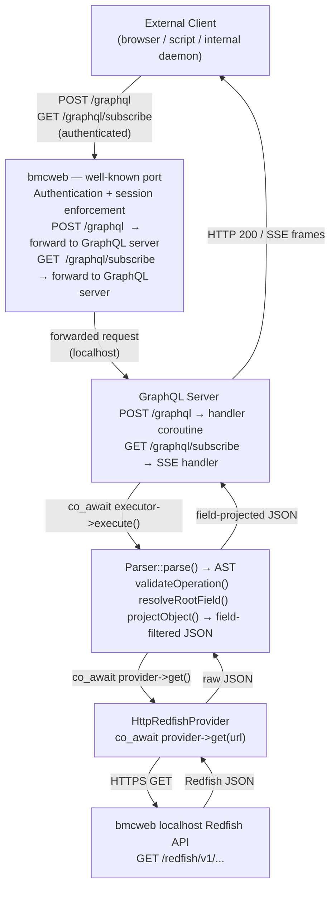

# Redfish GraphQL Server Design

Author: Abhilash Raju: <abhilash.kollam@gmail.com>

Other contributors: None

Created: 2026

## Problem Description

The Redfish REST API exposed by bmcweb is a powerful management interface, but
its REST semantics impose a fixed cost on every consumer: a client must fetch
entire resource representations and discard the fields it does not need, issue
one HTTP request per resource type, and poll repeatedly to detect changes.
External clients — browser-based management UIs, automation scripts, and
internal BMC daemons alike — have no standard way to declare exactly what data
they want, receive only those fields, or be notified when values change without
continuous polling.

A concrete example is PCIe topology on IBM Power systems.  After an operator
triggers a rescan (`Oem.IBM.PCIeTopologyRefresh=true`), bmcweb signals PLDM,
which scans the PCIe buses and updates the D-Bus inventory; but the management
UI shows a stale snapshot until the user manually reloads the page.  There is
no home-screen visibility and no automatic delivery of the updated device list
— the topology is buried behind a manual navigation step every time the
hardware changes.

This design proposes a **GraphQL server** running as a separate daemon on the
BMC alongside bmcweb.  bmcweb is extended with two thin forwarding endpoints
(`POST /graphql` and `GET /graphql/subscribe`) that proxy incoming GraphQL
requests to the GraphQL server over localhost.  Clients continue to use
bmcweb's well-known port and benefit from its existing authentication,
session management, and privilege enforcement — the GraphQL endpoints are
subject to exactly the same access controls as any other Redfish endpoint.
The GraphQL server itself never terminates client connections directly; it
receives already-authenticated requests forwarded by bmcweb, resolves them
by issuing Redfish GETs back to the same bmcweb instance over localhost,
and returns structured JSON responses.  Because
the query engine is a separate process, a bug in the GraphQL parser cannot
affect bmcweb's security boundary.  The same server also serves as the
foundation for internal BMC daemons — such as a Satellite BMC D-Bus client
— that need efficient, push-capable access to Redfish data without
reimplementing HTTP client logic in every daemon.

Clients also have no way to react to changes without polling. Exposing
GraphQL subscriptions over Server-Sent Events lets clients register interest
once and receive push updates asynchronously as server state changes,
removing the need for client-side polling loops.

## Background and References

- [DMTF Redfish schema DSP0268](https://www.dmtf.org/sites/default/files/standards/documents/DSP0268_2024.4.html)
- GraphQL is an open query language and runtime for APIs developed by Meta and
  standardised by the GraphQL Foundation. It is widely adopted in the industry
  by GitHub, IBM, Netflix, Shopify, and others:
  [GraphQL specification](https://spec.graphql.org/)
- Server-Sent Events (SSE) is a W3C standard for server-to-client push over
  plain HTTP/1.1:
  [W3C SSE specification](https://html.spec.whatwg.org/multipage/server-sent-events.html)
- [GraphQL over SSE transport](https://the-guild.dev/graphql/sse)
- [OpenBMC bmcweb](https://github.com/openbmc/bmcweb)
- Reference implementation:
  [coroserver graphql_server example](https://github.com/abhilashraju/coroserver/tree/main/examples/graphql_server)

## Requirements

The server must:

- Accept GraphQL queries at a single proxy URI (`POST /graphql`) and resolve
  them against the BMC's Redfish REST API without the caller needing to know
  any Redfish URI structure.
- Accept GraphQL subscriptions at a companion URI (`GET /graphql/subscribe`)
  and push SSE frames to connected clients at a configurable interval for as
  long as the connection is held open.
- Project responses to only the fields the client requested; fields not
  mentioned in the query must not appear in the response.
- Validate every incoming query against a statically typed schema before
  issuing any upstream Redfish request, returning a structured GraphQL
  `errors` response for invalid queries.
- Support multiple concurrent client connections without blocking.
- Support TLS for both query and subscription endpoints.
- Be independent of D-Bus and sdbusplus so it can be deployed as a standalone
  HTTP service.
- Be extensible: adding a new Redfish resource type to the schema must not
  require changes to the query-execution or HTTP infrastructure.

The following are not in scope for this design:

- GraphQL mutations (write operations) — addressed as future work.
- WebSocket-based subscription transport — SSE over HTTP/1.1 is sufficient for
  the current use cases.
- OEM Redfish extensions.

## Proposed Design

The system is composed of two deployment units and four loosely coupled
internal layers.  bmcweb adds two forwarding routes; the GraphQL server owns
parsing, validation, execution, and data fetching.



### Schema and type system

The server maintains a `TypedSchema` that describes the Redfish object model as
a set of named object types, each with a declared list of fields and their
types. Root queries and subscriptions are registered separately. When a client
sends a query, the schema validates field names and argument types before any
HTTP request is made.

Adding a new Redfish resource type requires registering a new object type and
root field in the schema — a handful of lines in a single file. The HTTP
infrastructure, the executor, and the SSE machinery are unaffected.

### Single proxy URI for queries

All Redfish data is accessible through one endpoint:

```
POST /graphql
Content-Type: application/json

{ "query": "{ sensors { id name reading readingUnits status { health } } }" }
```

The executor maps the root field name (`sensors`) to the appropriate Redfish
URI (`/redfish/v1/Chassis/{id}/Sensors`), issues the upstream GET, and
projects the response to exactly `{id, name, reading, readingUnits,
status.health}`. A caller that only needs sensor IDs and readings pays only for
those two fields, not the full Redfish sensor document.

Multiple top-level fields may appear in a single query:

```graphql
{
  systems  { id powerState }
  sensors  { id reading readingUnits }
  logEntries { id message severity }
}
```

The executor fans the resolution out to parallel upstream Redfish requests and
assembles a single JSON response. This collapses what would otherwise be three
separate HTTP round-trips into one.

### Single proxy URI for SSE subscriptions

Push subscriptions are accessed through one endpoint:

```
GET /graphql/subscribe
    ?query=subscription{sensorUpdates{id reading}}&interval=5
Accept: text/event-stream
```

The server opens a persistent chunked HTTP connection and, every `interval`
seconds, re-runs the resolver and pushes an SSE frame:

```
data: {"data":{"sensorUpdates":[{"id":"fan0","reading":3400.0},...]}}\n\n
```

Each client connection is an independent coroutine. The server holds no shared
mutable state between connections; adding or dropping a subscriber has no
effect on other subscribers. The `interval` parameter is forwarded by the
client and honoured per-connection, so different subscribers can request
different update rates for the same field.

This subscription endpoint is the primary interface for internal BMC daemons
that need continuous Redfish data — they connect once and receive a push stream
rather than managing their own polling timers and retry logic.

### Provider abstraction

The executor calls `co_await provider->get(url)` to fetch raw JSON from any
upstream source. The production provider is `HttpRedfishProvider`, which issues
TLS HTTP GETs against bmcweb or a Satellite BMC. A `MockProvider` is used in
unit tests and returns canned JSON without touching a network. Adding support
for a new backend (for example, a different Redfish host) requires only a new
`Provider` implementation; the schema, executor, and HTTP layers are
unchanged.

### Error handling

If an upstream Redfish GET fails, the executor returns a standard GraphQL
`errors` array. For subscriptions, the failed cycle is skipped; the connection
remains open and the next interval attempt proceeds normally. Malformed queries
are rejected at schema-validation time with a descriptive error response before
any upstream request is attempted. The server does not crash on any client
error; all error paths return structured HTTP/GraphQL responses.

## Alternatives Considered

### Embed the GraphQL engine fully inside bmcweb

Hosting the GraphQL parser and executor as an integral part of bmcweb would
avoid the forwarding hop but would introduce a non-trivial new dependency into
a security-critical, tightly audited codebase.  Any vulnerability in the
query parser would widen bmcweb's attack surface.  The chosen design keeps the
engine in a separate process while still routing all client traffic through
bmcweb's authentication layer via the two forwarding endpoints.

### REST with server-side filtering (OData $select)

Redfish supports `$select` and `$expand` OData query parameters for limited
field filtering. These are optional features that not all implementations
support, and they do not compose — a single `$select` applies to one resource
collection at a time. They also provide no push mechanism. GraphQL's type-safe,
composable, subscription-capable model is a strictly stronger contract with
broad tooling support.

### gRPC

gRPC provides strong typing and efficient binary framing. However, Redfish is
JSON-native; mapping Redfish responses onto protobuf schemas requires a
non-trivial IDL-to-JSON impedance layer. gRPC streaming requires HTTP/2 with no
standard SSE fallback, while bmcweb and the wider OpenBMC ecosystem is
HTTP/1.1 and JSON-centric. GraphQL over HTTPS with SSE integrates naturally
with the existing Redfish wire format.

### WebSocket subscriptions

WebSocket provides full-duplex streaming and is used by some GraphQL
implementations for subscriptions. SSE over HTTP/1.1 is chosen here because it
is simpler to implement (one-way push, standard chunked encoding, no framing
protocol), works through HTTP proxies and load balancers without special
configuration, and is sufficient for the read-only, server-push use case. A
WebSocket transport can be added as future work without changing the schema or
executor.

## Impacts

bmcweb gains two new forwarding routes (`POST /graphql`,
`GET /graphql/subscribe`).  All other Redfish endpoints and existing client
behaviour are unchanged.  The GraphQL server is a new, independently
deployable daemon on the same BMC host.

External clients use bmcweb's existing well-known port and credentials.
Authentication, session tokens, and privilege checks are enforced by bmcweb
before the request is forwarded — the GraphQL server never sees
unauthenticated traffic and requires no authentication logic of its own.

Security: the GraphQL server listens on a localhost-only port; it is not
directly reachable from the network.  Outbound Redfish requests from the
server target bmcweb's localhost Redfish interface.  The server is read-only
in the current scope and does not modify any Redfish resource.

Performance: the server is a thin projection and fan-out layer with no
persistent state. Memory usage is proportional to the number of open
connections. Each connection is a coroutine that is parked between SSE ticks
with no CPU cost.

### Organizational

- Does this proposal require a new repository? Yes. A new repository
  `graphql-redfish-server` is needed.
- Who will be the initial maintainer(s) of this repository? To be determined.
- Which repositories are expected to be modified to execute this design?
  A new repository and BitBake recipe should be created. No changes are required in
  existing repositories.


## Testing

### Unit Testing

The `TypedExecutor` is tested with a `MockProvider` returning canned Redfish
JSON, covering: field projection, nested object traversal, list and scalar
root fields, argument handling, invalid query rejection, and upstream error
propagation. The `Parser` and `TypedSchema` are tested independently with
valid and invalid GraphQL strings.

### Integration Testing

The server is started against a mock Redfish HTTP server and verified to:
execute single and multi-field queries, project responses to only requested
fields, emit SSE frames at the configured interval, reject invalid queries
with a structured error, handle upstream Redfish errors gracefully, and
complete TLS handshakes. Load tests verify that multiple concurrent SSE
subscribers do not interfere with each other.
