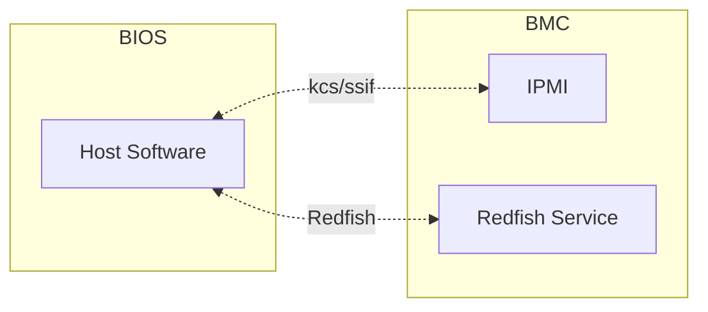
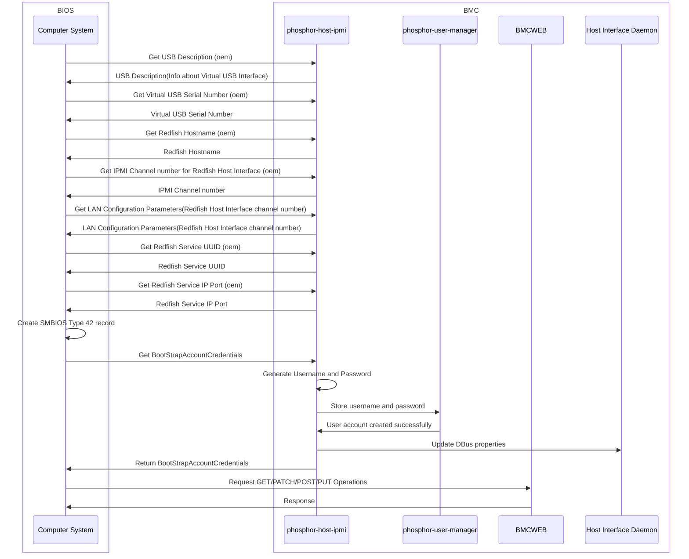

# Redfish Host Interface Support

Author: Prithvi Pai

Other contributors: Rohit Pai

Created: March 20th, 2025

## Problem Description

Redfish added schema for
[HostInterface](https://redfish.dmtf.org/redfish/schema_index), which
allows the standardized Redfish-based communication between the host
CPU and the Redfish service in the management unit.

This design focuses on [Redfish Host Interface](https://www.dmtf.org/sites/default/files/standards/documents/DSP0270_1.3.0.pdf).

## Background and References

Redfish Host Interface is a spec published by
[DMTF](https://www.dmtf.org/sites/default/files/standards/documents/DSP0270_1.3.0.pdf).
It is designed for standardized Redfish-based communication between the host
CPU and the Redfish service in the management unit.
[HostInterface](https://redfish.dmtf.org/schemas/v1/HostInterface.v1_3_3.yaml)
adds support for managing connection between Host CPU and Redfish Service on 
management unit.

## Requirements

This feature aims at supporting standardized Redfish-based communication between
the host CPU and the Redfish service in the management unit providing system
manufactures to easily integrate the feature to existing management controller
technology. This feature enables
1. BIOS to communicate with BMC using standard `Redfish` protocol over network
   interface.
2. BIOS to `GET/SET` BIOS attributes, Secure Boot Settings,Boot Options and
   Boot Order.
3. Out-of-Band(OOB) users to modify BIOS settings which is consumed by the BIOS
   in the next boot cycle.

This design includes:

- New D-Bus interface for Redfish resources `HostInterface`.
- BMCWeb changes for supporting the above Redfish resources.
- Design for Redfish Host Interface D-Bus Daemon, demonstrating how to
  create and manage boot strap account.

## Out of Scope

- Enabling the Redfish stack on Computer System (Host). 

## Proposed Design

### Redfish Host Interface related D-Bus Interfaces

Following information is exposed by host interface daemon on Dbus:

1. Interface Name: `xyz.openbmc_project.RedfishHostInterface.HostInterface`
2. Properties:
    - `CredentialBootstrap` - An indication of whether credential bootstrapping
    is enabled for this interface.
    - `EnableAfterReset` - An indication of whether credential bootstrapping is
    enabled after a reset for this interface.

So far, phosphor-dbus-interfaces lacks interfaces defined for redfish host
interface purpose. Thus, a new interface is proposed:

- `RedfishHostInterface.HostInterface`

### Redfish Host Interface D-Bus Daemon

#### High Level Design

Host Interface is the standardized interface specified by Redfish DMTF Community
that enables Redfish based communication between the Host CPU and the Redfish
service in the BMC. In this communication Redfish Host and the service in BMC
does not require any external network interface and it is achieved via internal
network channel between the BIOS and the BMC. This interface is used in both
Pre-boot(Firmware) stage and by the drivers and applications in the Host
Operating System without use of external networking.

#### Low Level Design

Redfish Host Interface supports HTTPS requests/responses over a TCP/IP network
connection between a Host and Redfish Service. The following main modules are
involved in the communication as depicted in the block diagram below:

#### BootStrapAccount Creation and Management

1. BIOS requests for Bootstrap account for redfish communication over ipmi
   (NetFn 2Ch, Command 02h)
2. BMC generates username and password to be used for further communication and
   sends it back to BIOS. This account will only be used by host software for
   redfish comunication and account will not be shown under IPMI user list as well
   as Redfish AccountService schema
3. The Bootstrap account will be deleted whenever: 
    - Redfish service reset is detected
    - Host Reset is detected

#### Authentication

- Basic Auth: BIOS Initiates BootStrap IPMI Command to get the Credentials.
BIOS communicates to BMC with these account credentials for subsequent HTTPS Requests.

### BMCWeb Support

In BMCWeb, addition of routes handler are required for `HostInterfaces`.
The corresponding URI are specified as follows according to Redfish spec:

- `/redfish/v1/Managers/{ManagerId}/HostInterfaces`

## Impacts

This change will:

- Create a redfish-host-interface daemon that can manage boot strap account
- Add `HostInterfaces` related D-Bus interfaces in
  phosphor-dbus-interfaces.
- Add Host Interface support in BMCWeb with new routes.

### Organizational

The following repositories are expected to be modified to execute this
design:

- https://github.com/openbmc/bmcweb
- https://github.com/openbmc/bios-settings-mgr
- https://github.com/openbmc/phosphor-host-ipmid
- https://github.com/openbmc/phosphor-dbus-interfaces

## Testing

### Unit Test

For the BMCWeb changes, unit test can be done with the Redfish Service
Validator.

For the Host Interface D-Bus Daemon, unit tests should cover the following
cases:

- Enumerate host interface D-Bus objects and check properties.
- host interface should be able to detect bmcweb reset and delete boot strap
  accounts.
- host interface should be able to detect host reset and delete boot strap
  accounts.

### Integration Test

BMCWeb/D-Bus Daemon integration test should cover the following type of
requests:

- Get a collection of `HostInterface` resources.
- Get properties of a `HostInterface` resources.
