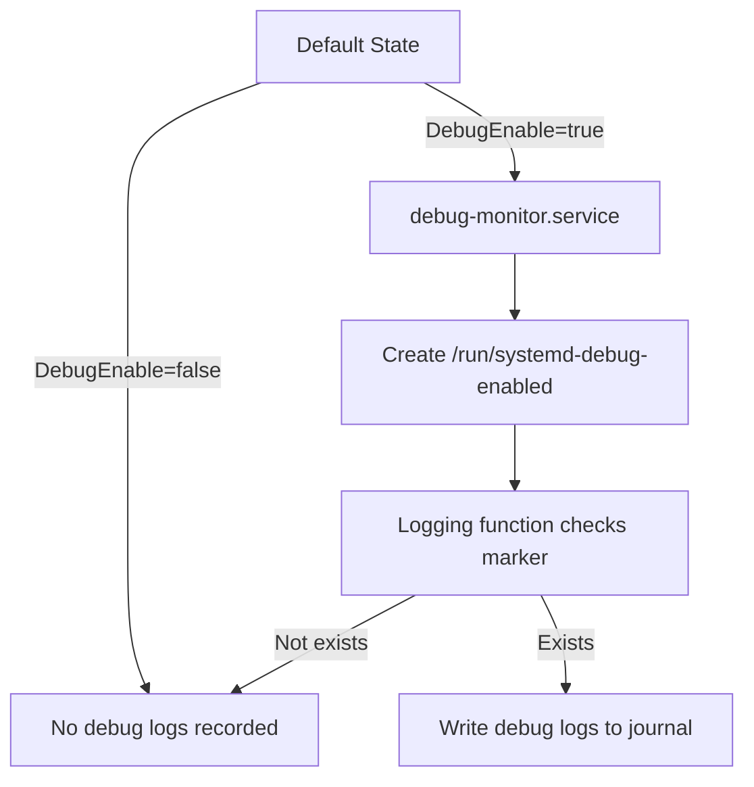

# Runtime Debug Logging Enablement

Author: Patrick Lin (patrick_lin_wiwynn)

Created: Sep 25, 2025

## Problem Description

Currently, debug-level log messages are filtered by default and are not stored
in the system journal. To enable debug-level logs, users must:

1. Configure the journal settings (`MaxLevelStore=debug`).
2. Set the environment variable `DEBUG_INVOCATION`.
3. Restart the target service.

The requirement to restart services introduces a critical problem: restarting
may disrupt the environment and prevent certain issues from being reproduced,
making debugging significantly harder.

## Background and References

- OpenBMC uses `phosphor-logging` for log management and `systemd` for service
  control.
- By design, debug-level logs are filtered to reduce noise in the journal.
- Current enabling mechanism depends on **environment variables + service
  restart**, which is not suitable for runtime debugging.

## Requirements

- Allow enabling/disabling debug-level logging at runtime without restarting
  services.
- Default system behavior should remain unchanged: debug logs are not recorded
  unless explicitly enabled.
- The mechanism must:
  - Be simple to use (single command).
  - Not disrupt existing system processes.
  - Persist only during runtime (reset upon reboot).
- Minimal impact on performance and storage.

## Proposed Design

We propose introducing a runtime mechanism to control whether debug-level logs
are written to the system journal without requiring service restarts. By
default, journald will be configured to accept debug logs, but logging behavior
will be gated through a new runtime flag.

The design introduces:

- A new **systemd property** (`.DebugEnable`) and a **DBus signal**
  (`.DebugEnableChanged`) to control debug mode.
- A lightweight monitoring service (`debug-monitor.service`) that reacts to
  property changes and sets a runtime marker (`/run/systemd-debug-enabled`).
- A simple runtime check in logging functions to determine whether debug logs
  should be stored.

This approach allows operators to dynamically toggle debug logging at runtime
with a single DBus command. No service restart is required, preserving the
environment and making it easier to capture hard-to-reproduce issues.

### Flow Diagram

## Alternatives Considered

1. Keep current mechanism: environment variable + restart (disruptive).
2. Through thread monitoring: a new thread will be created for each service,
   which consumes too many resources

## Impacts

1. `journal`'s **MaxLevelStore** default needs to be set to `debug`.
2. When `DEBUG_INVOCATION` is not configured to 0, debug-level messages cannot
   be filtered into the journal.
3. The filtering switch is now controlled by checking the existence of the
   runtime marker (`/run/systemd-debug-enabled`)
4. Users (with DBus/systemd access) can runtime manage log level by toggling
   `.DebugEnable`.
5. Debug logs may increase journal size when enabled.
6. Default behavior remains the same: debug logs are not recorded unless
   explicitly enabled.

## Testing

1. Verify that by default, debug logs are not stored.
2. Enable debug mode via DBus:
   - Check `/run/systemd-debug-enabled` exists.
   - Verify debug-level logs appear in `journalctl`.
3. Disable debug mode:
   - Verify `/run/systemd-debug-enabled` removed.
   - Confirm debug logs no longer appear.
4. Ensure no service restart is required during the process.
5. Stress test toggling multiple times.
