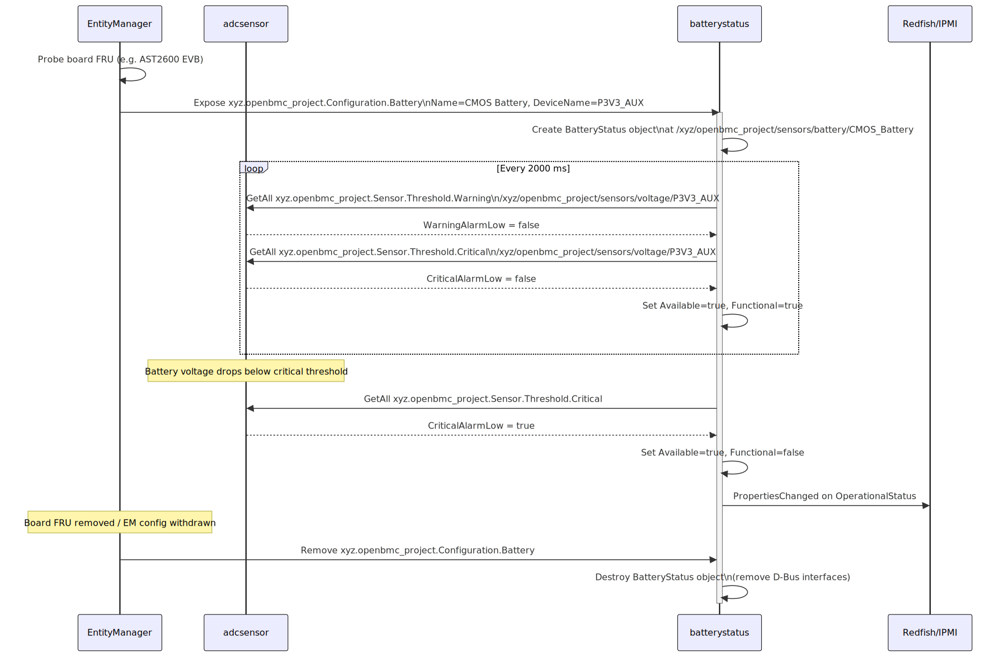

# CMOS Battery Status Support

Author: Mahalakshmi K <mahalakshmik@ami.com>  
Other contributors: None  
Created: June 10, 2026

## Problem Description

OpenBMC does not currently have a common configuration model for CMOS battery
status in Entity Manager. Platforms may expose battery-related information in
different ad-hoc ways, or may not expose it at all, which leads to inconsistent
runtime behavior and inconsistent external interface mapping.

This design introduces a common cross-repository approach:

- a common Entity Manager configuration record for battery status metadata
- a runtime service path to evaluate and publish battery state
- eventual consumption by external interfaces such as Redfish and IPMI

## Background and References

Entity Manager publishes platform configuration records on D-Bus based on JSON
configuration and probe conditions. Other daemons consume those configuration
objects and publish runtime state.

For battery status, this design adds a Battery expose record type to Entity
Manager schema. A platform can then publish battery metadata consistently, while
runtime state evaluation remains in a dedicated battery status service.

This preserves architecture boundaries:

- Entity Manager: configuration publication
- Runtime service: state evaluation and status publication
- External interfaces: consume runtime objects, not raw Entity Manager
  configuration

References:

- [dbus-sensors adcsensor](https://github.com/openbmc/dbus-sensors/tree/master/src/adc)
- [phosphor-dbus-interfaces OperationalStatus](https://github.com/openbmc/phosphor-dbus-interfaces/blob/master/yaml/xyz/openbmc_project/State/Decorator/OperationalStatus.interface.yaml)
- [phosphor-dbus-interfaces Availability](https://github.com/openbmc/phosphor-dbus-interfaces/blob/master/yaml/xyz/openbmc_project/State/Decorator/Availability.interface.yaml)
- [entity-manager configuration format](https://github.com/openbmc/entity-manager/blob/master/CONFIG_FORMAT.md)

## Requirements

- Define a common Entity Manager configuration model for battery status.
- Support schema validation for Battery configuration records.
- Ensure board-scoped activation through probe-gated configuration.
- Keep Entity Manager limited to configuration publication.
- Allow a dedicated runtime service to evaluate battery state and publish
  runtime status objects.

## Non-Goals

- This design does not define charging policy or battery power management.
- This design does not define a complete BBU management framework.
- This design does not require Entity Manager to monitor hardware directly.
- This phase does not finalize all Redfish/IPMI payload mappings.

## Proposed Design

The design is split into configuration and runtime layers.

### Overview

A new batterystatus daemon is added to dbus-sensors. It follows existing
dbus-sensors daemon patterns.

1. On startup, query Entity Manager through GetManagedObjects for objects
  exposing xyz.openbmc_project.Configuration.Battery.
2. For each discovered configuration, construct a BatteryStatus runtime object.
3. Register a D-Bus PropertiesChanged match on
  xyz.openbmc_project.Configuration.Battery to detect add and remove events.
4. Periodically read WarningAlarmLow and CriticalAlarmLow from the configured
  ADC voltage sensor and update runtime status properties.

### Configuration Layer (Entity Manager)

Entity Manager introduces a new expose type: Battery.

Battery record fields:

- Name
- EntityId
- EntityInstance
- DeviceName
- State
- Type (must be Battery)

Entity Manager validates and publishes this configuration when probe conditions
match.

### Runtime Layer (Battery Status Service)

The runtime service consumes xyz.openbmc_project.Configuration.Battery records,
resolves the configured ADC source, and maps threshold state to battery runtime
status.

Published runtime object path:

- /xyz/openbmc_project/sensors/battery/{Name}

Published interfaces:

- xyz.openbmc_project.State.Decorator.OperationalStatus
- xyz.openbmc_project.State.Decorator.Availability
- xyz.openbmc_project.Association.Definitions

No new custom battery runtime interface is required in this phase.

### Interface Consumer Layer (bmcweb/IPMI)

External interfaces should consume runtime objects from batterystatus, not raw
Entity Manager configuration objects.

## Diagram



## Forward Flow Summary

- Probe-gated board configuration matches in Entity Manager.
- Entity Manager publishes Configuration.Battery.
- batterystatus discovers configuration.
- batterystatus evaluates source data and computes runtime battery state.
- batterystatus publishes runtime status objects for consumers.

## Reverse Flow Summary

- If backing source value changes, runtime battery status updates.
- If board/config is withdrawn, runtime battery object is removed.
- Consumers stop seeing stale battery status.

## Proposed D-Bus Interfaces

Configuration interface (published by Entity Manager):

- xyz.openbmc_project.Configuration.Battery

Runtime interfaces (published by batterystatus at
/xyz/openbmc_project/sensors/battery/{Name}):

- xyz.openbmc_project.State.Decorator.OperationalStatus
  - Functional: true when battery is functional
- xyz.openbmc_project.State.Decorator.Availability
  - Available: true when ADC source is reachable
- xyz.openbmc_project.Association.Definitions
  - association back to Entity Manager configuration object

## Handling Removal of Device/Source

- Missing or unavailable source should produce warnings.
- Service remains active and recovers when source becomes available.
- Configuration removal removes corresponding runtime status objects.

## Proposed Changes in Entity Manager

- Add Battery definition in schemas/legacy.json.
- Register Battery in schemas/exposes_record.json.
- Add platform battery configuration (example: AST2600 EVB).
- Include configuration in configurations/meson.build.
- Use scoped FRU probe with MATCH_ONE to avoid global activation and duplicate
  board instantiation.

## Entity Manager Configuration Schema

```json
{
  "$schema": "http://json-schema.org/draft-07/schema#",
  "$defs": {
    "Battery": {
      "type": "object",
      "properties": {
        "Name": {
          "type": "string",
          "description": "Unique sensor name used as D-Bus path suffix."
        },
        "Type": {
          "type": "string",
          "enum": ["Battery"]
        },
        "DeviceName": {
          "type": "string",
          "description": "Name of ADC voltage sensor to monitor."
        },
        "State": {
          "type": "array",
          "items": { "type": "string" },
          "description": "Optional human-readable state labels."
        },
        "EntityId": {
          "type": "string",
          "description": "IPMI Entity ID (hex string)."
        },
        "EntityInstance": {
          "type": "string",
          "description": "IPMI Entity Instance (hex string)."
        }
      },
      "required": ["Name", "Type", "DeviceName"]
    }
  }
}
```

## Example Entity Manager Config Fragment

```json
{
  "Exposes": [
    {
      "DeviceName": "P3V3_AUX",
      "EntityId": "0x28",
      "EntityInstance": "0x01",
      "Name": "CMOS Battery",
      "State": ["Battery Low", "Battery Failed", "Battery presence detected"],
      "Type": "Battery"
    }
  ],
  "Name": "AST2600 EVB Baseboard",
  "Probe": [
    "xyz.openbmc_project.FruDevice({'BOARD_PRODUCT_NAME': 'AST2600 EVB', 'BOARD_MANUFACTURER': 'ASPEED'})",
    "OR",
    "xyz.openbmc_project.FruDevice({'PRODUCT_PRODUCT_NAME': 'AST2600 EVB', 'PRODUCT_MANUFACTURER': 'ASPEED'})",
    "MATCH_ONE"
  ],
  "Type": "Board"
}
```

## Uniqueness of Name Property

Name should be stable and platform-unique enough to avoid collisions when
multiple battery records exist.

## New Files

- src/batterystatus/BatteryStatus.hpp
- src/batterystatus/BatteryStatus.cpp
- src/batterystatus/BatteryStatusMain.cpp
- src/batterystatus/meson.build
- service_files/xyz.openbmc_project.batterystatus.service

## systemd Service

The service depends on both Entity Manager (configuration) and adcsensor
(threshold source).

```ini
[Unit]
Description=Battery Sensor
StopWhenUnneeded=false
Requires=xyz.openbmc_project.EntityManager.service
After=xyz.openbmc_project.EntityManager.service
Requires=xyz.openbmc_project.adcsensor.service
After=xyz.openbmc_project.adcsensor.service

[Service]
Type=dbus
BusName=xyz.openbmc_project.BatteryStatus
Restart=always
RestartSec=5
ExecStart=/usr/libexec/dbus-sensors/batterystatus

[Install]
WantedBy=multi-user.target
```

## Alternatives Considered

- Keep battery information as generic voltage-only sensor metadata. Rejected
  because it does not provide a clear battery-status semantic model.
- Move battery health evaluation into Entity Manager. Rejected because Entity
  Manager should remain a configuration publisher.
- Implement board-specific runtime logic without a common configuration model.
  Rejected because it does not scale across platforms.
- Read ADC registers directly in batterystatus. Rejected because adcsensor
  already provides threshold handling, hysteresis, and deglitch filtering.

## Impacts

### Organizational

- New repository required: No.
- Repositories expected to be modified:
  - openbmc/docs
  - entity-manager
  - dbus-sensors

Potential follow-up repositories:

- bmcweb (if Redfish mapping is added)
- IPMI repository (if IPMI mapping is added)
- phosphor-dbus-interfaces (only if maintainers request additional interface
  formalization)

## Testing

Configuration and schema:

- Validate Battery records in Entity Manager schema.
- Validate probe-gated publication behavior.
- Validate Configuration.Battery appears only on matching platforms.

Runtime:

- Validate service discovery and consumption of Configuration.Battery.
- Validate source-to-state translation.
- Validate behavior when source is absent (warning path, no crash).
- Validate runtime object cleanup on configuration removal.

Integration/system:

- Validate object creation on AST2600 EVB.
- Validate stable service startup and runtime updates.
- Validate external exposure behavior when bmcweb/IPMI integration is enabled.
