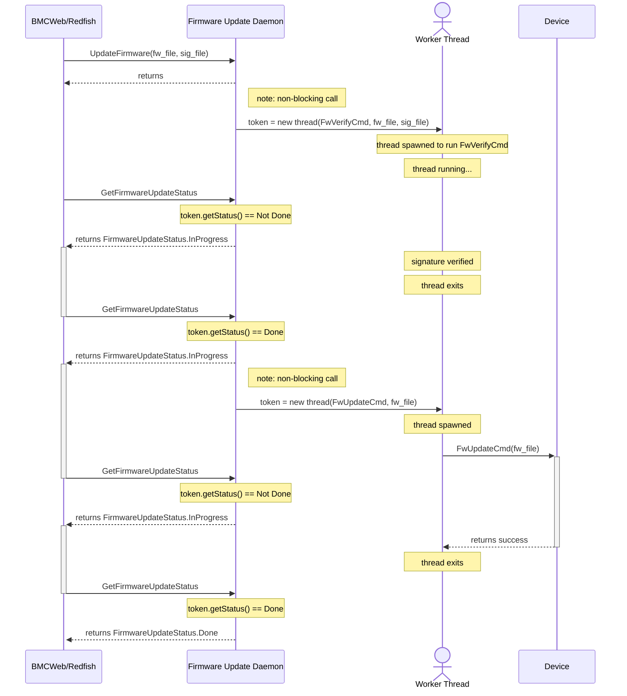
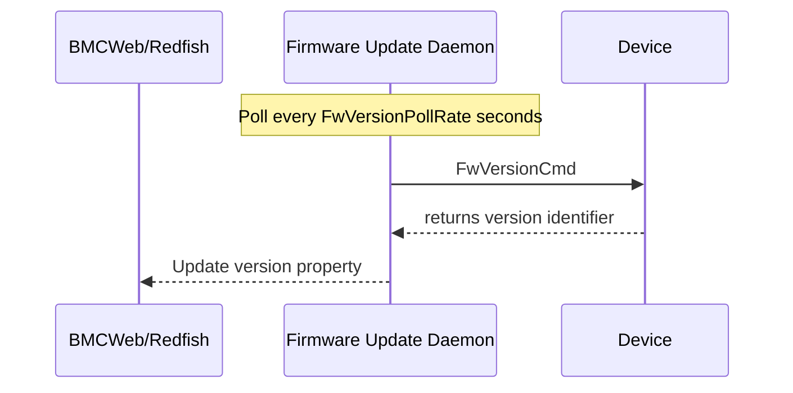

# Shell-based Firmware Update Daemon

Authors: Justin Ledford (justinledford@google.com), Edmond Mo
(edmondmo@google.com), Peter Lundgren (peterlundgren@google.com)

Created: June 28, 2022

## Problem Description

It is expensive to onboard existing firmware update tools (e.g. a vendor
provided command line tool) to OpenBMC. OpenBMC requires implementing standard
D-Bus APIs to provide firmware update and version reporting capabilities. A
one-shot command line tool cannot provide long-lived D-Bus APIs. So, this means
that onboarding a new firmware update tool requires refactoring the one-shot
tool into a daemon.

What if we could onboard the existing tool without modification by bridging the
gap between D-Bus and command line tools?

## Background and References

Some software currently exists for updating BMC and BIOS [^2], but it does not
support generic devices.

BMC developers typically have existing CLIs for updating devices, either from
vendors or developed in-house. If Redfish firmware updates for those devices are
desired, the developers may wish to re-use the CLIs, as opposed to porting the
update code into a daemon. Ideally, a vendor can supply a daemon that supports
updates and adheres to a standard update API, but this is not always possible
with aggressive product schedules.

## Requirements

-   Provide a user-friendly way for developers to integrate existing software
    into D-Bus/Redfish firmware update and version reporting APIs.
-   Support verifying the image before the firmware update [^1].
-   Handle updates for multiple devices of the same type that may or may not
    require separate images.

## Proposed Design

This proposal bridges from the D-Bus simple firmware update API (UpdateFirmware
and GetFirmwareUpdateStatus) [^1] and the Software.Version interface to command
line utilities for firmware updates using a new daemon:

```
                               ┌──────────────────────┐
                               │                      │
┌─────────────────────────┐    │                      │     ┌────────────────────────────┐
│                         │    │                      │     │                            │
│     UpdateFirmware      ├────►------bridge to-------├─────► FwVerifyCmd && FwUpdateCmd │
│ GetFirmwareUpdateStatus │    │                      │     │                            │
│                         │    │                      │     └────────────────────────────┘
└─────────────────────────┘    │ Shell-based Firmware │
                               │    Update Daemon     │
┌─────────────────────────┐    │                      │     ┌───────────────────────┐
│                         │    │                      │     │                       │
│    Software.Version     ├────►------bridge to-------├─────►     FwVersionCmd      │
│                         │    │                      │     │                       │
└─────────────────────────┘    │                      │     └───────────────────────┘
                               │                      │
                               └──────────▲───────────┘
                                          │
                                          │
                               ┌──────────┴───────────┐
                               │                      │
                               │    entity-manager    │
                               │    configuration     │
                               │                      │
                               └──────────────────────┘
```

The UpdateFirmware method returns immediately (to avoid long-blocking D-Bus
method calls) and launches a background task to run FwVerifyCmd && FwUpdateCmd.
FwVerifyCmd will check the integrity of the firmware payload and FwUpdateCmd
will actually perform the update. GetFirmwareUpdateStatus can be polled in the
meantime and will return Done only after both FwVerifyCmd and FwUpdateCmd have
finished successfully.



Version reporting is implemented by calling FwVersionCmd every FwVersionPollRate
seconds. The D-Bus Version property is updated if the output of FwVersionCmd
changes.



### Architectural Aside

The preferred pattern for managing peripherals is for there to be one daemon
responsible for all of the management of that peripheral device including:
command/control, telemetry, and firmware updates. Combining those features
allows the daemon to intelligently schedule (e.g. pause telemetry during a
firmware update) and avoids race conditions from independent software components
using the same interface.

This Shell-based Firmware Update Daemon is intended as an intermediate step on
the way to fully-fledged device specific daemons.

Most uses of this daemon should probably come with a plan to migrate off of it.

### Configuration

The device daemon is a reactor to Entity-Manager[^3]. It listens on D-Bus for
objects with an interface matching `xyz.openbmc_project.Configuration.${TYPE}`
and then reacts accordingly by creating new objects and two interfaces (see
Example Configuration below) per object created.

5 configuration properties are supported:

| Property          | Type   | Description                                     |
| ----------------- | ------ | ----------------------------------------------- |
| FwImageType       | string | (Optional) Use when you have multiple of the    |
:                   :        : same Type of device that require different      :
:                   :        : firmwares.                                      :
| FwUpdateCmd       | string | (Optional) Command to run to update firmware.   |
:                   :        : Should return 0 on success.                     :
| FwVerifyCmd       | string | (Optional) Command to run to verify the         |
:                   :        : integrity of the firmware file typically using  :
:                   :        : the corresponding signature file. Should return :
:                   :        : 0 on success.                                   :
| FwVersionCmd      | string | (Optional) Command to run to get the firmware   |
:                   :        : version. Should write the firmware version to   :
:                   :        : stdout.                                         :
| FwVersionPollRate | number | (Optional) Polling rate in seconds to poll the  |
:                   :        : FWVersionCmd. Defaults to 1 second.             :

All properties are optional, allowing you to use this Shell-based Firmware
Update Daemon to provide either UpdateFirmware, Software.Version, or both
depending on what your device actually supports.

#### Variable Substitution

The substrings "{{fw_file}}" and "{{sig_file}}" will be substituted with the
file path to the firmware image and signature file respectively when the
UpdateFirmware [^1] method is invoked.

This syntax was chosen to avoid colliding with entity-manager's existing use of
$variable substitution.

#### Example Configuration

In this toy example, the contents of the fw_file is assumed to be an ascii
string version number. The fw_file is stored in /tmp/ instead of actually
programming an external device. Three devices are configured: one expecting the
primary ImageType and two expecting the secondary ImageType:

```
    {
      "Name": "primary_sequencer",
      "Type": "MyDevice",
      "FwImageType": "primary",
      "FwUpdateCmd": "cat {{fw_file}} > /tmp/fw0",
      "FwVerifyCmd": "gpg –verify {{sig_file}} {{fw_file}}"
      "FwVersionCmd": "cat /tmp/fw0",
      "FwVersionPollRate": 10.0
    },
    {
      "Name": "secondary_sequencer0",
      "Type": "MyDevice",
      "FwImageType": "secondary",
      "FwUpdateCmd": "cat {{fw_file}} > /tmp/fw1",
      "FwVerifyCmd": "gpg –verify {{sig_file}} {{fw_file}}"
      "FwVersionCmd": "cat /tmp/fw1",
      "FwVersionPollRate": 10.0
    },
    {
      "Name": "secondary_sequencer1",
      "Type": "MyDevice"
      "FwImageType": "secondary",
      "FwUpdateCmd": "cat {{fw_file}} > /tmp/fw2",
      "FwVerifyCmd": "gpg –verify {{sig_file}} {{fw_file}}"
      "FwVersionCmd": "cat /tmp/fw2",
      "FwVersionPollRate": 10.0
    },
```

With this configuration, the daemon will create the following objects with the
interfaces described in this section:

> `/xyz/openbmc_project/devices/primary_sequencer`
> `/xyz/openbmc_project/devices/secondary_sequencer0`
> `/xyz/openbmc_project/devices/secondary_sequencer1`

### Firmware Updates

The simple firmware update API [^1] provides the interface for updating devices.

A client will call `UpdateFirmware` with the firmware image and signature file
to start the update process on devices matching a Type and ImageType, and then
poll `GetFirmwareUpdateStatus` until the process has finished or failed.

### Software Version Interface

Each object created by the daemon will implement and expose the
`xyz.openbmc_project.Software.Version` interface [^4]. By utilizing this
interface, the daemon will support version reporting through Redfish
out-of-the-box given the existing BMCWeb support.

## Alternatives Considered

One alternative is to create specific daemons for each device or a single daemon
with support for multiple devices with the update logic contained in the daemon
itself rather than in external software such as CLIs. This would require porting
all existing code into these daemons, and may not always be feasible.

Another is extending phosphor-bmc-code-mgmt to support generic devices. However
phosphor-bmc-code-mgmt adds another layer of systemd services between the
commands and D-Bus that may not be necessary. In addition phosphor-bmc-code-mgmt
uses the ImageManager/ItemUpdater API which is not preferred as described in the
simple API [^5].

## Impacts

With this design, there will be 2 implementations of firmware update APIs. The
impact of introducing the simpler API is discussed in its proposal [^1].

By exposing a method to update various devices on a board, there is the
possibility of bricking a system, either maliciously or unintentionally. Care
should be taken to provide a proper verification command to verify firmware
contents before writing them.

## Organizational

This would require a new repository. The initial maintainers will be the authors
of this design.

## Testing

-   Unit tests using **`gMock/gTest`** and **`sdbusplus::SdBusMock`**
-   Shell scripts or CLI to interact with the D-Bus interfaces exposed by the
    daemon. Possible advanced testing would be a Python parser that parses the
    entity manager’s configuration json files and matches them with
    introspection results from the new objects created by the daemon.

## Footnotes

[^1]: https://gerrit.openbmc.org/c/openbmc/docs/+/54589
[^2]: https://github.com/openbmc/phosphor-bmc-code-mgmt
[^3]: https://github.com/openbmc/entity-manager
[^4]: https://github.com/openbmc/phosphor-dbus-interfaces/blob/master/yaml/xyz/openbmc_project/Software/Version.interface.yaml
[^5]: https://github.com/openbmc/phosphor-dbus-interfaces/tree/master/yaml/xyz/openbmc_project/Software#software-version-management-and-image-update
