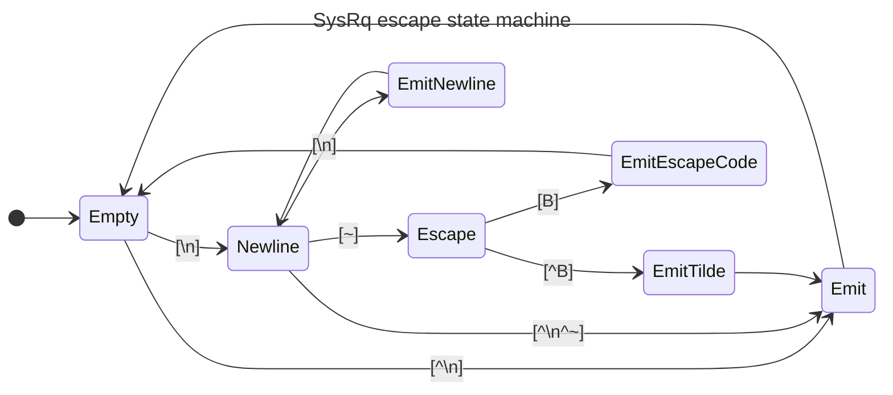

# SysRq Support in SOL

Author: Lei Yu <LeiYU!>

Other contributors: Chen Tingting

Created: Aug 02, 2023

## Problem Description

[SysRq][1] is a special key combination used by Linux to perform various
low-level commands. BMC usually provides SysRq support in KVM and SOL functions,
but this is not available in OpenBMC. This doc is to provide the SysRq support
in OpenBMC's SOL.

## Background and References

The key combination consists of Alt+SysRq (usually the `PrintScreen` key) and
another key, which controls the command issued. This is not typical key code and
requires special handling. A serial console usually invokes SysRq feature by
sending a serial break signal, followed by the desired key. The "break signal"
is usually generated by `ctrl+break` key combination.[2]

In ipmitool, the "break signal" is implemented in [ipmi_sol.c][3] by handling
the special `\n~B` keys.

## Requirements

OpenBMC SOL involves several ways:

- The ipmitool SOL.
- The SOL in WebUI.
- The console with SSH (default) 2200 port.

This doc provides the design for SOL in ipmitool and WebUI, but does not aim to
support the SSH SOL.

## Proposed Design

In OpenBMC, the service `obmc-console-server` provides the host console and
could be connected by multiple clients, using unix domain socket.

To implement the SysRq in OpenBMC SOL for ipmi and WebUI, `MSG_OOB` is used to
send the "break signal" between clients and console-server, so that the data
becomes `Out-Of-Band` and could be handled by the server specifically. When the
server receives the `MSG_OOB` data, it could invoke `tcsendbreak()` to send the
"break signal" to the Host.

### netipmid

In `phosphor-ipmi-net`, the code in `processInboundPayload()` shall handle the
break signal from ipmitool, and send a `MSG_OOB` message to the server.

Then in ipmitool SOL sessioin, user could enter `\n~B` keys to trigger the
break, and then enter a keycode as the SysRq command.

### WebUI

There are no changes required in WebUI, like netipmid, the user could enter the
key code sequence `\n~B` to trigger the break, and then user could enter a
keycode as the SysRq command.

### bmcweb

In `obmc_console.hpp`, check the user input buffer to handle the `\n~B`
sequence. A simple state machine is used to detect the sequence:

If `EmitSysRq` state is reached, send a `MSG_OOB` message to the
obmc-console-server.

### obmc-console

As the obmc-console server, it shall add `POLLPRI` to poll the `MSG_OOB`
message, and when the message is polled, it shall call `tcsendbreak()` to send
the "break message" to the Host.

### OOB message

The OOB message is a data with `MSG_OOB` flag, and it shall contain some data
anyway. This doc proposes to use a byte of `72` (ASCII `H`) as the message data.
The clients and the server could use the same data to indicate it's a SysRq
event.

Note: The OOB data `72` was introduced to [net-ipmid][4] as the indicator of
sysrq. It is extendable to send other OOB messages in the future.

| OOB Data | Message |
| -------- | ------- |
| `H`      | SysRq   |

## Alternatives Considered

The SysRq always requires some communication between the console clients and the
server. If not using `MSG_OOB`, some other data shall be pre-defined anyway.
This could impact the normal input and output.

## Impacts

Below services need minor changes to add the SysRq support:

- netipmid
- WebUI
- bmcweb
- obmc-console

## Testing

The SysRq in SOL could be verified in both ipmitool SOL and WebUI SOL.

[1]: https://en.wikipedia.org/wiki/Magic_SysRq_key
[2]: https://www.kernel.org/doc/html/latest/admin-guide/sysrq.html
[3]: https://github.com/ipmitool/ipmitool/blob/master/lib/ipmi_sol.c#L1398-L1401
[4]:
  https://github.com/openbmc/phosphor-net-ipmid/commit/ec4374146147e339132243725d345eb30ec2da1d
