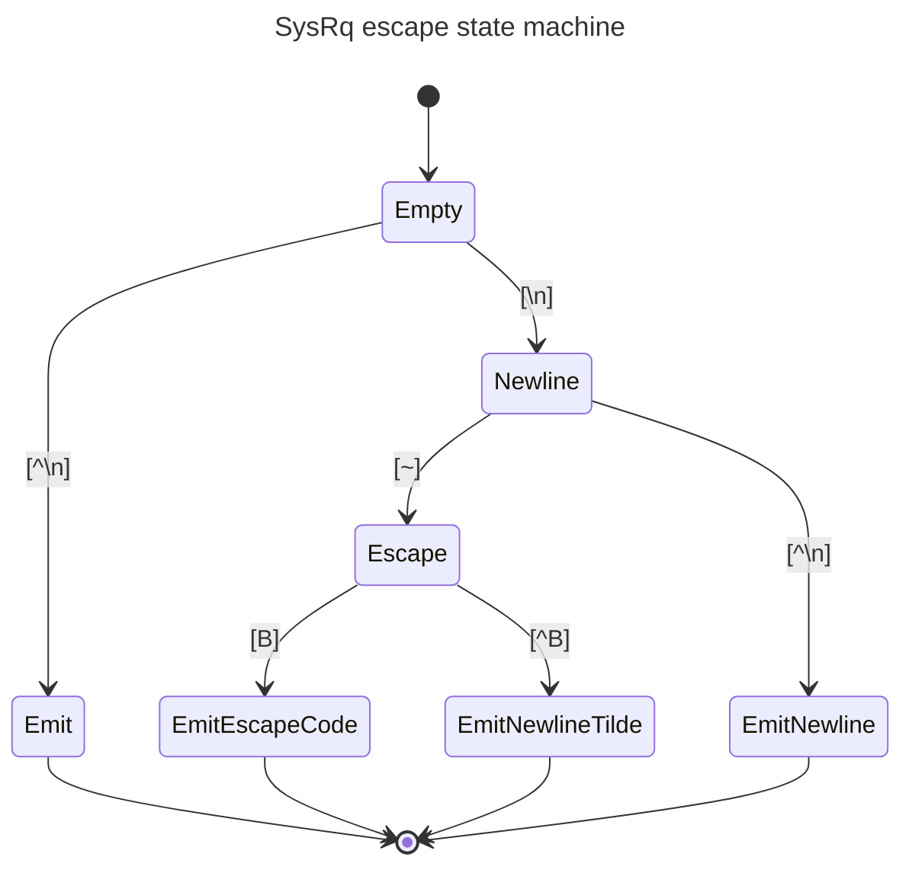

# SysRq Support in SOL

Author: Lei Yu <LeiYU!>

Other contributors: Chen Tingting, Xie Xinnan

Created: Aug 02, 2023

## Problem Description

[SysRq][1] is a special key combination used by Linux to perform various
low-level commands. BMC usually provides SysRq support in KVM and SOL functions,
but this is not available in OpenBMC. This doc is to provide the SysRq support
in OpenBMC's SOL.

## Background and References

The key combination consists of Alt+SysRq (usually the `PrintScreen` key) and
another key, which controls the command issued. This is not typical key code and
requires special handling. A serial console usually invokes SysRq feature by
sending a serial break signal, followed by the desired key. The "break signal"
is usually generated by `ctrl+break` key combination.[2]

In ipmitool, the "break signal" is implemented in [ipmi_sol.c][3] by handling
the special `\n~B` keys.

## Requirements

OpenBMC SOL involves several ways:

- The ipmitool SOL.
- The SOL in WebUI.
- The console with SSH (default) 2200 port.

This doc provides the design for SOL in ipmitool and WebUI, but does not aim to
support the SSH SOL.

## Proposed Design

In OpenBMC, the service `obmc-console-server` provides the host console and
could be connected by multiple clients, using unix domain socket.

To implement the SysRq in OpenBMC SOL for ipmi and WebUI, the special key code
sequence `\n~B` is used to send the "break signal" between clients and
console-server. In `obmc-console`, a state machine shall handle the sequence.
Once the sequence is detected, it could invoke `tcsendbreak()` to send the
"break signal" to the Host.

### netipmid

In `phosphor-ipmi-net`, the code in `processInboundPayload()` shall handle the
break signal from ipmitool, and send the sequence `\n~B` to the server.

Then in ipmitool SOL session, user could enter `\n~B` keys to trigger the break,
and then enter a keycode as the SysRq command.

### WebUI

There are no changes required in WebUI, like netipmid, the user could enter the
key code sequence `\n~B` to trigger the break, and then user could enter a
keycode as the SysRq command.

### obmc-console

As the obmc-console server, in `console-server.h`, a simple state machine is
used to detect the sequence `\n~B`:

If `EmitEscapeCode` state is reached, it shall call `tcsendbreak()` to send the
"break message" to the Host.

## Alternatives Considered

An alternative way to send the "break signal" between clients and console-server
is use `MSG_OOB` as the indicator of sysrq. The `MSG_OOB` was already introduced
to [netipmid][4] as the indicator of sysrq. In this solution, bmcweb shall be
modified to send `MSG_OOB` to obmc-console when the user enter the key code
sequence `\n~B`. When obmc-console receive `MSG_OOB`, it shall send the "break
message" to the Host.

However, in this solution, in some scenarios, obmc-console can not handle the
input sequence correctly, as `MSG_OOB` can be anywhere in the input sequence. It
is possible to synchronise the `MSG_OOB` with the stream with
[sockatmark(3)][5]. But it requires signalling the `MSG_OOB` in all obmc-console
clients, which is more work than the state machine solution.

## Impacts

Below services need minor changes to add the SysRq support:

- netipmid
- obmc-console

## Testing

The SysRq in SOL could be verified in both ipmitool SOL and WebUI SOL.

[1]: https://en.wikipedia.org/wiki/Magic_SysRq_key
[2]: https://www.kernel.org/doc/html/latest/admin-guide/sysrq.html
[3]: https://github.com/ipmitool/ipmitool/blob/master/lib/ipmi_sol.c#L1398-L1401
[4]:
  https://github.com/openbmc/phosphor-net-ipmid/commit/ec4374146147e339132243725d345eb30ec2da1d
[5]: https://man7.org/linux/man-pages/man3/sockatmark.3.html
