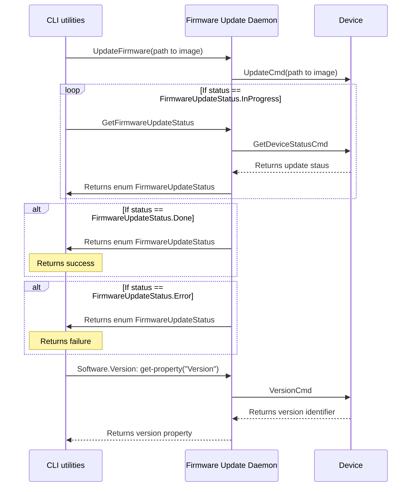

# Title

```mermaid
sequenceDiagram;
participant CLI as CLI utilities
participant FWD as Firmware Update Daemon
participant DEV as Device

CLI ->> FWD: UpdateFirmware(path to image)
FWD ->> DEV: UpdateCmd(path to image)
loop If status == FirmwareUpdateStatus.InProgress
  CLI ->> FWD: GetFirmwareUpdateStatus
  FWD ->> DEV: GetDeviceStatusCmd
  DEV -->> FWD: Returns update staus
  FWD ->> CLI: Returns enum FirmwareUpdateStatus
end
alt If status == FirmwareUpdateStatus.Done
  FWD ->> CLI: Returns enum FirmwareUpdateStatus
  note over CLI: Returns success
end
alt If status == FirmwareUpdateStatus.Error
  FWD ->> CLI: Returns enum FirmwareUpdateStatus
  note over CLI: Returns failure
end

CLI ->> FWD: Software.Version: get-property("Version")
FWD ->> DEV: VersionCmd
DEV -->> FWD: Returns version identifier
FWD -->> CLI: Returns version property
```

