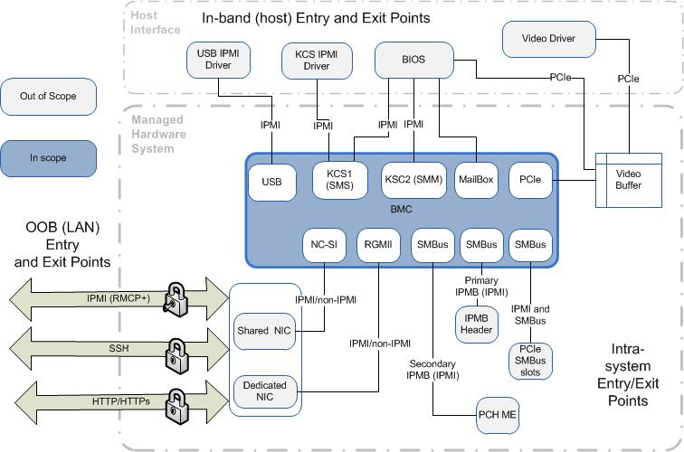

**OpenBMC Server Security Architecture**

**Overview**

The Baseboard Management Controller (BMC) is an embedded controller that
provides manageability to the server outside of the domain of the host processor
and operating system. The BMC provides an alternate interface to control power &
reset to the host processor independent of the host operating system, thermal
management, health monitoring, remote access, and management of Field
Replaceable Units (FRUs). Where FRUs typically consist of power supplies, fan
controllers, network switches, storage controllers, storage devices, and
Add-In-Cards (AICs).

The typical BMC is a System-On-a-Chip (SOC) that integrates three functional
components consisting of an ARM embedded controller, video controller, and a
Super I/O (SIO) controller.

The primary purpose of the BMC is autonomously monitor the health of the system
while logging events, collecting event data, and storing the data into a systm
event log for later retrieval. The event data can be collected from the BMC
using the host interface or via the remote management network interface.

**Server Management Hardware**

The BMC is the central management controller and interacts with many other
devices in the server management subsystem. The relevant hardware includes the
following primary components:

-   Integrated Baseboard Management Controller (BMC) and associated support
    components (DDR4, SPI flash, network controller). The typical BMC component
used in a server are the ASPEED AST2500, ASPEED Pilot series, and the Nuvoton
W83795 series.

-   Non-volatile data storage provided by a SPI flash device or eMMC device on
    the baseboard

-   DDR3 or DDR4 memory device.

-   Management network interface.

-   Remote Controllers for FRU devices (i.e., power supplies, storage
    controllers)

-   Baseboard temperature sensors and voltage regulators

-   Front panel hardware for switches, indicators, and temperature sensor

The following diagram shows high-level server management components of a typical
server.

<<< INSERT SM HI LEVEL DIAGRAM HERE <<<

**BMC Interfaces**

**Keyboard Controller Style (KCS)**

The KCS interface to the host is used for SIO and BMC functionality.

**Block Transfer (BT)**

The BT interface to the host may also be used for SIO and BMC functionality.

**PCIe**

The PCI Express interface has the following use cases:

-   Video/graphics interface - The video controller interface to communicate
    with the host. The video controller is a VGA-compliant controller with 2D
hardware acceleration and full bus master support. It exposes a video partition
of the BMC external DDR memory. The BMC firmware configures and locks this
memory partition such that only the area allocated to video is visible to the
host video driver (i.e. memory allocated for BMC usage is not accessible).

-   MCTP/PCIe - The BMC device supports an MCTP over PCIe capability that allows
    BMC firmware to communicate with an MCTP-compliant endpoint over PCIe.

**USB**

The USB 1.1 interface is used for remote keyboard and mouse support, and the USB
2.0 interface is used for remote storage support. The BMC supports various
storage device types such as CDROM, DVDROM, CDROM (ISO image), floppy and USB
flash disk. Any of the storage device type can be used as a remote boot device
and the host can boot from this remote media.

Additionally, the USB 2.0 interface can be used for local/host BMC firmware
updates, as the slower speed of the KCS or BT interfaces can result in
significant increased update times compared to use of the USB interface.
Firmware updates over USB are supported in a data channel mode as a mode where
the BMC exposes a region of its DDR memory to the host OS as a virtual USB
drive.

**OpenBMC Firmware Distribution**

The OpenBMC firmware distribution is created using the Yocto build
infrastructure. Where Yocto provides the framework using recipes to build a
Linux distribution for use as a server management package for server
manufacturers. The driver support is provided by a combination of the 3rd party
hardware vendors and the open source community.

The following kernel and library versions are applicable to OpenBMC firmware as
of the time this document was written; noting that they will be updated to
incorporate security fixes during the lifetime of the project.

-   Linux kernel: version 4.14.44

-   OpenSSL: version 1.0.2k

-   Web server used is lighttpd: version 1.4.45.

**ASPEED AST2500 Security**

The following features of the ASPEED AST2500 have security related implications
that should be taken into consideration when creating a firmware distribution.
These are pathways for software running on the host to access AST2500 resources.

**AHB Bridges**

The AST2500 supports three AHB bridges that allow host software to access the
BMC registers, DRAM, and flash.

-   PCIe-to-AHB bridge
-   LPC-to-AHB
-   UART-to-AHB

These bridges all default to an enabled state at BMC power-on reset or after a
full BMC watchdog (WD) reset. The BMC must disable these bridges early in its
‘ROM’ boot block in order to prevent potential host-based attacks.

For the BMC power-on reset case, the BMC will always be able to disable the
bridges before the host comes on-line, so there is no window of opportunity for
a host-based attack using an AHB bridges. To ensure that there is also no window
for such an attack after a BMC WD reset, the BMC firmware must ensure that the
WD timer is only configured to do an SOC reset rather than a full WD reset. An
SOC WD reset does not reset the configuration registers that were used to
disable the bridges.

Security Guidance (Requirements?):

-   BMC ‘ROM’ boot block must disable all AHB bridges.

    -   To disable PCIe-to-AHB bridge
    -   Set register bits SCU2C[25:22] to all 1s.

    -   To disable LPC-to-AHB bridge
    -   Set register bit HICR5[10] to 0.

    -   Set register bit HICRB[6] to 1.
    -   To disable UART-to-AHB bridge

    -   Set register bit SCU2C[10] to 1.

-   BMC must not configure the WDT for WDT Full reset usage (use WDT_SOC reset).

**Host Access to BMC Flash via eSPI Flash Channel**

The AST2500 can support eSPI Slave Attached Flash Sharing (SAFS) which can allow
host access flash devices behind the BMC. In this context, BMC flash is
referring to the flash device that holds the BMC firmware and BIOS flash is
referring to a flash device that would hold BIOS code if we were implementing an
SAFS configuration with BIOS flash behind the BMC.

BMC flash read from host can be supported either by the BMC HW (no firmware
involved) or by the BMC firmware. Whether this is handled by firmware or HW is
determined by a BMC register setting (Register ESPI000[10]) which defaults to HW
mode.

BMC flash write from the host requires BMC firmware support (i.e., there is no
HW-only write capability).

The specific flash device that the host can access is determined by a BMC
register setting (Register ESPI090[31:24) which defaults to the BIOS flash.

When the BMC powers on, or is reset, the only possible flash access mode from
the host is in read mode. Which defaults to a different SPI interface than is
used for the BMC firmware flash device. Therefore, no access (read or write) is
available to the host unless BMC firmware enables it.

**Host Access to BMC DRAM**

The BMC device provides host access to BMC memory via the X-DMA BMC device
functionality. The primary usage of this is to allow the host video driver to
access the video memory partition of the BMC DRAM; however it can be configured
to allow the host to access any area of BMC DRAM. The BMC reset default
configuration is that the host only has access to VGA memory. The BMC firmware
should not configure the X-DMA Bridge to allow host access to non-VGA memory.

**Security Analysis**

**Entry and Exit Points**

The following diagram shows high-level server management interfaces of a typical
server.

**Interface :: Protocol :: Security Assumption**

**SMS (inband)**

    - IPMI over KCS/LPC
    - Assumption is that only authenticated Software/applications are using
      the SMS interface from host side.
    - There is no session authentication required (IPMI spec considers host
      interfaces to the BMC to be trusted).

**SMM (inband)**

    - IPMI over KCS/LPC
    - Only secure BIOS code will communicate with BMC via this interface.
    - There is no session authentication (IPMI spec considers host
      interfaces to the BMC to be trusted).

**SMS (inband)**

    - IPMI over BT
    - Assumption is that only authenticated Software /applications are using
      the SMS interface from host side.
    - There is no session authentication required (IPMI spec considers host
      interfaces to the BMC to be trusted).

**Mail box register (inband)**

    - Bit-map manipulation
    - Assumption is that mail box registers are only used for BIOS/BMC
      interactions.
    - Only secure BIOS code will access this registers from host side.

**BMC Shared Video buffer(inband)**

    - Host accesses memory buffer via PCIe (coordinate ted via IPMI commands
      over SMS/SMM)
    - Assumption is that this is only used for BIOS/BMC interactions during
      system POST.
    - Not used after POST complete.
    - Only authenticated Software (video driver) using this interface from
      host side after POSTS complete.

**BMC USB interface(inband)**

    - Assumption is that only authenticated Software /applications are using
      this USB interface from host side.
    - There is no session authentication (IPMI spec considers host
      interfaces to the BMC to be trusted).

**OOB Shared LAN**

    - See table section for LAN protocols
    - Assumption that the external LAN Controller filtering hardware
      provides correct routing and maintains isolation between the OOB
manageability traffic and In-band traffic to the OS. (The LAN controller is only
a pass-through for the remote management traffic.
    - It plays no role in the authentication, integrity, or confidentiality
      of the remote session.).
    -  Authentication, integrity & confidentiality for OOB manageability
       traffic will be enforced based on IPMI spec.
    - Authentication, integrity & confidentiality for OOB manageability
      traffic shall be enforced for non–IPMI access.

**OOB Dedicated LAN**

    - See table section for LAN protocols
    - If optional NIC add in card is installed then BMC will support LAN
      traffic on this NIC also. Authentication, integrity & confidentiality
for OOB manageability traffic will be enforced based on IPMI 2.0 spec.
    - Authentication, integrity & confidentiality for OOB manageability
      traffic shall be enforced for non–IPMI access.

**Primary IPMB**

    - IPMI over SMBus (IPMB)
    - It is assumed secure since it requires local access to connect to it.
    - There is no session authentication on this interface (Based on IPMI
      2.0 Spec)

**Secondary IPMB**

    - IPMI over SMBus (IPMB)
    - It is assumed secure since it requires local access to connect to it.
    - There is no session authentication on this interface (Based on IPMI
      2.0 Spec)

**SMBUS**

-   BMC use this interface to read the slave devices. Slave devices cannot send
    any IPMI commands to BMC using this interface.

**MCTP/PCIe**

    - MCTP using PCIe VDMs
    - AST2500 MCTP/PCIe HW is only capable of intiating PCIe message
      transactions using MCTP (i.e. not capable of PCIe memory write/read or
IO transactions).

**Protocols/features used in the LAN interface**

***RMCP***

    - Not supported

***RMCP+***

    - Authentication, integrity & confidentiality will be enforced based on
      IPMI specification.
    - Only support cipher suites 3 and 17.

***SOL***

    - Authentication, integrity & confidentiality will be enforced based on
      SSL

***Web Server***

    - Authentication, integrity & confidentiality for OOB manageability
      traffic shall be enforced.
    - Assumption is the administrator installs server authentication
      certificates into BMC and uses SSL to communicate with BMC.

***KVM***

    - Authentication, integrity & confidentiality for OOB manageability
      traffic shall be enforced.
    - Assumption is the administrator installs server authentication
      certificates into BMC and uses SSL to communicate with BMC.

***Media-redirection***

    - Authentication, integrity & confidentiality for OOB manageability
      traffic shall be enforced.
    - Assumption is the administrator installs server authentication
      certificates into BMC and uses SSL to communicate with BMC.

**General Security Objectives and Non-Goals**

This section describes the general security objectives and non-goals for the
OpenBMC firmware stack. Specific security objectives that apply to specific
assets are described in the next section as part of the threat analysis.

**Objectives**

- Prevent installation or execution of an unauthorized BMC firmware image in the
  field (i.e. support secure update and secure boot).
- Ensure only authorized remote users of the BMC capabilities by enforcing user
  authentication/privilege levels for OOB (LAN) access to the BMC.
- Support confidentiality of OOB management traffic when appropriate, as
  determined by threat analysis/mitigation and subject to spec compliance.
- Protect user credentials from exposure to a network adversary for non-IPMI
  connections (IPMI spec allows for configuration of credentials in the clear if
user chooses to do so).
- No support for IPMI RMCP.
- Disable IPMI RMCP+ by default, and provide an opt-in for the insecure RMPC+
  protocol.
- Protect against run-time compromise of the BMC firmware execution (e.g.
  injection of malware).

**Non-Goals**

- Protection from any local or physical attacks (e.g. “chip swap”, HW based
  attacks on SPI flash, etc.).

- Enforce IPMI privilege levels for in-band access via local interfaces (e.g.SMS
  & IPMB interface). Access is required to be open by the IPMI specification.
Mitigation can be to limit the time in-band access is provided while providing
an alternative for host software using a Redfish host interface.

- Protect against denial of service attacks by users of the SMS and the IPMB
  interfaces. As per IPMI specification, access to these functions to be open.

# Assets, Objectives, Threats, and Mitigations #

This section describes the assets along with possible security threats, security
objectives and requirements, detailing what the threats achieve, how they are
carried out, where in the system they can occur and how they can be mitigated.

### Asset: BMC Firmware Integrity ###

-   **Description**

    The firmware image is stored in a SPI flash device. The BMC code is
loaded from the SPI flash into BMC-owned external DRAM for execution.

-   **Security Objectives**

    Secure BMC Firmware update – Detect the attempted download of an
unauthorized or maliciously modified BMC firmware (code and data) and prevent
the unauthorized firmware image from being written to the BMC’s non-volatile
code/data storage memory

    Secure BMC boot – Prevent the BMC from executing unauthorized or
maliciously modified BMC code that may exist in the BMC’s non-volatile
code/data memory.

    Secure BMC Firmware execution during runtime – Prevent loading and
execution of code other than loaded as part of the secure BMC firmware update
process.

    User notification of unauthorized firmware – Provide user notification
of attempts to download unauthorized BMC firmware or web content data as well
inform the user of the presence of such code or data in the BMC’s non-volatile
code/data storage memory.  This includes attempts to download or execute a
firmware image with an older security revision number.

    Prevent download/rollback to unsecure firmware – Prevent the download
or rollback of BMC firmware to an older revision with known security
vulnerabilities (as determined by the security revision number of the firmware).

    Secure key replacement – Provide a secure method to replace the public
key used for authentication of an image.

    Recovery from firmware corruption – A recovery mechanism shall be
provided to protect against the “bricking” of a BMC due to the corruption of
an updateable BMC code regions (e.g. as may occur due to power loss during
update process).

-   **Non-Goals**

    Protect against “bricking’ due to catastrophic failure of the flash
component which results in the corruption of multiple areas of the flash memory
map (e.g. firmware image and its backup copy are both corrupted).

    Protect against physical hardware attacks to the BMC non-volatile code
and data storage.  This includes any attack that is equivalent to a chip-swap
(e.g. attacker replaces BMC SPI flash or reprograms the component by physically
instrumenting the board).

    Provide a secure method for an entity external to the BMC to verify what
version of BMC firmware is running without relying on querying the BMC firmware
itself for this information. (Note that, this basically means that there is no
‘secure’ method of reporting version information of BMC firmware to an
external entity”)

    Prevent download or execution of an older firmware image that has been
properly signed with the current signing key and has the most recent security
revision number (i.e. the highest security revision number of firmware that has
been loaded to date).

    Protecting against hardware attacks on the DRAM where the BMC firmware
runs.

    ###Attack Methods and Threats###

    1. Attacker downloads unauthorized firmware image into BMC flash,
overwriting existing valid image, and potentially executing rogue image to
disrupt a server/datacenter operation.

        - Risk Level: **HIGH**

        - High-Level Security Requirements/Features
            - Sign all firmware images and prevent firmware updates
              unless the image can be successfully authenticated.
            - Provide user notification of attempts to download
              invalid image.
            - Enforce Admin privilege level for firmware updates via
              OOB interfaces.

    2. Attacker downloads older BMC firmware image with known security
vulnerabilities or otherwise enables rollback to an unsecure version.

        - Risk Level: **HIGH**

        - High-Level Security Requirements/Features
            - Use security versioning in firmware releases.
            - Prevent rollback or download to a prior security
              revision.
            - Delete any backup copies of firmware with old security
              revision after newer revision has been successfully
comitted to flash.
            - Provide user notification of attempts to download
              invalid image.

    3. Attacker injects malware into the BMC and manages to load rogue
firmware into the BMC flash, corrupt BMC firmware to make it unusable, or
disrupt server operation by malicious usage of BMC capabilities.

        - Risk Level: **HIGH**

        - High-Level Security Requirements/Features
            - No APIs (debug or otherwise) to support for injecting
              unauthenticated code.
            - Sign all firmware images and prevent firmware
              execution unless the image can be successfully
authenticated.
            - Provide user notification of authentication failures
              related to firmware boot.
            - Follow secure coding practices.
            - Provide HW write-protection for a recovery image such
              that malware on BMC can’t corrupt it. (NOTE:  This
can only be met on products implementing a secure hardware protection
technology)

    4. Attacker replaces the primary boot block code (code a reset vector)
with a modified version, allowing bypass of authentication safeguards.

        - Risk Level: **HIGH**

        - High-Level Security Requirements/Features
            - Incorporate hardware-based write-protection of boot
              block such that there is no SW method to overwrite or
erase it.

    5. BMC image is corrupted due to a power failure/glitch during the flash
write update process.

        - Risk Level: **HIGH**

        - High-Level Security Requirements/Features
            - Provide a redundant BMC firmware image to fall back to
              if the active image is corrupted.

    6. Malware on host directly accesses BMC flash to overwrite BMC firmware
or read the BMC flash contents to reverse engineer features or gain knowledge of
BMC security implementation.

        - Risk Level: **HIGH**

        - High-Level Security Requirements/Features
            - Design hardware and firmware architecture such that
              this is prevented.  That is, there shall be no HW data
path for host SW to get to the BMC SPI flash and the BMC firmware shall not
provide any APIs for the host to write or erase BMC SPI flash contents without
going through the secure update process.  7. Malware on host directly accesses
BMC DRAM memory to gain run-time control over BMC.

        - Risk Level: **HIGH**

        - High-Level Security Requirements/Features
            - Design hardware and firmware architecture such that
              this is prevented.  That is, there shall be no HW data
path for host SW to get to the BMC DRAM and the BMC firmware shall not provide
any APIs for the host to alter BMC DRAM contents without going through
structured API calls (e.g. IPMI commands).  8.   Attacker uses open network
ports to inject malware into the BMC or otherwise impair BMC firmware operation.

        - Risk Level: **HIGH**

        - High-Level Security Requirements/Features
            - Implement network firewall support to protect the
              embedded web server from attacks by blocking packets
using unexpected port numbers. (Note that Malware through these ports can only
cause DOS but BMC secure boot feature can recover from DOS).
            - Factor BMC code to restrict accessibility of network
              code.

### Asset: Image Signing Keys ###

-   **Description**

    The private and public key pair are the root keys that are used for
authentications of digital signatures

-   **Security Objectives**

    Secure private key storage – Use a Hardware Security Module (HSM) to
generate and store the public key used for image signing. The private key must
not be humanly readable.

    Secure public key storage – Provide a secure method to store the public
key used for authentication of an image or data region.

    Secure key replacement – Provide a secure method to replace the public
key.

    Recovery from firmware corruption – Safeguard public key against
corruption used for signature authentication (e.g. due to power loss during key
replacement).

-   **Non-Goals**

    Protect against catastrophic failure of the flash component which
results in the corruption of multiple areas of the flash memory map (e.g. public
key and its backup copy are both corrupted).

    Protect against physical hardware attacks to the BMC non-volatile code
and data storage. This includes any attack that is equivalent to a chip-swap
(e.g. attacker replaces BMC SPI flash or reprograms the component by physically
instrumenting the board).

    ###Attack Methods and Threats###

    1. The private key used for signing the BMC firmware image is
compromised, allowing potential attackers to download a rogue BMC firmware image
to disrupt a server/datacenter operation.

        - Risk Level: **HIGH**

        - High-Level Security Requirements/Features
            - Put secure processes in place to protect the private
              key.
            - Support secure in-field public key replacement
              process.

    2. Attacker replaces the BMC’s copy of the Intel public key used for
authentication of images with their own version of the key, allowing potential
attackers to download a rogue BMC firmware image to disrupt a server/datacenter
operation.

        - Risk Level: **HIGH**

        - High-Level Security Requirements/Features
            - Store the BMC’s copy of the public key in a secure
              manner such that it cannot be replaced with an
unauthorized version.

    3. Attacker somehow manages to corrupt the BMC’s copy of the public key
used for authentication. Note that corruption can also occur if there is a power
failure during the flash write update process.  This could result in permanently
disabling the BMC functionality (‘bricking’ the board).

        - Risk Level: **HIGH**

        - High-Level Security Requirements/Features
            - Protect BMC’s copy of the public key from corruption
              by an attacker or by accident (e.g. power loss during
update of the key).

### Asset: Host Memory and PCIe Configuration Space ###

-   **Description**

    Memory used by the host system and PCIe config space.

    BMC has ability to generate MCTP/PCIe transactions. There may be
undocumented capabilities in the BMC device that allows access to host system
memory (e.g. some BMCs support limited LPC DMA) and/or general PCIe mastering.

-   **Security Objectives**

    Prevent use of the BMC in attacks on host system memory and PCIe
configuration space.

-   **Non-Goals**

    Protect against physical hardware attacks to the BMC non-volatile code
and data storage.  This includes any attack that is equivalent to a chip-swap
(e.g. attacker replaces BMC SPI flash or reprograms the component by physically
instrumenting the board).

    Protecting against HW attacks on DRAM memory from which BMC code runs.

    ###Attack Methods and Threats###

    1. Attacker uses BMC interfaces to modify or corrupt host system memory
or PCIe configuration space.

        - Risk Level: **HIGH**

        - High-Level Security Requirements/Features
            - Do not expose any command interfaces for access to LPC
              DMA/bus mastering.
            - Do not expose any command interfaces to access
              MCTP/PCIe.

    2. Attacker gains control of the BMC firmware by injecting malware or
downloading rogue BMC image, which modifies or corrupts host system memory or
PCI configuration space.

        - Risk Level: **HIGH**

        - High-Level Security Requirements/Features
            - Support requirements for protecting BMC firmware
              integrity.

### Asset: Integrity of Power Supply Firmware ###

-   **Description**

    A power supply unit (PSU) incorporates a microcontroller and its
associated firmware to perform its functions (power regulation, monitoring,
etc.).  It is connected to the BMC via an SMBus-based Power Management Bus
(PMBus). The BMC may support autonomous update of PSU firmware with a PSU
firmware image that is either embedded in the signed BMC firmware image, or as a
separate downloaded firmware package.

-   **Security Objectives**

    Prevent update of PSU with unauthorized firmware via host or OOB
interfaces.

-   **Non-Goals**

    Prevent update of PSU with unauthorized firmware using a physical attack
(e.g. attacker gains physical access of the system or the PSU itself, and
connects directly to the PMBus to reprogram the PSU firmware).

    Detect or recover from installation of a PSU that has unauthorized PSU
firmware (this is a form of physical attack).

    Is it also a non-goal to protect system from vulnerabilites (security or
otherwise) that may exist in PSU firmware (In other words PSU firmware is a
black box that is protected by BMC firmware mechanisms but we do not have any
control over what is “PSU firmware”).

    ###Attack Methods and Threats###

    1. Attacker loads rogue firmware to the PSU via a BMC external interface
(i.e., using the BMC to proxy the update).

        - Risk Level: **MEDIUM**

        - High-Level Security Requirements/Features
            - Prevent loading of PSU code via a BMC external
              interface (either host or network).

            - Authenticated BMC firmware shall prevent firmware
              update commands from being bridged to a PSU through
the BMC (e.g. using IPMI Master Write Read command).

            - Support PSU update by embedding PSU firmware into
              signed BMC image so that PSU firmware cannot be
tampered with w/o detection.  BMC firmware that has performed secure boot will
actually handle the PSU update.

    2. Attacker gains control of the BMC firmware by injecting malware or
downloading rogue BMC image, which loads malicious code to PSU.

        - Risk Level: **MEDIUM**

        - High-Level Security Requirements/Features
            - Support BMC secure update and secure boot.

            - Do not support APIs (debug or otherwise) for injecting
              unauthenticated code.

    3. User installs PSU that has older (potentially defective) firmware
revision installed or a revision that is not compatible with the installed BMC
firmware.

        - Risk Level: **MEDIUM**

        - High-Level Security Requirements/Features
            - [optional policy] BMC shall automatically update the
              PSU upon BMC resets, if the PSU or firmware doesn’t
match what is embedded in the BMC image.

### Asset: Remote Access User Credentials and Settings ###

-   **Description**

    Passwords, user privilege levels, and security settings used for remote
user access via the network. Includes IPMI over LAN or non-IPMI OOB methods
(e.g. SSH, Redfish, Embedded Web Server, and KVM).

    Users are typically created locally first, but can be
added/deleted/modified remotely).

-   **Security Objectives**

    Protect user security parameters (e.g., certificates, keys, passwords)
from being modified by an unauthorized user or rogue software.

    Protect against discovery of passwords.

-   **Non-Goals**

    Protection against HW based attacks is not a goal.

    Protection against attacks using social engineering to gain knowledge of
passwords.

    ###Attack Methods and Threats###

    1. Malware injected into BMC through BMC (local/remote) interfaces gains
access to security data (e.g. passwords).

        - Risk Level: **HIGH**

        - High-Level Security Requirements/Features
            - No APIs (debug or otherwise) to support for injecting
              unauthenticated code.

            - Implement BMC secure boot and secure update, using
              signed firmware images.

            - Enforce secure coding practices and implement
              penetration testing.

    2. Malware on remote system uses remote sessions to modify BMC security
parameters via IPMI APIs. (remote)

        - Risk Level: **HIGH**

        - High-Level Security Requirements/Features
            - Enforce IPMI privilege levels for remote OOB access.
            - Enable IPMI cipher suites 3, 17, and 18 by default.
            - Option: only IPMI support cipher suites 3, and 17.

    3. Malware on host hi-jacks the IPMI host driver and intercepts
plaintext passwords during configuration. (local)

        - Risk Level: **HIGH**

        - High-Level Security Requirements/Features
            - Host IPMI driver must be signed.

            - None:  IPMI 2.0 specification considers BMC IPMI host
              interface as trusted.

            - Transition to host Redfish interface and restrict host
              KCS interface to BIOS POST.

    4. Attacker modified the remote traffic on LAN. (remote)

        - Risk Level: **HIGH**

        - High-Level Security Requirements/Features
            - IPMI traffic protected using existing IPMI defined
              protocols.

            - Non-IPMI LAN traffic protected using SSL.

    5. Attacker gains access to a user name and password with administrator
privileges using social engineering. (remote)

        - Risk Level: **HIGH**

        - High-Level Security Requirements/Features
            - None

    6. Attacker cracks the user password. (remote)

        - Risk Level: **MEDIUM**

        - High-Level Security Requirements/Features
            - Owner can choose to use strong passwords.

            - Enforce strong passwords.

    7. Malware on host extracts the plaintext password from BMC memory.
(local)

        - Risk Level: **MEDIUM**

        - High-Level Security Requirements/Features

            - Design system such that SW running on host has no
              direct access to BMC DRAM or flash on which password
data is stored.

    8. Attacker reads user password data from BMC external DRAM or flash.

        - Risk Level: **MEDIUM**

        - High-Level Security Requirements/Features
            - Protection against HW-based attacks is a non-goal,
              however the risk of IPMI passwords being retrieved
from flash (e.g. in the case of a decommissioned system) can be reduced by the
following:

                - Encrypt the IPMI passwords for storage in
                  flash. The encryption key must be a randomly
generated key unique to each instance of firmware.

                - Clear any passwords stored in flash if the BMC
                  firmware is restored to factory defaults
(using the OEM Restore Configuration command).  Users can send this command
prior to decommissioning system.

    9. Attacker snoops the remote traffic on LAN.

        - Risk Level: **HIGH**

        - High-Level Security Requirements/Features
            - For IPMI traffic, support RMCP+ with cipher suites 3 &
              17 protocols only.
            - For non-IPMI traffic, protected using SSL.

    10. Malware injected into BMC through BMC (local/remote) interfaces
gains access to security data (e.g. passwords).

        - Risk Level: **HIGH**

        - High-Level Security Requirements/Features
            - No APIs (debug or otherwise) to support for injecting
              unauthenticated code.

            - Implement BMC secure boot and secure update, using
              signed firmware images.

            - Implement secure BMC coding practices and penetration
              testing.

    11. Malware on remote system uses remote sessions to modify BMC security
parameters via IPMI APIs. (remote)

        - Risk Level: **HIGH**

        - High-Level Security Requirements/Features
            - Enforce IPMI privilege levels for remote OOB access.
            - Support RMCP+ with cipher suites 3 & 17 protocols
              only.

    12. Malware on host hi-jacks the IPMI host driver and intercepts
plaintext passwords during configuration. (local)

        - Risk Level: **HIGH**

        - High-Level Security Requirements/Features
            - None due to IPMI 2.0 specification considering BMC
              IPMI host interface as trusted.

            - Transition to host Redfish interface and restrict host
              KCS interface to BIOS POST.

            - Restrict host KCS interface to BIOS POST.

    13. Attacker modified the remote traffic on LAN. (remote)

        - Risk Level: **HIGH**

        - High-Level Security Requirements/Features
            - For IPMI traffic, support RMCP+ with cipher suites 3 &
              17 protocols only.
            - For non-IPMI traffic, protected using SSL.

    14. Attacker gains access to a user name and password with administrator
privileges using social engineering. (remote)

        - Risk Level: **HIGH**

        - High-Level Security Requirements/Features
            - None

    15. Malware on host extracts the plaintext password from BMC memory.
(local)

        - Risk Level: **HIGH**

        - High-Level Security Requirements/Features
            - Design system such that SW running on host has no
              direct access to BMC DRAM or flash on which password
data is stored.

# TO BE FINISHED #

### Asset: Access to SMBusses ###

-   **Description**

    The BMC XYZ...

-   **Security Objectives**

    Secure BMC XYZ...

    Secure BMC 123...

-   **Non-Goals**

    Protect against XYZ...

    ###Attack Methods and Threats###

    1. Attacker downloads ...

        - Risk Level: **HIGH**

        - High-Level Security Requirements/Features
            - Sign all ...
            - Provide ...
            - Enforce ...

### Asset: BMC System Monitoring ###

-   **Description**

    The BMC XYZ...

-   **Security Objectives**

    Secure BMC XYZ...

    Secure BMC 123...

-   **Non-Goals**

    Protect against XYZ...

    ###Attack Methods and Threats###

    1. Attacker downloads ...

        - Risk Level: **HIGH**

        - High-Level Security Requirements/Features
            - Sign all ...
            - Provide ...
            - Enforce ...

### Asset: FRU Data ###

-   **Description**

    The BMC XYZ...

-   **Security Objectives**

    Secure BMC XYZ...

    Secure BMC 123...

-   **Non-Goals**

    Protect against XYZ...

    ###Attack Methods and Threats###

    1. Attacker downloads ...

        - Risk Level: **HIGH**

        - High-Level Security Requirements/Features
            - Sign all ...
            - Provide ...
            - Enforce ...

### Asset: NCSI Interface ### ### Asset: BMC SPI Flash Device ### ### Asset:
Alternate Cores in the BMC ### ### Asset: BIOS Configuration Data ### ### Asset:
System Thermal Management ###

